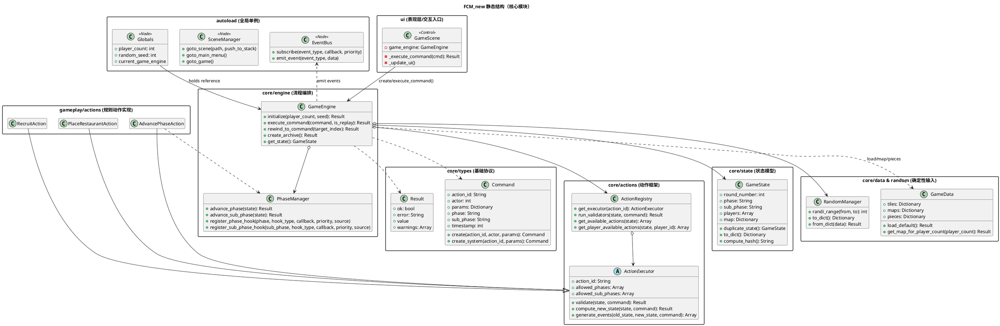
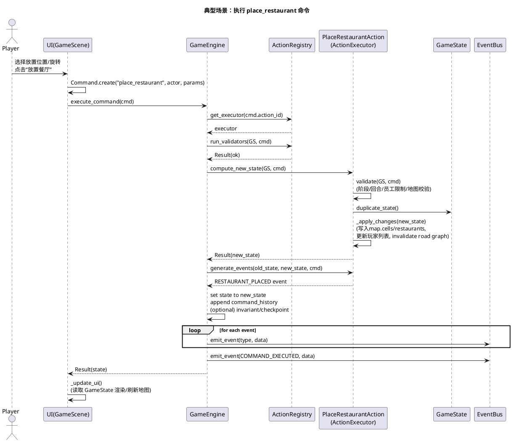
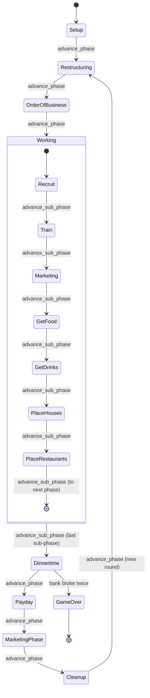

# 系统总览：架构解析（面向新入职开发）

进一步阅读（模块拆分）：

- `docs/architecture/10-autoload.md`（全局单例）
- `docs/architecture/20-ui.md`（UI 入口与交互）
- `docs/architecture/30-core-engine.md`（命令执行/存档/回放）
- `docs/architecture/31-core-phase-manager.md`（阶段状态机）
- `docs/architecture/32-core-actions-framework.md`（动作框架）
- `docs/architecture/33-core-state-model.md`（状态模型）
- `docs/architecture/34-core-events.md`（事件总线）
- `docs/architecture/35-core-data-random.md`（数据与随机）
- `docs/architecture/36-core-map.md`（地图系统）
- `docs/architecture/40-gameplay-actions.md`（规则动作实现）
- `docs/architecture/41-gameplay-validators.md`（校验器）
- `docs/architecture/50-tools-replay.md`（回放/确定性工具）

## 系统概述 (System Overview)

本项目是一个基于 Godot 的回合制桌游规则引擎与 UI 结合体，其核心以“命令（`Command`）驱动状态（`GameState`）变更”的方式实现可回放、可存档、可撤销的确定性流程。系统将“阶段/子阶段状态机（`PhaseManager`）”与“动作执行框架（`ActionRegistry` / `ActionExecutor`）”解耦，用以承载复杂规则并保持逻辑层可测试。UI 侧通过场景脚本创建并调用 `GameEngine`，再通过事件总线 `EventBus` 获取状态变化通知以刷新表现层。

## 静态结构图 (PlantUML)

## 核心流程图 (PlantUML Sequence)

典型场景：**玩家在 Working / PlaceRestaurants 子阶段执行 `place_restaurant`**（UI 按钮/交互产生命令，推动核心状态变更并广播事件）。

## 状态机/逻辑流 (Mermaid)

该系统的显式状态切换主要体现在 **七阶段主流程 + Working 阶段子阶段**（由 `PhaseManager` 驱动，`advance_phase` / `advance_sub_phase`）。

## 设计模式与要点 (Design Insights)

- **命令模式（Command）+ 事件溯源（轻量版）**：所有状态变化通过 `Command` 进入 `GameEngine.execute_command`，并写入 `command_history`，配合 `rewind/full_replay` 形成可回放/可撤销的线性时间线。
- **策略/插件式执行器（ActionExecutor）**：每个动作封装为一个 `ActionExecutor` 子类，通过 `ActionRegistry` 以 `action_id` 分发；动作校验（`validate`）与状态变更（`_apply_changes`）分离，便于测试与规则演进。
- **状态机（PhaseManager）+ Hook 扩展点**：阶段/子阶段推进集中在 `PhaseManager`，并提供 phase/subphase hooks，使“结算规则”“自动流程”“强制动作校验”等能在统一入口编排。

最关键的 3 个维护要点：

1. **确定性优先**：任何影响结果的随机必须走 `RandomManager`；任何状态变更必须来自 `Command`（避免 UI/节点直接改 `GameState`），否则回放/存档对齐会失效。
2. **状态结构是事实来源**：动作实现普遍直接读写 `GameState` 内的 `Dictionary/Array`（尤其是 `state.map`、`state.players`）；修改 schema 前先盘点所有引用点并同步序列化/反序列化与测试。
3. **阶段边界即规则边界**：跨阶段结算（如 `Dinnertime/Marketing/Payday/Cleanup`）集中在 `PhaseManager` 内部调用的 rules；新增规则优先考虑放入对应结算点或子阶段切换点，避免散落在多个 Action 中。

潜在耦合风险（需重点关注）：

- `core/` 逻辑层直接依赖全局单例/Node（`EventBus`、`DebugFlags`、`Globals` 常量），降低了“纯逻辑可复用/可嵌入”的隔离度；若后续要做服务器裁决或无 Godot 的 headless 运行，建议把事件发射与日志/调试开关抽象为可注入接口。
- `GameState` 大量使用嵌套 `Dictionary/Array` 作为 schema，动作代码对键名强耦合；当系统变大时容易出现“字段改名导致静默逻辑错误”，建议逐步引入小范围强类型包装（例如 Map/Player 子结构体或访问器层）。
- `ActionExecutor.compute_new_state()` 每次都深拷贝整个 `GameState`：对确定性与回放友好，但在命令频繁/状态变大时可能成为性能瓶颈；可考虑对热点子结构做结构共享或增量更新（保持可序列化与哈希稳定的前提下）。
