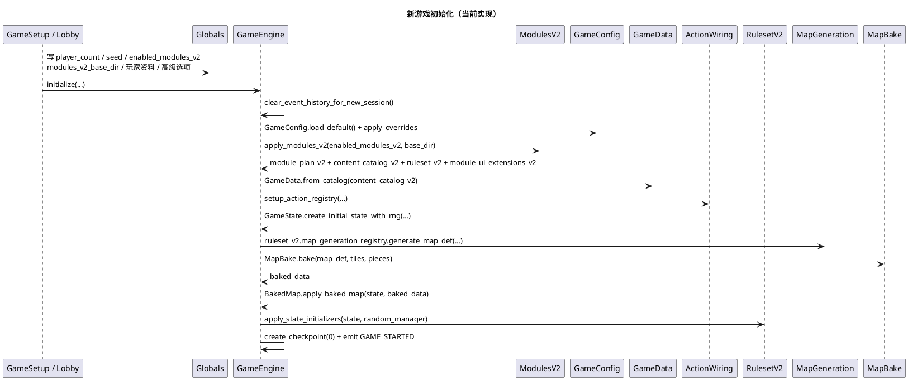
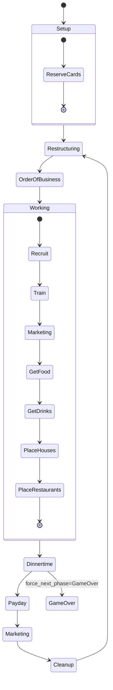

# 系统总览：命令驱动 + 可回放引擎 + 模块系统 V2 + 在线平台

本项目是一个基于 Godot 4.x 的回合制规则引擎与 UI，当前代码已经形成四条稳定主线：

- **确定性引擎**：同一 `seed` + 同一命令序列 ⇒ 同一最终 `GameState`（可用 `compute_hash()` 验证）
- **唯一写入口**：所有规则变更都必须通过 `GameEngine.execute_command(Command)`
- **Strict Mode 模块装配**：内容与规则由启用模块集合装配，缺失依赖/重复注册/引用失效直接 fail-fast
- **平台化联机**：`backend/` 提供账号/房间目录/历史对局，`server/` 提供权威房间服，客户端通过 `PlatformApi + NetClient` 串起来

## 目录分层（Ownership）

- `core/`：引擎优先的可复用逻辑（状态、规则、动作框架、地图、随机、回放）
- `gameplay/`：内建动作、复用校验器、派生时间线、模块 UI 元数据 bootstrap
- `ui/`：场景、Controller、组件与表现层
- `autoload/`：跨场景单例（配置、事件、联机会话、平台会话、自动恢复协调）
- `modules/`：模块系统 V2 的内容与规则脚本
- `modules_test/`：测试专用模块包
- `server/`：Godot WebSocket 房间服（实时权威对局）
- `backend/`：FastAPI 平台后端（账号、房间目录、connect_token、历史对局、后台管理）
- `tools/`：headless 测试、replay runner、性能打点等开发工具

## 核心对象与职责

- `core/engine/game_engine.gd`：`GameEngine`
  - 初始化：装配模块、加载 `GameConfig`、构造 `GameData`、生成并烘焙地图、建立初始 `GameState`
  - 执行：`execute_command` 统一做 gating / validators / executor / auto-advance / 事件输出 / checkpoint
  - 存档与回放：`create_archive` / `load_from_archive` / `full_replay` / `rewind_to_command`
- `core/engine/phase_manager.gd`：`PhaseManager`
  - 维护阶段/子阶段推进、结算触发、hooks、顺序覆盖
- `core/actions/*`：动作框架
  - `ActionExecutor`：动作三段式接口（`validate` / `compute_new_state` / `generate_events`）
  - `ActionRegistry`：动作注册、可用性门禁、validators 调度、可启动动作查询
- `core/state/game_state.gd`：`GameState`
  - 承载对局唯一事实来源、序列化/反序列化、哈希与运行时缓存
- `core/engine/game_engine/modules_v2.gd`：模块系统装配入口
  - 读取 `module.json`、构建 module plan、加载 `ContentCatalog` / `RulesetV2` / `RulesetV2UiExtensions`
- `autoload/platform_session.gd` + `autoload/platform_api.gd`
  - 平台账号会话、游客登录、账号资料、房间/历史对局 HTTP API
- `autoload/net_client.gd` + `server/*`
  - WebSocket 房间服通信、房间/实时命令广播、resync / rewind / reconnect
- `autoload/online_session_coordinator.gd`
  - 把平台层的 resume ticket、客户端 WS 重连、游戏场景恢复串成统一自动恢复流程

## 新游戏初始化（真实代码路径）

入口：`GameEngine.initialize(...)` → `core/engine/game_engine/initializer.gd`

```plantuml
@startuml
title 新游戏初始化（当前实现）

participant "GameSetup / Lobby" as UI
participant "Globals" as G
participant "GameEngine" as GE
participant "ModulesV2" as M
participant "GameConfig" as CFG
participant "GameData" as GD
participant "ActionWiring" as AW
participant "RulesetV2" as RS
participant "MapGeneration" as MG
participant "MapBake" as MB

UI -> G : 写 player_count / seed / enabled_modules_v2\nmodules_v2_base_dir / 玩家资料 / 高级选项
UI -> GE : initialize(...)
GE -> GE : clear_event_history_for_new_session()
GE -> CFG : GameConfig.load_default() + apply_overrides
GE -> M : apply_modules_v2(enabled_modules_v2, base_dir)
M --> GE : module_plan_v2 + content_catalog_v2 + ruleset_v2 + module_ui_extensions_v2
GE -> GD : GameData.from_catalog(content_catalog_v2)
GE -> AW : setup_action_registry(...)
GE -> GE : GameState.create_initial_state_with_rng(...)
GE -> MG : ruleset_v2.map_generation_registry.generate_map_def(...)
GE -> MB : MapBake.bake(map_def, tiles, pieces)
MB --> GE : baked_data
GE -> GE : BakedMap.apply_baked_map(state, baked_data)
GE -> RS : apply_state_initializers(state, random_manager)
GE -> GE : create_checkpoint(0) + emit GAME_STARTED
@enduml
```

## 命令执行（唯一写入口）

入口：`GameEngine.execute_command(cmd, is_replay=false)` → `core/engine/game_engine/command_runner.gd`

关键语义：

- `ActionRegistry.run_validators` 先跑 phase/sub_phase gating，再跑全局/动作级 validators
- 正常路径走 `ActionExecutor.compute_new_state`；Debug 强制执行路径才走 `compute_new_state_force`
- 命令后会统一执行 `AutoAdvance.drain(...)`
- 回到历史位置后再执行新命令，会调用 `truncate_future_history()` 保持 **单分支线性时间线**
- 每 `checkpoint_interval` 条命令写 checkpoint；默认还会把事件发到 `EventBus`

## 阶段/子阶段概览（Definitions）

阶段定义位于：`core/engine/phase_manager/definitions.gd`

```mermaid
stateDiagram-v2
  [*] --> Setup
  state Setup {
    [*] --> ReserveCards
    ReserveCards --> [*]
  }
  Setup --> Restructuring
  Restructuring --> OrderOfBusiness
  OrderOfBusiness --> Working

  state Working {
    [*] --> Recruit
    Recruit --> Train
    Train --> Marketing
    Marketing --> GetFood
    GetFood --> GetDrinks
    GetDrinks --> PlaceHouses
    PlaceHouses --> PlaceRestaurants
    PlaceRestaurants --> [*]
  }

  Working --> Dinnertime
  Dinnertime --> Payday
  Payday --> MarketingPhase
  state "Marketing" as MarketingPhase
  MarketingPhase --> Cleanup
  Cleanup --> Restructuring
  Dinnertime --> GameOver : force_next_phase=GameOver
```

> 当前实现还支持：
>
> - `working_sub_phase_order` / `cleanup_sub_phase_order` / `phase_sub_phase_orders` 的运行时覆盖
> - 按名称插入自定义子阶段与 named hooks

下一步阅读建议：

- 模块装配：`docs/architecture/60-modules-v2.md`
- 引擎与时间线：`docs/architecture/30-core-engine.md`
- 联机实时层：`docs/architecture/70-online-multiplayer.md`
