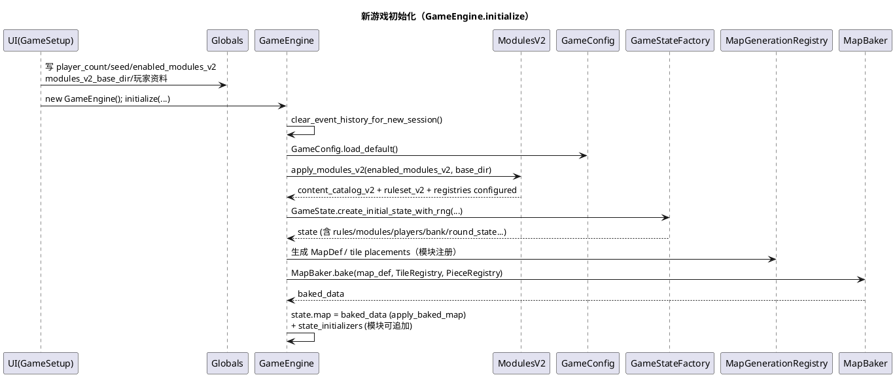
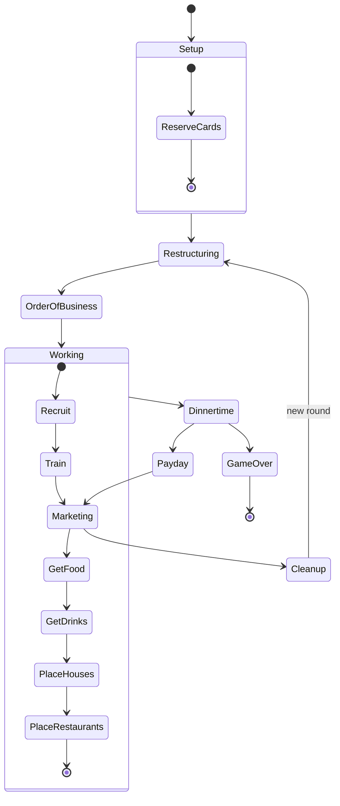

# 系统总览：命令驱动 + 可回放引擎 + 模块系统 V2

本项目是一个 Godot 4.x 的回合制规则引擎与 UI。核心目标是：

- **确定性**：同一 `seed` + 同一命令序列 ⇒ 同一最终 `GameState`（可 `compute_hash()` 验证）
- **唯一写入口**：所有规则变更都必须通过 `GameEngine.execute_command(Command)`
- **可回放/可倒带**：命令历史 + checkpoint 支持 `full_replay()` 与 `rewind_to_command()`
- **严格模块化（V2）**：内容/规则由启用模块集合装配；缺失依赖或重复注册直接 fail-fast

## 目录分层（Ownership）

- `core/`：引擎优先的可复用逻辑（尽量避免 UI/Node 依赖；但允许通过 `event_sink` 输出事件）
- `gameplay/`：动作与校验器的“玩法层”实现（内建 actions/validators）
- `ui/`：场景与交互（把玩家操作转换成 `Command`，并渲染 `GameState`）
- `autoload/`：跨场景单例（配置/场景切换/事件历史/调试开关）
- `modules/`：模块系统 V2 的内容与规则脚本
- `tools/`：开发工具（回放 runner、编译检查等）

## 核心对象与职责

- `core/engine/game_engine.gd`：`GameEngine`
  - 初始化：装配模块、加载 `GameConfig`、生成地图/初始状态
  - 执行：`execute_command` 统一校验、生成新状态、维护命令时间线
  - 存档/回放：`create_archive`/`load_from_archive`/`full_replay`/`rewind_to_command`
- `core/engine/phase_manager.gd`：`PhaseManager`
  - 阶段/子阶段推进（含 Setup 子阶段 `ReserveCards`）
  - 结算触发：通过 `SettlementRegistry` + triggers（enter/exit）
  - Hooks：phase/subphase hooks（含“按名称”的自定义子阶段 hooks）
- `core/actions/*`：动作框架
  - `ActionExecutor`：`validate`/`compute_new_state`/`generate_events`
  - `ActionRegistry`：动作分发、全局/动作级校验链、可用性门禁
- `core/state/game_state.gd`：`GameState`
  - schema version、序列化/反序列化、`compute_hash`（含 JSON number 归一化）
  - 运行时缓存：RoadGraph（不序列化，地图变更需显式 invalidate）
- `core/engine/game_engine/modules_v2.gd`：模块系统 V2 装配入口
  - 解析 `modules_v2_base_dir`，加载 `module.json`
  - 构建 module plan（含依赖闭包/冲突检查/稳定排序）
  - 装配 `ContentCatalog` 与 `RulesetV2`，并配置各类 registry

## 新游戏初始化（真实代码路径）

入口：`GameEngine.initialize(...)` → `core/engine/game_engine/initializer.gd`

简化时序如下（细节以代码为准）：

```plantuml
@startuml
title 新游戏初始化（GameEngine.initialize）

participant "UI(GameSetup)" as UI
participant "Globals" as G
participant "GameEngine" as GE
participant "ModulesV2" as M
participant "GameConfig" as CFG
participant "GameStateFactory" as F
participant "MapGenerationRegistry" as MG
participant "MapBaker" as MB

UI -> G : 写 player_count/seed/enabled_modules_v2\nmodules_v2_base_dir/玩家资料
UI -> GE : new GameEngine(); initialize(...)

GE -> GE : clear_event_history_for_new_session()
GE -> CFG : GameConfig.load_default()
GE -> M : apply_modules_v2(enabled_modules_v2, base_dir)
M --> GE : content_catalog_v2 + ruleset_v2 + registries configured

GE -> F : GameState.create_initial_state_with_rng(...)
F --> GE : state (含 rules/modules/players/bank/round_state...)

GE -> MG : 生成 MapDef / tile placements（模块注册）
GE -> MB : MapBaker.bake(map_def, TileRegistry, PieceRegistry)
MB --> GE : baked_data
GE -> GE : state.map = baked_data (apply_baked_map)\n+ state_initializers (模块可追加)
@enduml
```

## 命令执行（唯一写入口）

入口：`GameEngine.execute_command(cmd, is_replay=false)` → `core/engine/game_engine/command_runner.gd`

关键语义：

- `ActionRegistry.run_validators` 先跑可用性门禁 + 全局/动作级校验
- 执行器 `compute_new_state` 默认是 copy-on-write（`duplicate_state()` + `_apply_changes`）
- 若处于“倒带后的历史位置”，执行新命令会**截断未来**保持线性时间线（`truncate_future_history`）
- 每 N 条命令写 checkpoint（含 state hash 与 RNG call_count）

## 阶段/子阶段概览（Definitions）

阶段定义见：`core/engine/phase_manager/definitions.gd`

```mermaid
stateDiagram-v2
  [*] --> Setup
  state Setup {
    [*] --> ReserveCards
    ReserveCards --> [*]
  }
  Setup --> Restructuring
  Restructuring --> OrderOfBusiness

  state Working {
    [*] --> Recruit
    Recruit --> Train
    Train --> Marketing
    Marketing --> GetFood
    GetFood --> GetDrinks
    GetDrinks --> PlaceHouses
    PlaceHouses --> PlaceRestaurants
    PlaceRestaurants --> [*]
  }

  OrderOfBusiness --> Working
  Working --> Dinnertime
  Dinnertime --> Payday
  Payday --> Marketing
  Marketing --> Cleanup
  Cleanup --> Restructuring : new round
  Dinnertime --> GameOver
  GameOver --> [*]
```

下一步阅读建议：

- 模块装配：`docs/architecture/60-modules-v2.md`
- 引擎与时间线：`docs/architecture/30-core-engine.md`
- 阶段与结算：`docs/architecture/31-core-phase-manager.md`

