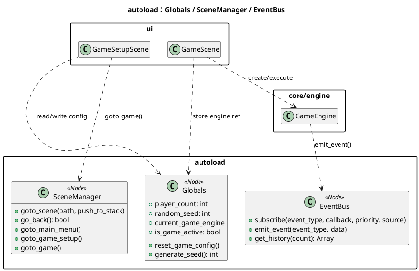
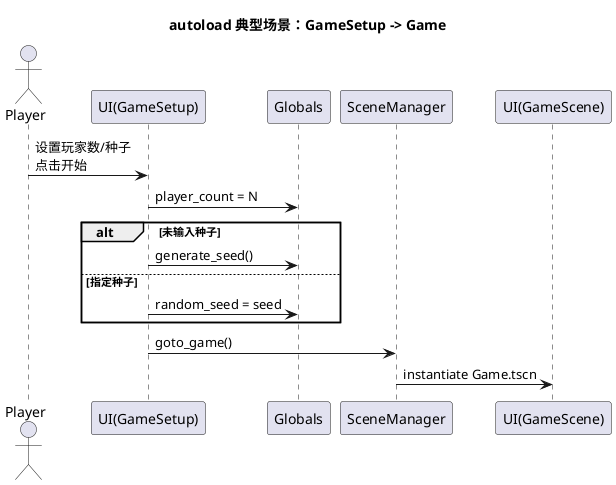
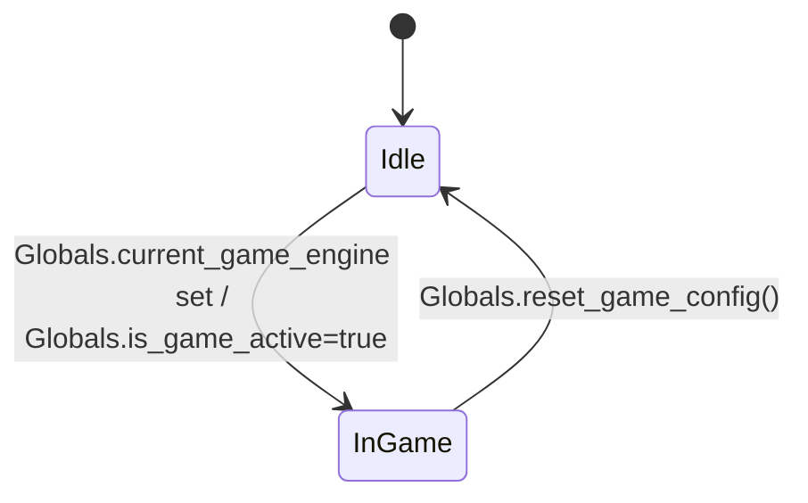

# 模块：autoload（全局单例）

## 系统概述 (System Overview)

autoload 模块提供跨场景可用的全局状态与服务入口（配置、场景切换、事件总线）。它承担“跨层粘合剂”的角色，使 UI 与 core 逻辑不必显式传递对象引用即可协作。该模块的使用方式会直接影响系统耦合度与可测试性。

## 静态结构图 (PlantUML)

## 核心流程图 (PlantUML Sequence)

典型场景：**从设置界面进入游戏**（写入 Globals，再由 SceneManager 切场景）。

## 状态机/逻辑流 (Mermaid)

autoload 本身不定义复杂状态机；其状态更多表现为 **Globals 中的运行时标志**（是否在对局中、当前引擎引用等）。

## 设计模式与要点 (Design Insights)

- **Service Locator（服务定位器）**：autoload 等价于全局服务容器，使用方便但天然增加耦合。
- **事件总线（EventBus）**：通过发布订阅降低显式依赖，但也会引入“隐式调用链”。

维护要点：

1. `Globals` 中的 `current_game_engine` 是跨层强引用，若未来存在“多局并行/观战/回放实例化”等需求，需要把“当前对局上下文”从全局拆出来。
2. `SceneManager` 负责场景栈与切换时机（`call_deferred`），UI 状态初始化要假设“下一帧才完成切换”。
3. `EventBus` 默认记录历史（用于调试/回放比对），若出现性能/内存问题可从 `_max_history_size` 与 `_history_enabled` 入手。

潜在耦合风险：

- 逻辑层（`core/engine/game_engine.gd`）直接调用 `EventBus.emit_event`，使 core 不再是严格“纯逻辑库”；若需要 headless/服务器裁决，建议把“事件输出”改为可注入回调或接口。
