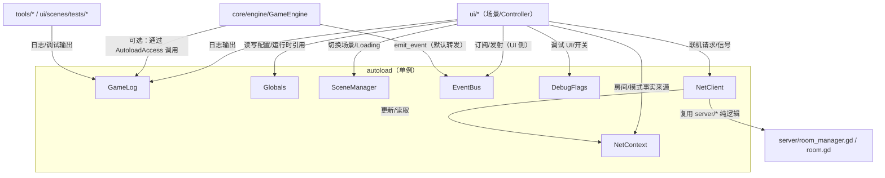

# 模块：autoload（全局单例）

autoload 目录提供跨场景可用的单例节点（见 `project.godot` 的 `[autoload]`）。它们是“粘合层”：UI 方便，但也会提高耦合度，因此 core 侧尽量只通过可注入接口使用（例如 `GameEngine.event_sink`）。

本项目实际包含：

- `tools/logger.gd`：`GameLog`（全局日志；级别可由 DebugFlags 调整）
- `autoload/globals.gd`：`Globals`（配置、玩家资料、运行时引擎引用）
- `autoload/net_context.gd`：`NetContext`（运行模式/房间信息/本地玩家 profile）
- `autoload/net_client.gd`：`NetClient`（联机会话层：Client/Server 共用 RPC 节点）
- `autoload/scene_manager.gd`：`SceneManager`（场景切换 + loading overlay）
- `autoload/event_bus.gd`：`EventBus`（事件发布/订阅 + 历史）
- `autoload/debug_flags.gd`：`DebugFlags`（调试开关）

## 模块关系图（谁在用这些单例）

```mermaid
flowchart TB
  UI["ui/*（场景/Controller）"]
  GE["core/engine/GameEngine"]
  TOOLS["tools/* / ui/scenes/tests/*"]

  subgraph AL["autoload（单例）"]
    GL["GameLog"]
    G["Globals"]
    SM["SceneManager"]
    EB["EventBus"]
    DF["DebugFlags"]
    NC["NetClient"]
    NX["NetContext"]
  end

  UI -->|"读写配置/运行时引用"| G
  UI -->|"切换场景/Loading"| SM
  UI -->|"订阅/发射（UI 侧）"| EB
  UI -->|"调试 UI/开关"| DF
  UI -->|"联机请求/信号"| NC
  UI -->|"房间/模式事实来源"| NX
  UI -->|"日志输出"| GL

  GE -->|"emit_event（默认转发）"| EB
  GE -->|"可选：通过 AutoloadAccess 调用"| GL

  NC -->|"复用 server/* 纯逻辑"| SVR["server/room_manager.gd / room.gd"]
  NC -->|"更新/读取"| NX

  TOOLS -->|"日志/调试输出"| GL
```

## GameLog：统一日志

代码：`tools/logger.gd`（autoload 名称：`GameLog`）

用途：

- 统一日志级别（DEBUG/INFO/WARN/ERROR）与格式；
- UI 与 core 都可用（core 侧若需要降低硬依赖，优先通过 `core/utils/autoload_access.gd` 调用）。

## Globals：跨场景配置与“当前对局上下文”

代码：`autoload/globals.gd`

关键字段（以当前代码为准）：

- 新局配置：`player_count`、`random_seed`
- 模块系统 V2：`enabled_modules_v2`、`modules_v2_base_dir`
- UI/玩家资料：`player_names`、`player_color_indices`、`player_restaurant_logo_choices`、`ui_scale`、`font_scale` 等
- 运行时：`current_game_engine`、`is_game_active`
- 回放入口：`pending_replay_file_path`（主菜单选择回放文件后，进入 Game 场景自动打开回放播放器）

## SceneManager：场景切换与加载遮罩

代码：`autoload/scene_manager.gd`

职责：

- 统一场景跳转：`goto_scene(...)`/`goto_main_menu()`/`goto_online_lobby()`/`goto_game_setup()`/`goto_game()`
- 开发/测试入口：`goto_tile_editor()`/`goto_replay_test()`
- 维护 scene 栈：`go_back()`（用于“返回上一页”）
- 栈维护工具：`clear_stack()`（返回主菜单前清空）
- 加载遮罩：`show_loading(...)`/`hide_loading()`（避免初始化/读档卡顿的观感）

## EventBus：事件总线与“事件历史”

代码：`autoload/event_bus.gd`

特性：

- 订阅：`subscribe(event_type, callback, priority=100, source="")`
- 发射：`emit_event(event_type, data={})`
- **确定性序号**：事件自带 `sequence/timestamp`，用于回放/日志对齐（timestamp=sequence）
- 历史：`get_history(...)`/`clear_history()`/`clear_history_and_reset_sequence()`
- 回退/重放支持：`record_event(...)`（只写历史，不触发订阅者副作用）
- 事件类型常量：`EventBus.EventType.*`（字符串）

> 约定：core 侧不直接依赖 `EventBus`，而是调用 `GameEngine.emit_event(...)`；引擎默认会把事件转发到 autoload 的 `EventBus`，但也允许通过 `GameEngine.set_event_sink(...)` 注入替代实现（用于 headless/测试/日志重建）。

## DebugFlags：调试与校验开关

代码：`autoload/debug_flags.gd`

常用字段：

- `verbose_logging`：更详细的日志
- `validate_invariants`：每条命令后校验不变量（现金/员工守恒等）
- `force_execute_commands`：跳过大部分校验（仅 DebugPanel 用，风险很高）
- `show_console`：UI 控制台/调试面板显隐

## NetContext：联机上下文（模式/房间/玩家）

代码：`autoload/net_context.gd`

关键字段：

- `mode`：`HOTSEAT/ONLINE_CLIENT/ONLINE_SERVER`
- `local_player_id`：联机模式下本地玩家 seat（用于禁止代操）
- `room_state`/`room_list`：大厅与房间 UI 的事实来源缓存
- `player_profile`：默认从 `Globals` 读取（名称/颜色），并由联机大厅更新

## NetClient：联机会话层（WebSocket RPC）

代码：`autoload/net_client.gd`

特性（节选）：

- 连接/断开：`connect_to_server(...)` / `shutdown()`
- 请求：`request_list_rooms/create_room/join_room/start_game/action/resync/...`
- 事件信号：`connected/disconnected/room_list_updated/room_state_updated/command_applied/resync_archive_received/...`

联机的整体协议、房间逻辑与 UI 分层见：`docs/architecture/70-online-multiplayer.md`
