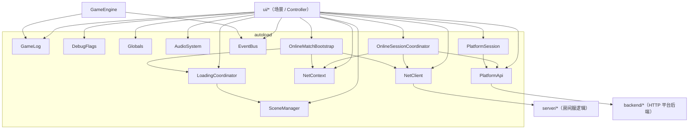

# 模块：autoload（全局单例）

`autoload/` 提供跨场景可用的单例节点（见 `project.godot` 的 `[autoload]`）。它们承担 UI 粘合层、跨场景状态、平台会话与联机恢复协调的职责；`core/` 侧仍尽量通过可注入接口或 `AutoloadAccess` 间接使用。

当前项目实际注册的 autoload：

- `autoload/game_log.gd`：`GameLog`
- `autoload/debug_flags.gd`：`DebugFlags`
- `autoload/globals.gd`：`Globals`
- `ui/audio/audio_system_initializer.tscn`：`AudioSystem`
- `autoload/loading_coordinator.gd`：`LoadingCoordinator`
- `autoload/online_match_bootstrap.gd`：`OnlineMatchBootstrap`
- `autoload/scene_manager.gd`：`SceneManager`
- `autoload/event_bus.gd`：`EventBus`
- `autoload/net_context.gd`：`NetContext`
- `autoload/net_client.gd`：`NetClient`
- `autoload/online_session_coordinator.gd`：`OnlineSessionCoordinator`
- `autoload/platform_api.gd`：`PlatformApi`
- `autoload/platform_session.gd`：`PlatformSession`

## 模块关系图（谁在用这些单例）

```mermaid
flowchart TB
  UI["ui/*（场景 / Controller）"]
  GE["GameEngine"]
  SERVER["server/*（房间服逻辑）"]
  BACKEND["backend/*（HTTP 平台后端）"]

  subgraph AL["autoload"]
    GL["GameLog"]
    DF["DebugFlags"]
    G["Globals"]
    AS["AudioSystem"]
    LC["LoadingCoordinator"]
    OMB["OnlineMatchBootstrap"]
    SM["SceneManager"]
    EB["EventBus"]
    NX["NetContext"]
    NC["NetClient"]
    OSC["OnlineSessionCoordinator"]
    API["PlatformApi"]
    PS["PlatformSession"]
  end

  UI --> G
  UI --> AS
  UI --> LC
  UI --> OMB
  UI --> SM
  UI --> EB
  UI --> NX
  UI --> NC
  UI --> OSC
  UI --> API
  UI --> PS
  UI --> GL
  UI --> DF

  GE --> EB
  GE --> GL

  NC --> SERVER
  API --> BACKEND
  OSC --> API
  OSC --> NC
  OSC --> NX
  PS --> API
  LC --> SM
  OMB --> LC
  OMB --> NC
  OMB --> NX
```

## GameLog：统一日志

代码：`autoload/game_log.gd`

职责：

- 统一日志级别（DEBUG / INFO / WARN / ERROR）与输出格式
- 被 UI、autoload、server 与 core 间接共用
- `DebugFlags.verbose_logging` 会动态调整最小输出级别

## Globals：跨场景配置与“当前对局上下文”

代码：`autoload/globals.gd`

关键字段（以当前实现为准）：

- 本地开局配置：`player_count`、`random_seed`
- 模块系统 V2：`enabled_modules_v2`、`modules_v2_base_dir`
- 玩家资料：`player_names`、`player_color_indices`、`player_restaurant_logo_choices`
- 高级配置：`game_config_overrides`、`confirm_actions`、音频/UI 缩放等
- 运行时：`current_game_engine`、`is_game_active`
- 入口状态：`pending_replay_file_path`

## AudioSystem：跨场景音频初始化

代码：`ui/audio/audio_system_initializer.tscn`、`ui/audio/audio_system_initializer.gd`

职责：

- 初始化 `Music` / `SFX` 音频总线与持久化的音乐、音效管理器
- 同步全局音频设置，并在场景切换后维持播放状态
- 处理 Web 平台需要用户手势解锁音频上下文的兼容流程

## LoadingCoordinator：统一 Loading 会话

代码：`autoload/loading_coordinator.gd`

职责：

- 通过 `begin_session / update_session / finish_session` 管理跨场景 Loading 生命周期
- 按优先级和更新时间选择当前展示的会话
- 将统一的标题、阶段、详情与进度状态交给 `SceneManager` 渲染

## OnlineMatchBootstrap：联机开局编排

代码：`autoload/online_match_bootstrap.gd`

职责：

- 协调 Lobby `Starting` 到 `InGame` 的本地准备、ready 回执与失败回滚
- 在恢复房中等待完整历史和日志时间线准备完成后再确认本地 ready
- 通过 `LoadingCoordinator` 维持跨 Lobby、Game 场景连续的开局进度

## SceneManager：场景切换与加载遮罩

代码：`autoload/scene_manager.gd`

职责：

- 场景跳转：`goto_main_menu()` / `goto_game_setup()` / `goto_online_lobby()` / `goto_game()`
- 栈式返回：`go_back()` / `clear_stack()`
- 加载遮罩：`show_loading(...)` / `hide_loading()` / `is_loading_visible()`

## EventBus：事件总线与事件历史

代码：`autoload/event_bus.gd`

特性：

- `subscribe / unsubscribe / unsubscribe_all_from_source`
- `emit_event / emit_events`
- `get_history / get_history_by_type / clear_history / clear_history_and_reset_sequence`
- `record_event`：只写历史，不触发订阅者副作用

> 约定：core 不直接依赖 `EventBus`；统一通过 `GameEngine.emit_event(...)`，必要时可替换 `event_sink`。

## DebugFlags：调试与校验开关

代码：`autoload/debug_flags.gd`

关键字段：

- `debug_mode`
- `verbose_logging`
- `validate_invariants`
- `force_execute_commands`
- `show_console`
- `profile_commands`

## NetContext：联机上下文与恢复状态

代码：`autoload/net_context.gd`

关键职责：

- 运行模式：`HOTSEAT / ONLINE_CLIENT / ONLINE_SERVER`
- 本地对局身份：`local_player_id`、`local_role`、`player_profile`
- 房间缓存：`room_state`、`room_list`
- 在线恢复：`online_resume_state`
  - `room_code` / `role` / `seat_index`
  - `session_id` / `user_id`
  - `checkpoint_id` / `last_applied_sequence` / `last_state_hash`
  - `in_game` / `reconnecting` / `resume_allowed` / `terminal_reason`

## NetClient：联机会话层（WebSocket RPC）

代码：`autoload/net_client.gd`

职责：

- 作为 client / server 共用 RPC 节点，封装 WebSocket 连接与消息流
- client 侧：`connect_to_server(...)`、房间请求、`command_applied` / `resync_archive_received` 等信号
- server 侧：`start_server(...)`，并复用 `server/room_manager.gd` / `server/room.gd`
- 支持 delta / snapshot / rewind_to_turn_start / reconnect 相关消息

## OnlineSessionCoordinator：联机自动恢复编排

代码：`autoload/online_session_coordinator.gd`

职责：

- 根据 `NetContext.online_resume_state` 判断是否应自动恢复
- 向平台后端请求 resume ticket（HTTP）
- 驱动 WS 重连、等待 room_state / game_started / resync 准备完成
- 统一输出“恢复成功 / 终止原因 / 是否清空恢复上下文”

## PlatformApi：平台 HTTP API 封装

代码：`autoload/platform_api.gd`

职责：

- 解析并决定当前 `base_url`
- 封装 `/v1/auth/*`、`/v1/auth/device/*`、`/v1/rooms/*`、`/v1/matches/*`
- 处理 TLS 选项、HTTP 错误映射、JSON 响应解析

## PlatformSession：账号会话与本地持久化

代码：`autoload/platform_session.gd`

职责：

- 管理 `user_id` / `session_id` / `is_guest` / `display_name` / `device_id`
- 持久化到 `user://platform_session*.cfg`
- 提供 `auto_guest_login`、`login`、`register`、`bind_email`、`refresh_account_profile`、`logout`
- 支持 device auth 与 Web 平台 localStorage 同步
