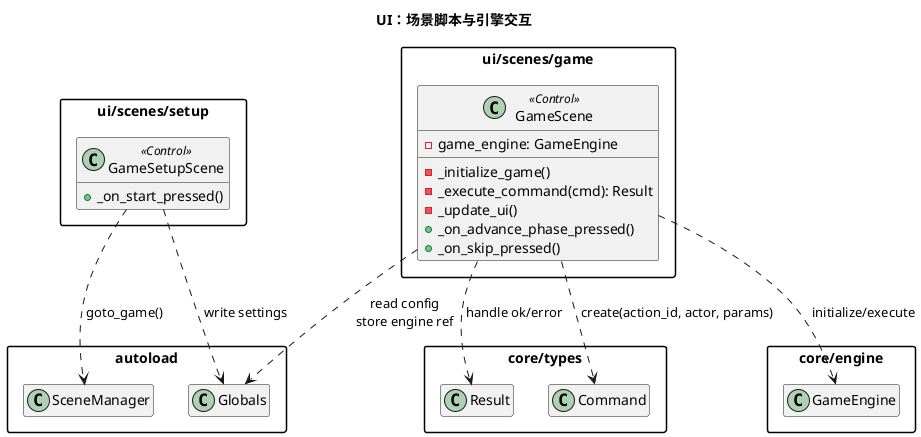
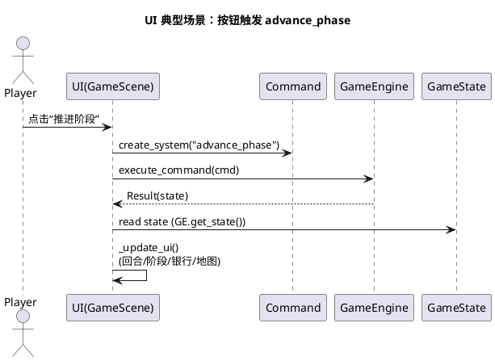
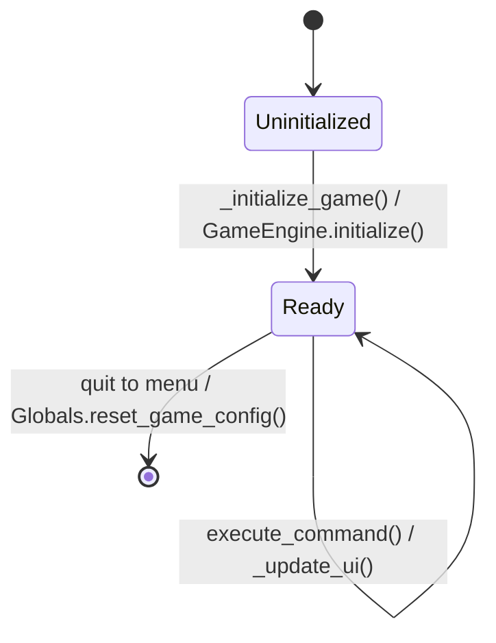

# 模块：ui（表现层与交互入口）

## 系统概述 (System Overview)

ui 模块负责将玩家交互转换为 `Command` 并驱动 `GameEngine`，同时把 `GameState` 的快照渲染为可视化界面。它不直接实现规则，而是作为“命令生产者 + 状态消费者”。其正确性重点在于：不绕过引擎修改状态、并能在状态变化后可靠刷新 UI。

## 静态结构图 (PlantUML)

## 核心流程图 (PlantUML Sequence)

典型场景：**GameScene 执行一次系统命令 `advance_phase` 并刷新 UI**。

## 状态机/逻辑流 (Mermaid)

UI 侧可以理解为“场景生命周期 + 引擎就绪状态”，复杂状态切换主要在 core 的 `PhaseManager`，UI 只需要跟随状态展示。

## 设计模式与要点 (Design Insights)

- **MVC-ish 分层**：UI 作为 View/Controller，规则在 core/gameplay；`GameState` 是唯一可信 Model。
- **命令驱动**：UI 不应直接改 `GameState`，只应构造 `Command` 交给 `GameEngine`。

维护要点：

1. 任何 UI 新功能（新按钮/新交互）优先落到“新增/复用 action_id + params”，而不是在 UI 里写规则分支。
2. `GameScene._update_ui()` 读取 `GameState` 的字段/键名耦合很强，修改 schema 时要同步更新 UI 显示逻辑。
3. 地图渲染通过 `map_view.call("set_game_state", state)` 反射调用，需保持 `MapView` 的接口稳定（否则运行期才暴露错误）。

潜在耦合风险：

- UI 直接持有 `GameEngine` 并写入 `Globals.current_game_engine`，未来若引入“回放/观战/沙盒对局”多实例，会逼迫 UI 改造为显式传递对局上下文而非依赖 Globals。
