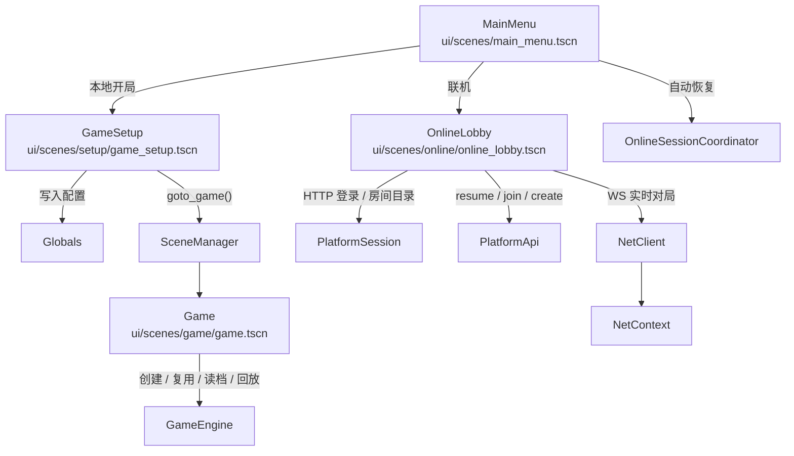

# 模块：ui（表现层与交互入口）

UI 的核心职责是：

- 把交互转换为 `Command`
- 调用 `GameEngine.execute_command` 推动规则
- 只读 `GameState` 渲染界面
- 在联机模式下同时串联平台后端（HTTP）与房间服（WebSocket）

## 模块关系图（UI 入口到引擎）

```mermaid
flowchart TB
  MainMenu["MainMenu\nui/scenes/main_menu.tscn"]
  Setup["GameSetup\nui/scenes/setup/game_setup.tscn"]
  Lobby["OnlineLobby\nui/scenes/online/online_lobby.tscn"]
  Game["Game\nui/scenes/game/game.tscn"]

  Globals["Globals"]
  SceneManager["SceneManager"]
  PlatformSession["PlatformSession"]
  PlatformApi["PlatformApi"]
  NetClient["NetClient"]
  NetContext["NetContext"]
  Resume["OnlineSessionCoordinator"]
  Engine["GameEngine"]

  MainMenu -->|"本地开局"| Setup
  MainMenu -->|"联机"| Lobby
  MainMenu -->|"自动恢复"| Resume
  Setup -->|"写入配置"| Globals
  Setup -->|"goto_game()"| SceneManager
  Lobby -->|"HTTP 登录 / 房间目录"| PlatformSession
  Lobby -->|"resume / join / create"| PlatformApi
  Lobby -->|"WS 实时对局"| NetClient
  NetClient --> NetContext
  SceneManager --> Game
  Game -->|"创建 / 复用 / 读档 / 回放"| Engine
```

## 主要入口场景与脚本

- 主菜单：`ui/scenes/main_menu.tscn`
  - 脚本：`ui/scenes/menus/main_menu.gd`
  - 功能：本地开局、联机入口、规则查看、回放载入、启动时自动检测联机恢复
- 新游戏设置：`ui/scenes/setup/game_setup.tscn`
  - 脚本：`ui/scenes/setup/game_setup.gd`
  - 功能：选择玩家数 / seed / 模块 / 玩家资料 / 高级配置，写入 `Globals` 后进入游戏
- 联机大厅：`ui/scenes/online/online_lobby.tscn`
  - 脚本：`ui/scenes/online/online_lobby.gd`
  - 功能：平台登录、服务器选择、房间列表、创建/加入/观战、房主配置同步、自动恢复
- 游戏主场景：`ui/scenes/game/game.tscn`
  - 脚本：`ui/scenes/game/game.gd`
  - 功能：本地新局、载入存档、主菜单回放、联机 InGame、启动时直接恢复到在线对局

## Game 场景与引擎交互方式

`ui/scenes/game/game.gd` 是编排器，统一提供：

- `_initialize_game()`：按入口模式创建或复用 `GameEngine`
- `_execute_command(command)`：唯一执行入口
  - 回放模式下禁止执行
  - 查看历史时默认禁止分叉，除非显式进入 timeline edit mode
  - 联机客户端下把命令转交给 `online_resync_controller`
- `_update_ui()`：从 `game_engine.get_state()` 拉取状态并驱动各 controller 刷新

## 日志/时间线（StepTimeline）

当前 UI 主流程使用“从引擎事实来源重建”的派生时间线，而不是只依赖实时事件订阅：

- `gameplay/replay/step_timeline_build.gd`
- `gameplay/replay/event_timeline_build.gd`
- `ui/scenes/game/timeline/controller.gd`
- `ui/scenes/game/event_log/controller.gd`

这使得以下场景仍然可稳定展示：

- rewind / replay seek
- 截断未来后重新分叉
- 读档后重建日志
- 联机 resync 后重建本地时间线

## UI 与 autoload 的边界

- UI 允许直接使用 `Globals` / `SceneManager` / `EventBus` / `PlatformSession` / `NetClient`
- core 尽量不依赖 Node；事件统一通过 `GameEngine.emit_event(...)`
- 新局 / 读档 / 回放入口都会清理或重建 `EventBus.history`，避免跨对局污染
