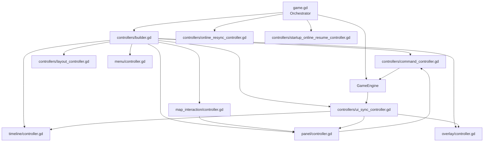

# Game 场景：controller 拆分与职责边界（`ui/scenes/game/*`）

`ui/scenes/game/game.gd` 当前是一个轻量编排器：负责绑定节点、创建控制器、管理 `GameEngine` 生命周期，并处理本地/回放/联机恢复等入口差异。

## 模块关系图（`game.gd` 与 controller / 引擎）

## 顶层编排：`game.gd`

代码：`ui/scenes/game/game.gd`

职责：

- 入口分流：
  - 本地新局
  - 复用 `Globals.current_game_engine`（读档/某些场景切回）
  - 主菜单回放（`Globals.pending_replay_file_path`）
  - 在线恢复直达游戏场景
- 在 `_ready()` 中通过 `controllers/builder.gd` 创建并接线各控制器
- 处理加载遮罩、UI 样式、首帧性能打点
- 在 `_exit_tree()` / disposer 中统一清理运行时对象与信号绑定

## Controllers 一览（按职责）

- 命令执行：`ui/scenes/game/controllers/command_controller.gd`
  - 本地执行、联机发包、回退到回合开始、SKIP 前强制动作自动补完
- UI 同步：`ui/scenes/game/controllers/ui_sync_controller.gd`
  - 顶栏状态、地图/面板/覆盖层刷新、日志/时间线联动
- 时间线/回放：`ui/scenes/game/timeline/controller.gd`
  - 构建 `StepTimeline`，控制 replay bar、seek、timeline edit mode
- 联机 Resync：`ui/scenes/game/controllers/online_resync_controller.gd`
  - 处理 `command_applied` / `resync_archive_received` / rewind / delta snapshot
- 启动恢复：`ui/scenes/game/controllers/startup_online_resume_controller.gd`
  - 游戏场景直接进入在线恢复时的 UI 与超时编排
- 布局：`ui/scenes/game/controllers/layout_controller.gd`
- 右侧 Dock：`ui/scenes/game/controllers/right_panel_dock_controller.gd`
- 日志 Dock：`ui/scenes/game/controllers/log_dock_controller.gd`
- 教学编排：`ui/scenes/game/controllers/tutorials_controller.gd`
  - 配套子模块：`tutorial_content.gd`、`tutorial_targets_resolver.gd`
- 输入：`ui/scenes/game/controllers/input_controller.gd`
- 存档/回放对话框：`ui/scenes/game/controllers/save_load_controller.gd`
- DebugPanel：`ui/scenes/game/controllers/debug_panel_controller.gd`
- 后台预热：`ui/scenes/game/controllers/background_warmup_controller.gd`

## 面板：`panel/controller.gd`（以及 views / modals / working 子控制器）

面板主入口：`ui/scenes/game/panel/controller.gd`

核心拆分：

- Working 子阶段：`ui/scenes/game/panel/working/*.gd`
- 营销/结算：`ui/scenes/game/panel/marketing_panels.gd`、`end_panels.gd`
- 顶层浏览视图：`views_controller.gd`
- 顶层模态：`modals_controller.gd`
- 放置叠层编排：`placement_overlays.gd`
- 采购日志预览：`procurement/log_preview_controller.gd`

边界约束：

- 面板只负责收集 UI 参数、驱动模式切换、发出动作请求
- 真正执行仍统一走 `command_controller` / `game._execute_command`

## 地图与交互：MapView / Canvas + InteractionController

地图绘制：

- `ui/scenes/game/map/view.gd`
- `ui/scenes/game/map/canvas.gd`
- `ui/scenes/game/map/indexer.gd`
- `ui/scenes/game/map/tooltip.gd`
- `ui/scenes/game/map/drawer/drawer.gd` 及其 helpers

地图交互：

- `ui/scenes/game/map_interaction/controller.gd`
- `ui/scenes/game/map_interaction/placement_mode.gd`
- `ui/scenes/game/map_interaction/marketing_mode.gd`
- `ui/scenes/game/map_interaction/distance_tool_controller.gd`
- `ui/scenes/game/map_interaction/mode_bar_controller.gd`

当前实现还支持模块扩展的地图交互模式：`map_interaction/controller.gd` 会按 module manifest 的 `provides.ui.map_interaction_modes` 动态加载 handler。

## Overlays：统一管理与具体叠层

入口：`ui/scenes/game/overlay/controller.gd`

常见 overlay：

- `overlay/distance.gd`
- `overlay/marketing_range.gd`
- `overlay/procurement_route.gd`
- `overlay/demand_indicator.gd`
- `overlay/zoom.gd`

此外，晚餐阶段的独立表现逻辑在：`ui/scenes/game/dinnertime/controller.gd`。

## 日志：StepTimeline 为主，EventLog 为辅

当前主视图：

- `ui/scenes/game/timeline/controller.gd`
- `gameplay/replay/step_timeline_build.gd`

旧式/补充日志格式化仍保留在：

- `ui/scenes/game/event_log/controller.gd`
- `ui/scenes/game/event_log/formatter*.gd`

因此当前 Game 场景实际上同时存在两条日志链路：

1. **派生时间线链路**：给 replay、seek、历史浏览使用
2. **事件格式化链路**：给细粒度事件文本输出与兼容路径使用
