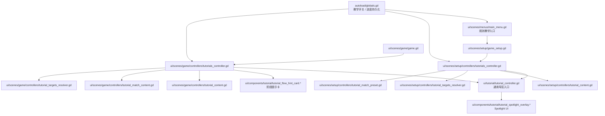

# Onboarding / 教学系统架构（`ui/tutorial` + `ui/scenes/*/controllers/tutorials_controller.gd`）

本文档只描述**当前已落地**的规则教学系统结构，不讨论未来更完整的互动式教学剧本。

## 目标

当前教学系统拆成三层，分别解决不同问题：

1. **通用导览组件**
	- 管理 spotlight overlay / step 切换 / 跳过
2. **主菜单入口编排**
	- 显式进入“规则教学”模式
3. **场景级教学 controller**
	- 决定什么时候开始导览、什么时候发流程提示
	- 决定是否切换到“教学局模式”文案
4. **全局进度与开关**
	- 保存“是否启用教学”“哪些提示已经看过”

这样可以避免把教学流程直接塞进 `game.gd`、`game_setup.gd` 这类主场景脚本里。

## 当前代码分层

## 通用层：`ui/tutorial/tutorial_controller.gd`

职责：

- 惰性创建 `tutorial_spotlight_overlay`
- 提供统一入口：
	- `start_tour(...)`
	- `is_tour_running()`
	- `close_tour(...)`
	- `dispose()`

边界：

- **不关心具体是 Setup 还是 Game**
- **不持有业务状态**
- 只负责“把 steps 交给 spotlight UI 去跑”

## Setup 场景教学 controller

代码：

- `ui/scenes/setup/controllers/tutorials_controller.gd`
- `ui/scenes/setup/controllers/tutorial_content.gd`
- `ui/scenes/setup/controllers/tutorial_targets_resolver.gd`

职责：

- `tutorials_controller.gd`
	- 响应主菜单传入的规则教学请求
	- 同步 start flags
	- 触发教学局预设应用
- `tutorial_content.gd`
	- 只负责 setup 导览步骤文案
- `tutorial_targets_resolver.gd`
	- 只负责解析玩家数量区 / 游戏选项 / 模块区 / 开始按钮等 target
- `tutorial_match_preset.gd`
	- 只负责提供教学局固定配置

边界：

- 只依赖 setup 场景暴露的少量 callback：
	- 读取 module selector 的 tutorial targets
	- 应用教学局预设
- 不直接负责真正开局切场景
- 不再把 setup 导览步骤和节点路径细节混在同一个 controller 里

## Game 场景教学 controller

代码：

- `ui/scenes/game/controllers/tutorials_controller.gd`
- `ui/scenes/game/controllers/tutorial_content.gd`
- `ui/scenes/game/controllers/tutorial_match_content.gd`
- `ui/scenes/game/controllers/tutorial_targets_resolver.gd`

职责：

- `tutorials_controller.gd`
	- 只负责触发时机、运行时阻塞判断、生命周期清理
	- 在普通局 / 教学局两套内容之间切换
	- 在教学局中按上下文触发关键交互面板 tour
- `tutorial_content.gd`
	- 只负责普通局的主界面导览 / 重组导览 / 顺位导览 / 放置导览 / 流程提示
- `tutorial_match_content.gd`
	- 只负责教学局模式下更短、更具体的导览、按子阶段流程提示，以及招聘/培训/营销/生产等关键面板导览
- `tutorial_targets_resolver.gd`
	- 只负责解析当前真实可见的 tutorial target
	- 包括主界面、重组弹窗、顺位弹窗、放置上下文区域，以及右侧当前激活的引导面板

触发来源：

- `game.gd` 在 `_update_ui()` 后调用 `on_ui_updated()`
- `game.gd` 在 startup intro 结束后调用 `on_startup_intro_finished()`

边界：

- `game.gd` 只负责**事件转发**
- `tutorials_controller.gd` 只做 orchestration
- 具体步骤内容与 target 路径细节，不再混在同一个大 controller 里

## 进度与设置：`autoload/globals.gd`

当前由 `Globals` 持有：

- 已看过进度：
	- `tutorial_setup_tour_seen`
	- `tutorial_game_ui_tour_seen`
	- `tutorial_flow_hints_seen`
- 运行时待触发标记：
	- `tutorial_pending_setup_tour`
	- `tutorial_pending_game_ui_tour`
	- `tutorial_pending_flow_tutorial`
	- `tutorial_match_enabled`

当前还提供：

- `request_rules_tutorial()`
- `is_tutorial_runtime_enabled()`
- `has_tutorial_flow_hint_seen(...)`
- `mark_tutorial_flow_hint_seen(...)`
- `reset_tutorial_progress(...)`
- `apply_tutorial_preferences_from_settings(...)`

## 设置页与帮助提示的关系

### 设置页

代码：

- `ui/dialogs/settings_dialog.gd`

职责：

- 只负责教学相关**设置项 UI**
	- 是否启用教学
	- 重置教学进度

边界：

- 不负责编排 tour
- 不负责决定何时显示教学

### 帮助提示

代码：

- `ui/components/help_tooltip/help_tooltip_manager.gd`
- `ui/scenes/game/overlay/controller.gd`

职责：

- hover 提示是**静态帮助系统**
- spotlight tour / flow hint 是**引导系统**

两者可以共存，但职责不同：

- tooltip：随时可查
- tutorial：首局引导 / 分阶段提醒

## 当前维护原则

后续若继续扩展教学，建议遵守：

1. **场景脚本只保留薄编排**
	- 像 `game.gd`、`game_setup.gd` 不再直接拼 tutorial steps
2. **一个场景一个教学 controller**
	- Setup 和 Game 的触发条件完全不同，不要重新揉回一个脚本
3. **通用 UI 与业务策略分离**
	- `ui/tutorial/tutorial_controller.gd` 只做通用 tour 容器
	- 具体“什么时候出现什么步骤”交给场景级 controller
4. **Globals 只保存状态，不渲染 UI**
	- 它负责进度与偏好，不负责任何弹窗或 overlay

## 当前自动化防线

已补充三类回归测试：

- `ui/scenes/tests/setup_tutorial_targets_contract_test.gd`
	- 检查 setup 导览关键 target 仍可解析且可见
- `ui/scenes/tests/game_tutorial_targets_contract_test.gd`
	- 检查 game 主界面、重组弹窗、顺位弹窗与放置相关 target 仍可解析
- `ui/scenes/tests/tutorial_scene_boundary_contract_test.gd`
	- 检查 `game.gd` / `game_setup.gd` 没有重新混入 `start_tour(...)` 等教学细节
