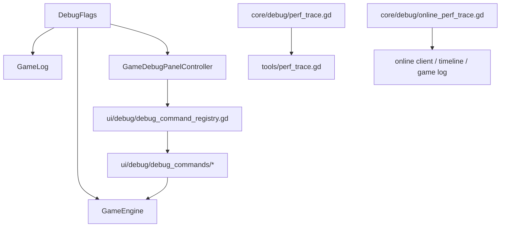

# 调试与性能分析（`DebugFlags` / Debug Commands / `PerfTrace` / `OnlinePerfTrace`）

本项目当前有两类性能打点：

- **通用启动/初始化打点**
  - `core/debug/perf_trace.gd`
  - `tools/perf_trace.gd`
- **联机同步 / 恢复房 / 日志时间线热路径打点**
  - `core/debug/online_perf_trace.gd`

调试与诊断主要分散在四层：

- `autoload/debug_flags.gd`：全局调试开关
- `ui/debug/*` + `ui/scenes/game/controllers/debug_panel_controller.gd`：调试命令与调试面板
- `core/debug/perf_trace.gd` → `tools/perf_trace.gd`：启动/初始化/首帧性能打点
- `core/debug/online_perf_trace.gd`：联机热路径 JSON 打点

## 模块关系图（开关 / 命令 / 打点流向）



## DebugFlags（全局调试开关）

代码：`autoload/debug_flags.gd`

关键字段：

- `debug_mode`
- `verbose_logging`
- `validate_invariants`
- `force_execute_commands`
- `show_console`
- `profile_commands`

说明：

- release 构建会强制关闭 `debug_mode`
- `verbose_logging` 会同步调整 `GameLog` 最小级别
- `force_execute_commands` 主要供 DebugPanel 命令走 `compute_new_state_force`

## Debug commands（调试命令注册表）

当前实现全部位于 `ui/debug/`：

- 注册表：`ui/debug/debug_command_registry.gd`
- 命令集合：
  - `ui/debug/debug_commands/action_commands.gd`
  - `ui/debug/debug_commands/game_commands.gd`
  - `ui/debug/debug_commands/state_commands.gd`
  - `ui/debug/debug_commands/util_commands.gd`

调试面板由 `ui/scenes/game/controllers/debug_panel_controller.gd` 动态实例化 `ui/scenes/debug/debug_panel.tscn`，并把命令执行结果回灌到当前 `GameEngine` 与 UI。

## PerfTrace（启动 / 开局性能打点）

代码：

- shim：`core/debug/perf_trace.gd`
- 实现：`tools/perf_trace.gd`

当前典型打点位置：

- `GameEngine.initialize_new_game`
- `ModulesV2.apply`
- `GameData.from_catalog`
- `setup_action_registry`
- `MapBake.bake`
- `game.gd` 的 `_ready()` / `_initialize_game()`

启用方式遵循 `tools/perf_trace.gd` 的命令行约定（如 `-- --profile_startup`），输出以固定前缀便于 grep 与 CI 日志解析。

## OnlinePerfTrace（联机同步 / 恢复房 / 日志时间线热路径）

代码：

- `core/debug/online_perf_trace.gd`

语义：

- 输出单行 JSON，前缀固定为 `[OnlinePerf]`
- 同时记录：
  - `wall_unix_ms`
  - `mono_usec`
  - `event`
  - 以及调用点附加字段
- 支持 `begin_span(...)` / `end_span(...)`
- 也支持直接 `emit_event(...)`

### 启用方式

满足任一条件即可启用：

1. 环境变量

```bash
FCM_ONLINE_PERF=1
```

2. 命令行参数

- `online_perf`
- `--online_perf`
- `profile_online_sync`
- `--profile_online_sync`

3. Web 查询参数

- `?online_perf=1`
- `?profile_online_sync=1`

这意味着 **native 客户端与 web 端共用同一套埋点实现**，只是在启用入口上分别使用命令行 / 环境变量 / URL query。

### 当前典型打点族

#### 1. 动作请求与命令应用（客户端）

- `client.action_request.tx`
- `client.command_applied.rx`
- `client.command_applied.apply_start`
- `client.command_applied.apply_done`
- `client.command_applied.resume_cache_sync`
- `client.command_applied.ui_update`
- `client.command_applied.ui_settled`

用途：

- 判断网络往返、服务端执行、客户端 apply、UI settle 的时间分布

#### 2. 服务端接收 / 执行 / 广播

- `server.action_request.rx`
- `server.action_request.execute`
- `server.command_applied.tx`

用途：

- 配合客户端事件还原：
  - 服务端收包时间
  - 权威执行时间
  - 广播时间

#### 3. 联机 UI 同步

- `ui.online_sync.timeline_ui`
- `ui.online_sync.map_view`
- `ui.online_sync.panel_controller`
- `ui.online_sync.overlay_controller`
- `ui.online_sync.debug_panel`
- `ui.online_sync.total`

用途：

- 判断动作到达后，UI 哪一层最耗时

#### 4. 时间线 / 日志面板

- `ui.timeline.apply_live_log`
- `ui.timeline.build_info_from_timeline`
- `ui.game_log.load_step_timeline`
- `ui.game_log.append_step_timeline`
- `ui.game_log.append_step_range`
- `ui.game_log.build_unified_timeline_display`
- `ui.game_log.apply_descriptor_rebuild`
- `ui.game_log.apply_descriptor_append`
- `ui.game_log.rebuild_display`
- `ui.game_log.apply_timeline_state`
- `ui.game_log.compute_visible_entry_count`
- `ui.game_log.show_in_right_panel`
- `ui.game_log.ensure_display_ready`

用途：

- 判断卡顿是在：
  - step timeline 构建
  - descriptor 构建
  - UI item append / rebuild
  - 还是 timeline state 批量更新

#### 5. 恢复房完整历史缓存

- `resume_cache.baseline_timeline.selected`
- `resume_cache.used_prebuilt_timeline`
- `resume_cache.miss_prebuilt_timeline`
- `resume_cache.live_tail.recorded`
- `resume_cache.live_append.start`
- `resume_cache.live_append.done`
- `resume_cache.live_append.failed_fallback_full`
- `resume_cache.timeline_cache_refresh.start`
- `resume_cache.timeline_cache_refresh.done`

用途：

- 判断恢复房是否正确复用：
  - prebuilt full-history timeline
  - prebuilt timeline entries
  - incremental append
  - live tail

### 当前使用建议

- **定位“点按钮后几秒别的客户端才变”**
  - 先看 `client_request_to_rx_ms`
  - 再看 `client_apply_ms`
  - 再看 `client_ui_settled_ms`
- **定位恢复房卡顿**
  - 优先看 `resume_cache.*` 与 `ui.timeline.apply_live_log`
- **定位日志面板卡顿**
  - 优先看 `ui.game_log.*`

进一步判断建议：

- 若 `client.command_applied.apply_done` 只有 3ms~5ms，但 `client.command_applied.ui_update` 有 25ms~40ms：
  - 优先排查 `ui.online_sync.timeline_ui`
  - 再看 `ui.online_sync.panel_controller`
- 若自动打开日志或阶段切换时出现 700ms~900ms 级峰值：
  - 重点看：
    - `ui.timeline.build_info_from_timeline`
    - `ui.game_log.load_step_timeline`
    - `ui.game_log.append_step_timeline`
    - `ui.timeline.apply_live_log`
- 若浏览器控制台出现：
  - `Blocking on the main thread is very dangerous`
  - 说明当前后台 job 的结果回收仍在阻塞主线程，优先检查 `GameLogPanel` 的 worker 回收链路。

### 说明

- `OnlinePerfTrace` 只负责结构化输出，不依赖 `GameLog`
- 适合用户手动测试时直接贴浏览器 console / 客户端日志
- 后续若增加更多热路径打点，应优先沿用这一套事件命名风格
