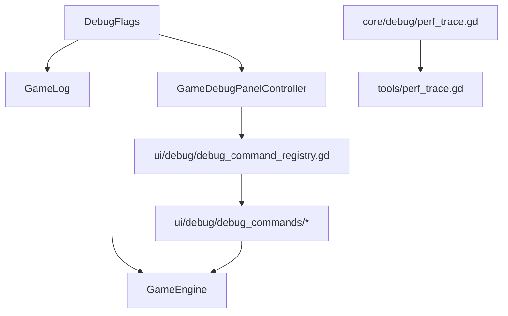

# 调试与性能分析（`DebugFlags` / Debug Commands / `PerfTrace`）

本项目的调试与诊断主要分散在三层：

- `autoload/debug_flags.gd`：全局调试开关
- `ui/debug/*` + `ui/scenes/game/controllers/debug_panel_controller.gd`：调试命令与调试面板
- `core/debug/perf_trace.gd` → `tools/perf_trace.gd`：启动/初始化/首帧性能打点

## 模块关系图（开关 / 命令 / 打点流向）

## DebugFlags（全局调试开关）

代码：`autoload/debug_flags.gd`

关键字段：

- `debug_mode`
- `verbose_logging`
- `validate_invariants`
- `force_execute_commands`
- `show_console`
- `profile_commands`

说明：

- release 构建会强制关闭 `debug_mode`
- `verbose_logging` 会同步调整 `GameLog` 最小级别
- `force_execute_commands` 主要供 DebugPanel 命令走 `compute_new_state_force`

## Debug commands（调试命令注册表）

当前实现全部位于 `ui/debug/`：

- 注册表：`ui/debug/debug_command_registry.gd`
- 命令集合：
  - `ui/debug/debug_commands/action_commands.gd`
  - `ui/debug/debug_commands/game_commands.gd`
  - `ui/debug/debug_commands/state_commands.gd`
  - `ui/debug/debug_commands/util_commands.gd`

调试面板由 `ui/scenes/game/controllers/debug_panel_controller.gd` 动态实例化 `ui/scenes/debug/debug_panel.tscn`，并把命令执行结果回灌到当前 `GameEngine` 与 UI。

## PerfTrace（启动 / 开局性能打点）

代码：

- shim：`core/debug/perf_trace.gd`
- 实现：`tools/perf_trace.gd`

当前典型打点位置：

- `GameEngine.initialize_new_game`
- `ModulesV2.apply`
- `GameData.from_catalog`
- `setup_action_registry`
- `MapBake.bake`
- `game.gd` 的 `_ready()` / `_initialize_game()`

启用方式遵循 `tools/perf_trace.gd` 的命令行约定（如 `-- --profile_startup`），输出以固定前缀便于 grep 与 CI 日志解析。
