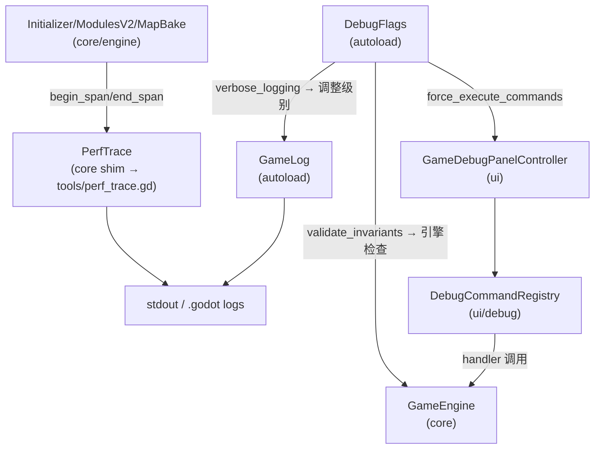

# 调试与性能分析（DebugFlags / Debug commands / PerfTrace）

本项目的调试与性能诊断分散在 `autoload/`、`ui/`、`core/debug/` 与 `tools/`，其中：

- “开关与 UI 显示”以 autoload 单例 `DebugFlags`（`autoload/debug_flags.gd`）为中心；
- “调试命令行”以 `ui/debug/debug_command_registry.gd` 为中心；
- “启动/开局性能打点”以 `PerfTrace` 为中心（core/debug 为 shim，真实实现位于 tools）。

## 模块关系图（开关/命令/打点流向）

## DebugFlags（全局调试开关）

代码：`autoload/debug_flags.gd`

关键字段：

- `debug_mode`：调试模式（release 构建会强制关闭）
- `verbose_logging`：更详细日志（会调整 `GameLog` 等级）
- `validate_invariants`：每条命令后校验不变量（现金/员工总量等）
- `force_execute_commands`：强制执行命令（跳过大部分校验，仅 DebugPanel 使用）
- `show_console`：控制台/调试面板显隐（由 game 场景响应信号）

## Debug commands（调试命令注册表）

真实实现：

- `ui/debug/debug_command_registry.gd`

core 侧兼容 shim（避免旧路径与 class cache 漂移）：

- `core/debug/debug_command_registry.gd`

该注册表用于：

- 注册 `name -> handler` 的命令；
- 在 UI 调试面板中解析并执行命令行；
- 允许“选中目标玩家”（调试用），并在无效时回退到当前玩家。

## PerfTrace（启动/开局性能打点）

core shim：

- `core/debug/perf_trace.gd`

真实实现：

- `tools/perf_trace.gd`

说明：

- `PerfTrace.begin_span/end_span` 被大量用于“启动/开局/模块装配/地图生成/首帧 UI”耗时定位；
- 默认关闭，按 `tools/perf_trace.gd` 的实现约定可通过命令行 user args 启用（例如 `-- --profile_startup`）；
- 输出以固定前缀（例如 `[StartupProfile]`）便于 grep 与机器解析。
