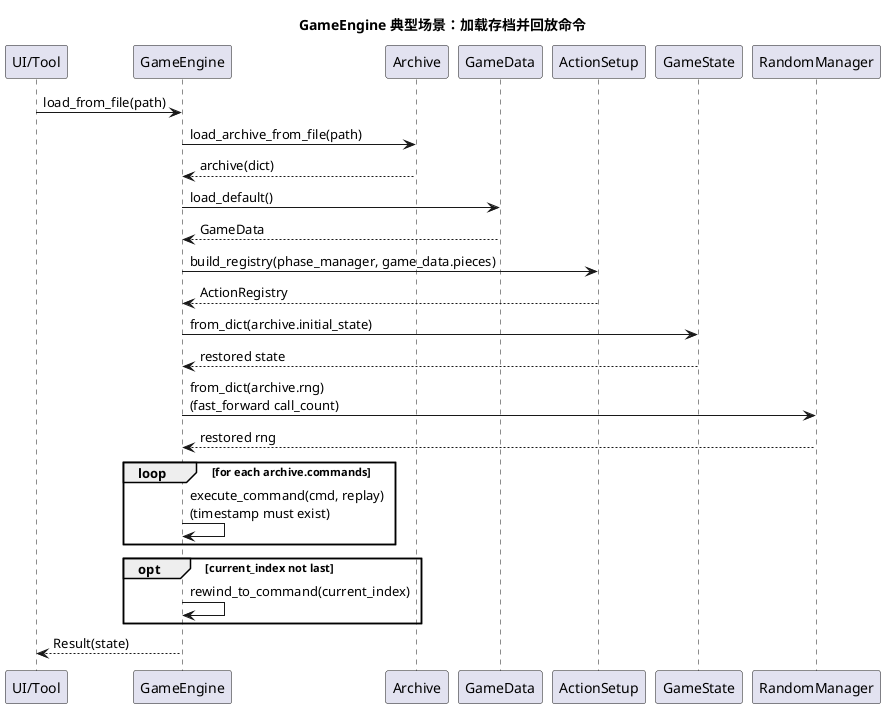
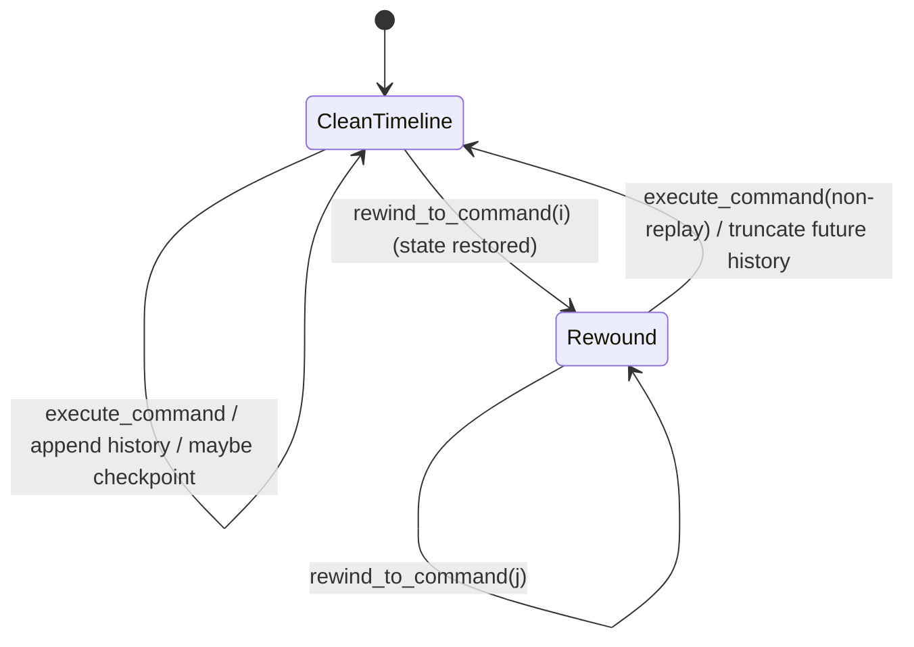

# 模块：core/engine（GameEngine：命令执行与可回放引擎）

## 系统概述 (System Overview)

`GameEngine` 是系统的“唯一写入口”：所有规则变更都必须通过 `execute_command(Command)` 产生新的 `GameState`。它负责命令历史、线性时间线（rewind 时丢弃未来分支）、校验点、存档与回放一致性。它同时承担引擎级不变量校验与事件发射，确保“状态可验证、结果可复现”。

## 静态结构图 (PlantUML)

```plantuml
@startuml
title core/engine：GameEngine 内部组成

hide empty members
skinparam packageStyle rectangle

package "core/engine" {
  class GameEngine {
    +initialize(player_count, seed): Result
    +execute_command(cmd, is_replay): Result
    +rewind_to_command(target_index): Result
    +full_replay(): Result
    +create_archive(): Result
    +save_to_file(path): Result
    +load_from_archive(archive): Result
    +verify_checkpoints(): Result
    +get_state(): GameState
    --
    -command_history: Array
    -checkpoints: Array
    -current_command_index: int
    -checkpoint_interval: int
    -validate_invariants: bool
  }
}

package "core/engine/game_engine" {
  class Checkpoints {
    +create_checkpoint(checkpoints, state, rng, index)
    +find_nearest_checkpoint(checkpoints, target_index)
    +verify_checkpoints(checkpoints): Result
  }
  class Replay {
    +rewind_to_command(history, checkpoints, registry, target_index): Result
    +full_replay(history, checkpoints, registry): Result
  }
  class Archive {
    +create_archive(state, rng, checkpoints, history, current_index): Result
    +save_archive_to_file(archive, path): Result
    +load_archive_from_file(path): Result
  }
  class Invariants {
    +check_invariants(state, initial_total_cash, initial_employee_totals): Result
    +compute_total_cash(state): int
  }
  class Diagnostics {
    +dump(state, history, current_index, checkpoints): String
    +get_status(state, history, current_index, checkpoints): Dictionary
  }
  class ActionSetup {
    +build_registry(phase_manager, piece_registry): ActionRegistry
  }
}

package "core/actions" {
  class ActionRegistry
}
package "core/state" {
  class GameState
}
package "core/random" {
  class RandomManager
}
package "core/data" {
  class GameData
}
package "autoload" {
  class EventBus
}
package "core/types" {
  class Command
  class Result
}

GameEngine o--> GameState
GameEngine o--> ActionRegistry
GameEngine o--> RandomManager
GameEngine ..> GameData : load_default()

GameEngine ..> ActionSetup : build_registry()
GameEngine ..> Checkpoints
GameEngine ..> Replay
GameEngine ..> Archive
GameEngine ..> Invariants
GameEngine ..> Diagnostics
GameEngine ..> EventBus : emit_event()
@enduml
```

## 核心流程图 (PlantUML Sequence)

典型场景：**存档加载（load_from_file -> load_from_archive）并重放命令恢复当前指针**。

## 状态机/逻辑流 (Mermaid)

引擎层的“状态机”更接近于 **时间线指针**（`current_command_index`）与 **校验点** 的协作，而非游戏阶段（阶段由 `PhaseManager` 管理）。

## 设计模式与要点 (Design Insights)

- **命令模式 + 快照（checkpoint）**：以 `Command` 序列作为事实来源，辅以 `checkpoint.state_dict` 作为加速点。
- **Fail Fast**：存档 schema_version 严格校验；回放命令必须带 `timestamp`，避免“兼容旧数据导致非确定性”。

维护要点：

1. `ActionExecutor.compute_new_state()` 必须是纯函数（只基于输入 state/cmd 得到新 state）；否则回放/倒带会产生分叉差异。
2. 任何“非确定性输入”（时间、随机、外部 IO）必须被隔离：存档只允许依赖 `GameState` + `RandomManager` 可序列化状态。
3. 不变量（`Invariants.check_invariants`）失败时会回滚状态并弹出命令历史尾项；新增规则时需同步维护不变量（或明确关闭/分级）。

潜在耦合风险：

- `Checkpoints.create_checkpoint` 里写入了 `Time.get_unix_time_from_system()`（仅用于展示但会进入 checkpoint 字典）；若未来把 checkpoint 完整序列化到存档，需避免把非确定性字段当作比对依据。
