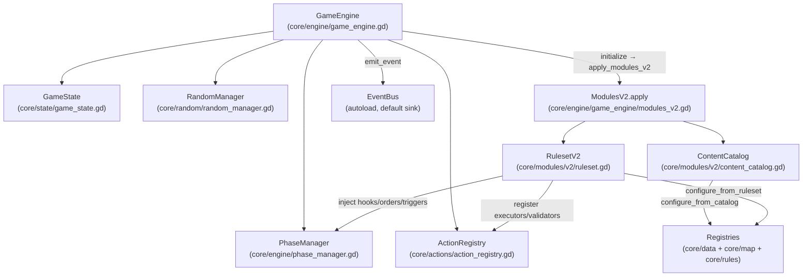

# 模块：core/engine（GameEngine：命令执行与可回放引擎）

`GameEngine` 是系统的“唯一写入口”。它保证：

- 所有状态变化都来自 `Command`（`execute_command`）
- 命令历史可重放（`full_replay`）与可回退（`rewind_to_command`）
- 存档可恢复（`create_archive`/`load_from_archive`）
- 可通过 `GameState.compute_hash()` 验证确定性

代码入口：`core/engine/game_engine.gd`

## 模块关系图（GameEngine 组成与依赖）

```mermaid
flowchart TB
  GE["GameEngine\n(core/engine/game_engine.gd)"]
  PM["PhaseManager\n(core/engine/phase_manager.gd)"]
  AR["ActionRegistry\n(core/actions/action_registry.gd)"]
  GS["GameState\n(core/state/game_state.gd)"]
  RNG["RandomManager\n(core/random/random_manager.gd)"]

  Mods["ModulesV2.apply\n(core/engine/game_engine/modules_v2.gd)"]
  CC["ContentCatalog\n(core/modules/v2/content_catalog.gd)"]
  RS["RulesetV2\n(core/modules/v2/ruleset.gd)"]
  Regs["Registries\n(core/data + core/map + core/rules)"]

  EB["EventBus\n(autoload, default sink)"]

  GE --> PM
  GE --> AR
  GE --> GS
  GE --> RNG

  GE -->|"initialize → apply_modules_v2"| Mods
  Mods --> CC
  Mods --> RS
  CC -->|"configure_from_catalog"| Regs
  RS -->|"configure_from_ruleset"| Regs
  RS -->|"inject hooks/orders/triggers"| PM
  RS -->|"register executors/validators"| AR

  GE -->|"emit_event"| EB
```

## 代码拆分（按文件职责）

引擎实现被拆分到 `core/engine/game_engine/*`：

- 初始化：`core/engine/game_engine/initializer.gd`
- 执行：`core/engine/game_engine/command_runner.gd`
- 回放/重放：`core/engine/game_engine/replay.gd`
- 回退：`core/engine/game_engine/rewind_ops.gd`
- 自动推进（AutoAdvance）：`core/engine/game_engine/auto_advance.gd` + `core/engine/game_engine/auto_advance_try_step.gd`（细节见下方补充文档）
- 校验点：`core/engine/game_engine/checkpoints.gd`
- 存档：`core/engine/game_engine/archive.gd` + `core/engine/game_engine/loader.gd`
- 不变量：`core/engine/game_engine/invariants.gd`
- 命令索引查询：`core/engine/game_engine/command_index_queries.gd`（回合开始/阶段边界等查询）
- 诊断：`core/engine/game_engine/diagnostics.gd`（checkpoint/replay 校验辅助）
- 事件历史重建：`core/engine/game_engine/event_history_rebuild.gd`、`core/engine/game_engine/game_started_event_build.gd`（供派生时间线/日志使用）
- 动作装配：`core/engine/game_engine/action_setup.gd` + `core/engine/game_engine/action_wiring.gd`
- 模块系统 V2：`core/engine/game_engine/modules_v2.gd`
  - strict 校验：`core/engine/game_engine/modules_v2_validations.gd`

相关补充文档：

- 自动推进（AutoAdvance）：`docs/architecture/30a-core-engine-auto-advance.md`
- 存档格式（archive）：`docs/architecture/30b-core-engine-archive.md`

## 时间线语义（线性历史）

引擎维护：

- `command_history`：事实来源（顺序命令列表）
- `current_command_index`：当前“时间线指针”
- `checkpoints`：加速回放/回退的快照点

当你曾 `rewind_to_command(i)` 回到历史位置，再执行新命令时，引擎会：

- 截断 `i` 之后的未来命令与未来 checkpoint（`truncate_future_history`）
- 从而保持“单分支线性时间线”

## 事件输出（可注入 sink）

`GameEngine` 提供：

- `set_event_sink(sink)`
- `emit_event(type, data)`

默认情况下会转发到 autoload 的 `EventBus`（`autoload/event_bus.gd`）。测试/工具场景可注入替代 sink，以避免 Node 依赖或实现“只记录历史不触发订阅者”的行为。

## 与模块系统 V2 的关系

初始化新局时（`initializer.gd`）会：

1. `apply_modules_v2(enabled_modules_v2, modules_v2_base_dir)`
2. 使用装配出的 `ContentCatalog` 构建 `GameData.from_catalog(...)`
3. 配置各类 registry（员工/里程碑/产品/营销、地图 tiles/pieces、结算/效果等）
4. 把 `RulesetV2` 的 settlement/effect registry 注入到 `PhaseManager`

详见：`docs/architecture/60-modules-v2.md`
