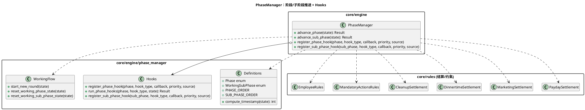
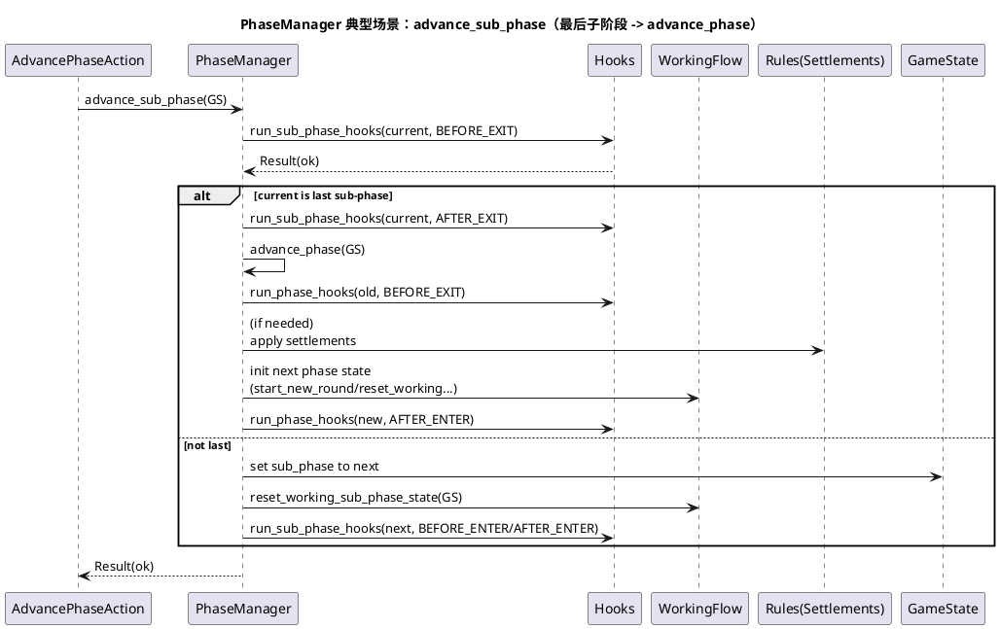
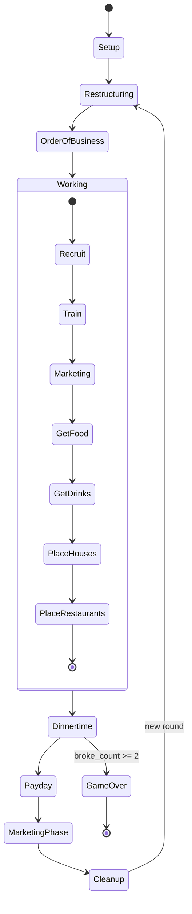

# 模块：core/engine/PhaseManager（阶段状态机与钩子）

## 系统概述 (System Overview)

`PhaseManager` 定义并驱动游戏主流程的阶段与 Working 子阶段，是“规则编排的时间轴”。它将跨阶段结算（Payday/Marketing/Dinnertime/Cleanup 等）集中到阶段切换点执行，并提供 Hook 机制作为可扩展入口。它的正确性直接决定回合推进、强制动作约束与结算一致性。

> 说明：当前实现仍通过 `preload()` 直接耦合到具体结算脚本；模块系统 V2 已确定将改为 **SettlementRegistry 由模块注册**，PhaseManager 仅负责编排调用（见 `docs/architecture/60-modules-v2.md`）。

## 静态结构图 (PlantUML)

## 核心流程图 (PlantUML Sequence)

典型场景：**Working 子阶段推进（advance_sub_phase），在最后一个子阶段自动转入下一主阶段**。

## 状态机/逻辑流 (Mermaid)

## 设计模式与要点 (Design Insights)

- **状态机 + 模板方法（Hook）**：PhaseManager 固定推进骨架，Hooks 提供“前后插桩”扩展点。
- **结算集中**：跨阶段的批处理规则在阶段切换点统一执行，避免散落在动作里导致边界不清。

维护要点：

1. Working 阶段禁止直接 `advance_phase`，必须用 `advance_sub_phase` 走完子阶段序列（见 `AdvancePhaseAction.validate`），这是防止绕过强制动作/子阶段重置的关键约束。
2. PhaseManager 内部对状态回滚采用“快照字段复制”（map/bank/players/round_state 等），新增重要字段时要同步纳入回滚快照，否则失败路径会留下半写入状态。
3. Hook 回调是隐式依赖，排查问题时建议用 `PhaseManager.dump()`（Hooks.dump）定位哪些 hook 在当前阶段运行。

潜在耦合风险：

- 结算逻辑通过 preload 直接耦合到具体 rules 实现；已在模块系统 V2 中确定整改为“模块注册结算器 + 缺失即初始化失败”（见 `docs/architecture/60-modules-v2.md` 与 `docs/decisions/0002-modules-v2-strict-mode.md`）。
