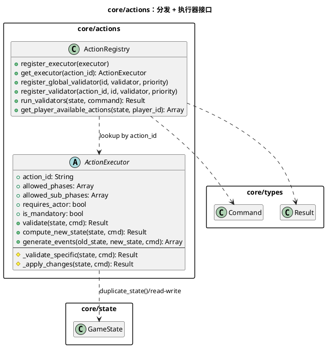
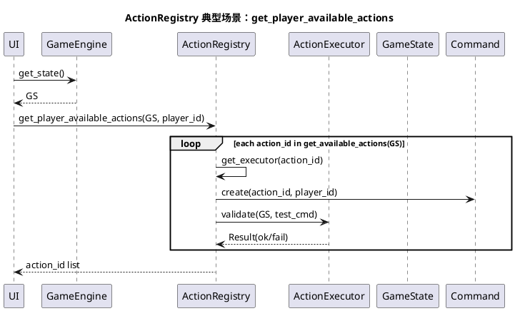
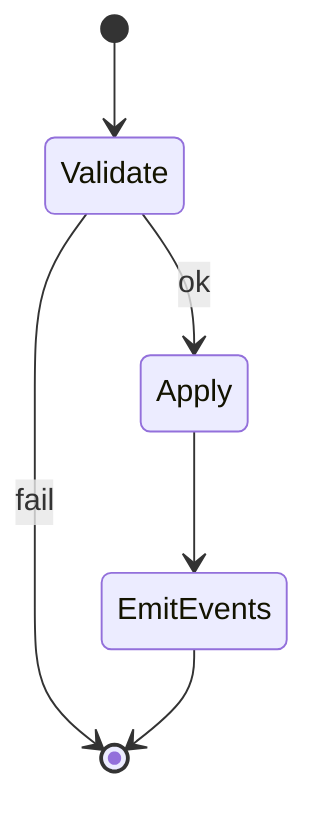

# 模块：core/actions（动作框架：ActionRegistry / ActionExecutor）

## 系统概述 (System Overview)

core/actions 定义“动作的统一接口”与“动作查找/校验的统一入口”，是规则实现的插件系统。`ActionExecutor` 将动作拆为校验（`validate`）、状态变更（`compute_new_state`）与事件生成（`generate_events`）三段。`ActionRegistry` 则负责按 `action_id` 分发执行器，并在引擎执行前运行全局/动作级校验器。

## 静态结构图 (PlantUML)

## 核心流程图 (PlantUML Sequence)

典型场景：**引擎查询“当前玩家可执行动作列表”**（用于 UI 生成按钮/菜单）。

## 状态机/逻辑流 (Mermaid)

动作框架本身不管理游戏阶段状态；其关键逻辑是执行器的“纯函数流水线”。

## 设计模式与要点 (Design Insights)

- **策略模式**：每个 `ActionExecutor` 子类是一种可替换策略，通过 `action_id` 注册并被引擎选择。
- **模板方法**：`compute_new_state` 固定“校验 -> 深拷贝 -> apply”的骨架，子类只实现 `_validate_specific` / `_apply_changes`。

维护要点：

1. 执行器必须避免副作用：不要写全局单例，不要直接发事件（事件由 `GameEngine` 统一发射），不要依赖真实时间。
2. 规则校验优先放在 `validate`，并尽量 Fail Fast（参数解析用 `require_*_param`），降低“半写入”风险。
3. `ActionRegistry.run_validators` 支持优先级排序；当校验链变长时，建议把“廉价校验”放在更高优先级（更早失败）。

潜在耦合风险：

- 执行器直接读写 `GameState` 的嵌套字典结构，导致 schema 键名成为事实接口；建议对高频字段逐步引入访问器/小结构封装以降低全局改动面。
