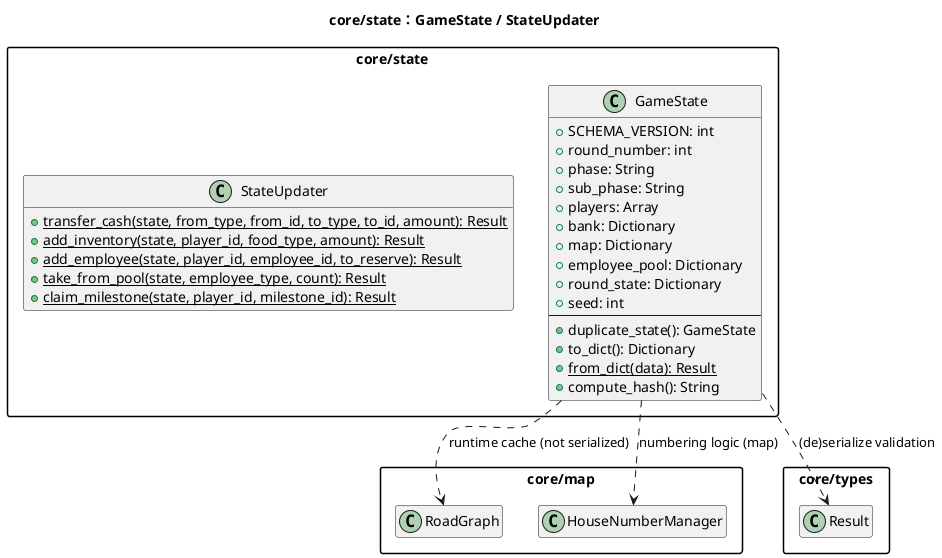
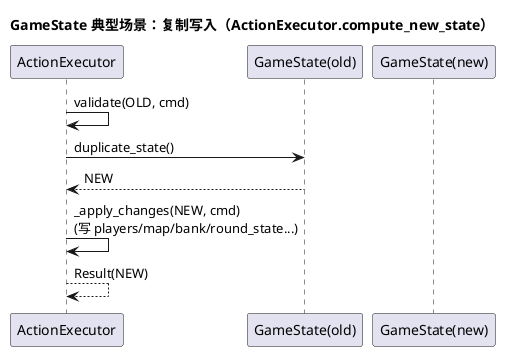
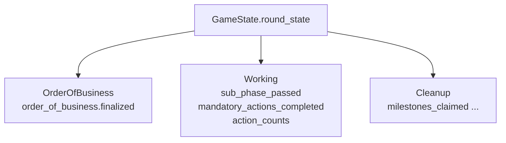

# 模块：core/state（GameState：状态模型与一致性）

## 系统概述 (System Overview)

`GameState` 是对局的唯一事实来源：它包含回合/阶段、玩家、银行、地图、供应池等全部状态，并支持深拷贝、序列化与哈希。系统通过“命令驱动 + 复制写入”的方式保证状态变更可回放、可撤销。`StateUpdater` 提供一组更安全的原子更新工具，用于现金/库存/员工/里程碑等常见操作。

## 静态结构图 (PlantUML)

## 核心流程图 (PlantUML Sequence)

典型场景：**动作执行器复制状态并写入局部结构**（以 `compute_new_state` 的通用骨架表示）。

## 状态机/逻辑流 (Mermaid)

`GameState` 自身不是状态机，但其 schema 随阶段演进：不同阶段会依赖不同的 `round_state` 子结构（例如 OrderOfBusiness/Working）。

## 设计模式与要点 (Design Insights)

- **不可变式倾向（copy-on-write）**：通过 `duplicate_state()` 将一次命令的写入隔离到新对象，利于回放与调试。
- **Schema 校验（Fail Fast）**：`from_dict` 对关键字段类型/非空做强校验，避免“坏存档”在运行中后置爆炸。

维护要点：

1. 修改 `GameState` schema 时，必须同步维护：`to_dict`/`from_dict`、`compute_hash` 的稳定性、以及所有动作对字段的读写点。
2. RoadGraph 等运行时缓存不序列化，任何改变道路/建筑布局的动作都要调用 `state.invalidate_road_graph()`（否则路径/距离计算可能用到过期缓存）。
3. `players`、`map` 等使用嵌套字典，容易出现“键名拼写错误但不报错”的问题；对高频结构建议提供访问器或常量键名集中管理。

潜在耦合风险：

- `GameState` 同时承载“规则状态 + UI 展示便利字段 + 缓存”，职责边界易膨胀；建议把缓存/派生数据尽量外置或明确标注“不可序列化”。
