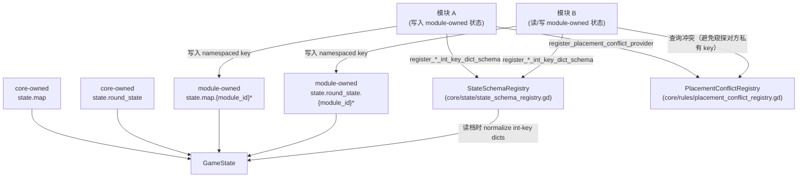

# GameState 扩展字段契约（state.map / state.round_state）

目的：把“模块如何扩展状态结构”的隐式约定显式化，降低跨模块耦合与存档/读档后的类型漂移风险。

## 模块关系图（状态扩展 + 归一化 + 跨模块协作）

## 总原则

- **core-owned vs module-owned**：core 定义的 key 属于稳定 ABI；模块不得覆盖/重解释。
- **模块不得窥探其他模块私有结构**：跨模块协作应通过 core-owned registry/provider（例如 PlacementConflictRegistry），而不是读取别的模块私有 key。
- **命名规则**：
  - module-owned：建议以 `module_id` 前缀命名（例如 `rural_marketeers_offramps`）
  - core-owned/shared：使用无前缀稳定 key
- **JSON 存档一致性**：若使用“int key Dictionary”（如 `{player_id(int) -> ...}`），JSON 会把 key 变为字符串（`"0"`）。读档阶段必须做归一化（见 `core/state/state_schema_registry.gd`）。

## core-owned：state.map（禁止模块覆盖）

地图运行时结构由 `core/map/map_runtime/*` 写入与维护，核心 key 包括：

- 结构与尺寸：`cells`、`grid_size`、`tile_grid_size`
- 地图来源：`tile_placements`、`external_tile_placements`
- 建筑：`houses`、`restaurants`
- 营销占位：`marketing_placements`
- 进货点：`drink_sources`
- 距离加速：`boundary_index`
- id 生成：`next_house_number`、`next_restaurant_id`
- 棋盘外组件容器：`external_cells`
- 供给（规则/UI）：`house_number_supply_remaining`、`garden_supply_remaining`

> 说明：module 可以往 `external_cells/external_tile_placements` 写“棋盘外结构”，但不得改变 core-owned 语义与类型约束。

## core-owned：state.round_state（禁止模块覆盖）

基础回合态 key（部分为可选，但语义与类型固定）：

- 强制动作：`mandatory_actions_completed`
- 计数：`actions_this_round`、`action_counts`
- 子阶段跳过：`sub_phase_passed`
- 阶段门禁：`pending_phase_actions`（见 `core/utils/round_state_pending_phase_actions.gd`）
- 顺序覆盖（由 PhaseManager/RulesetV2 写入/读取）：
  - `phase_order`（Array[String]）
  - `working_sub_phase_order`（Array[String]，允许包含自定义子阶段名）
  - `cleanup_sub_phase_order`（Array[String]）
  - `phase_sub_phase_orders`（Dictionary：phase_name -> Array[String]）
- 规则辅助字段（示例）：`marketing_rounds`

## module-owned：仅模块自己负责 schema/version

模块自有 key 由模块维护 schema/version；其他模块禁止直接读取其内部结构。

跨模块“查询/互斥/占用”应注册 provider 到 core-owned registry，再由其他模块调用 core API 查询。

已落地例子：

- `core/rules/placement_conflict_registry.gd`：模块提供“world_pos 是否存在外部冲突”查询面，避免互相窥探 state key
- `core/state/state_schema_registry.gd`：模块注册“int-key Dictionary 的归一化路径”，避免 JSON 字符串 key 漂移
