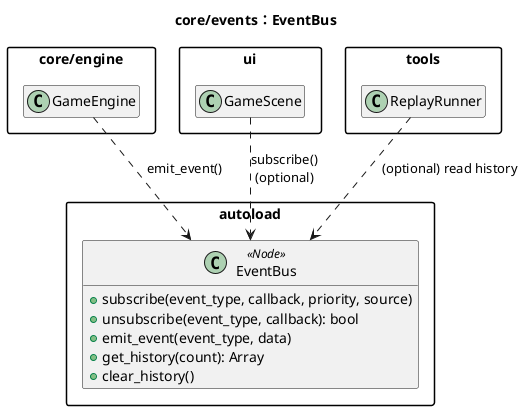
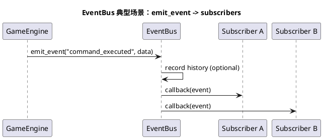
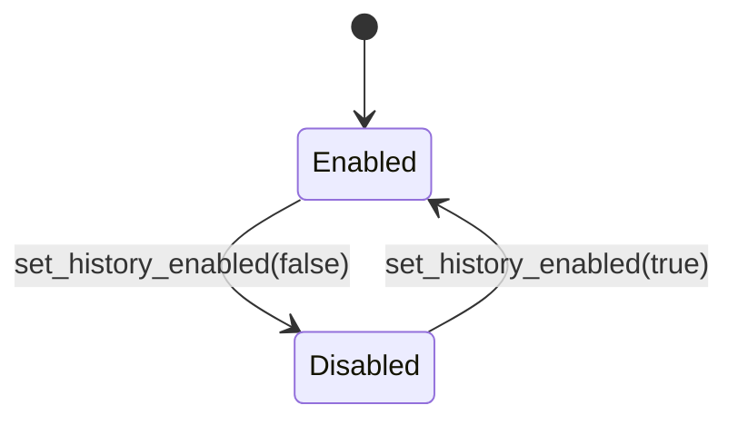

# 模块：core/events（EventBus：事件发布订阅）

## 系统概述 (System Overview)

`EventBus` 提供全局事件订阅/发射与事件历史记录，用于把核心逻辑的变化通知给 UI/调试系统。它通过事件类型字符串（如 `PHASE_CHANGED`、`COMMAND_EXECUTED`）来组织消息，并支持订阅优先级。它的核心价值在于降低显式依赖，但也会引入隐式调用链。

## 静态结构图 (PlantUML)

## 核心流程图 (PlantUML Sequence)

典型场景：**GameEngine 执行命令后发射事件，UI/系统订阅者接收**。

## 状态机/逻辑流 (Mermaid)

事件总线的状态主要是“历史记录开关/容量”与“序号递增”，不涉及复杂状态切换。

## 设计模式与要点 (Design Insights)

- **观察者模式**：订阅者通过回调接收事件，按优先级顺序执行。
- **事件历史**：用于调试与一致性排查（例如比较回放事件序列）。

维护要点：

1. 事件 payload 建议保持“可序列化、弱依赖 UI”，避免传 Node 引用或非确定性数据进入事件。
2. 优先级越多越难排查，建议只在确实存在顺序依赖时才使用不同 priority。
3. 如果事件回调内执行了 `execute_command`，可能形成重入/连锁调用；此类设计需谨慎并明确约束。

潜在耦合风险：

- EventBus 作为全局通道，容易成为“什么都往里塞”的依赖黑洞；长期建议建立事件命名规范与发布边界（哪些事件由 core 发、哪些由 UI 发）。
