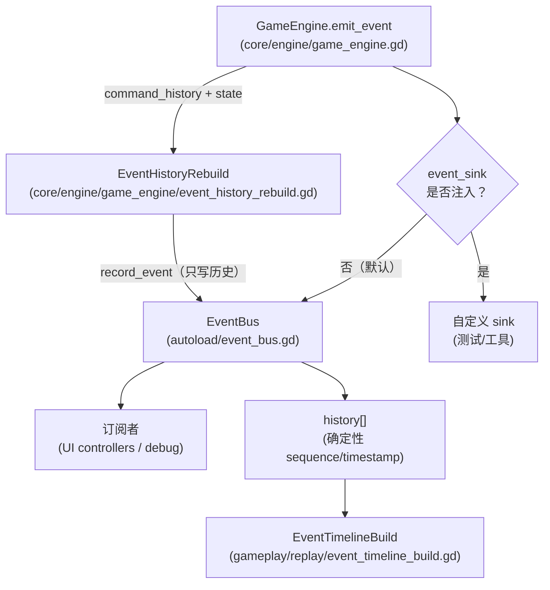

# 模块：EventBus（事件发布订阅 + 事件历史）

`EventBus` 位于 autoload（`autoload/event_bus.gd`），用于把引擎/规则变化通知 UI 与调试系统，并提供可检索的事件历史。

## 模块关系图（事件发射/历史/重建）


```mermaid
flowchart TB
  GE["GameEngine.emit_event\n(core/engine/game_engine.gd)"]
  Sink{"event_sink\n是否注入？"}
  EB["EventBus\n(autoload/event_bus.gd)"]
  Custom["自定义 sink\n(测试/工具)"]

  Subs["订阅者\n(UI controllers / debug)"]
  Hist["history[]\n(确定性 sequence/timestamp)"]

  Rebuild["EventHistoryRebuild\n(core/engine/game_engine/event_history_rebuild.gd)"]
  EventTL["EventTimelineBuild\n(gameplay/replay/event_timeline_build.gd)"]

  GE --> Sink
  Sink -->|"否（默认）"| EB
  Sink -->|"是"| Custom
  EB --> Subs
  EB --> Hist

  GE -->|"command_history + state"| Rebuild
  Rebuild -->|"record_event（只写历史）"| EB
  Hist --> EventTL
```

## API（以当前实现为准）

- 订阅：
  - `subscribe(event_type: String, callback: Callable, priority := 100, source := "")`
  - `unsubscribe(event_type, callback) -> bool`
  - `unsubscribe_all_from_source(source) -> int`
- 发射：
  - `emit_event(event_type, data := {})`
  - `emit_events(events: Array[Dictionary])`
- 历史：
  - `get_history(count := -1) -> Array[Dictionary]`
  - `get_history_by_type(event_type, count := -1)`
  - `clear_history()`
  - `clear_history_and_reset_sequence()`：用于“重建历史”
  - `record_event(event_type, data := {})`：只写历史，不触发订阅者

事件结构（简化）：

```text
{ type, data, sequence, timestamp, real_time_msec? }
```

其中 `timestamp == sequence`（确定性），`real_time_msec` 仅在 debug_mode 下用于展示。

## 与 GameEngine 的关系

`GameEngine.emit_event(...)` 默认转发到 autoload 的 `EventBus`，但引擎也支持 `set_event_sink(...)` 注入替代 sink。

用途：

- headless/测试：避免依赖 Node
- rewind/replay：用 `record_event` 重建事件历史而不触发运行期副作用

## 备注：core/events 目录（已移除）

历史上可能存在 `core/events/` 目录，但当前仓库已不再包含该目录；事件系统入口是 autoload 的 `EventBus`，core 侧事件输出通过 `GameEngine.emit_event(...)`（或注入 `event_sink`）完成。
