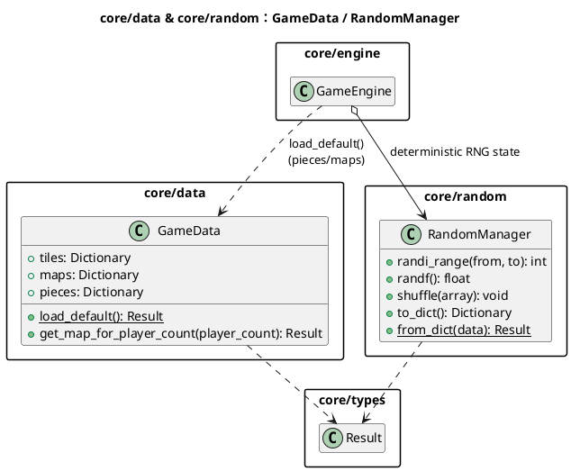
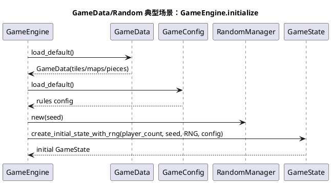
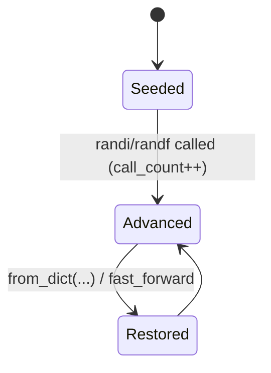

# 模块：core/data & core/random（确定性输入：数据与随机）

## 系统概述 (System Overview)

core/data 负责从 `res://data` 加载地图/板块/建筑件等定义，为规则系统提供稳定的静态输入。core/random 通过 `RandomManager` 封装确定性随机，确保在相同 seed 与命令序列下得到一致结果。两者共同支撑“存档可复现、回放可验证”的工程目标。

## 静态结构图 (PlantUML)

## 核心流程图 (PlantUML Sequence)

典型场景：**引擎初始化加载数据并构建随机/初始状态**。

## 状态机/逻辑流 (Mermaid)

数据加载是一次性流程；随机管理器的关键状态是调用计数（用于回放快进）。

## 设计模式与要点 (Design Insights)

- **数据驱动**：GameData 将 JSON 定义转为运行时对象，规则逻辑尽量不硬编码静态表。
- **可序列化 RNG 状态**：RandomManager 只记录 seed 与 call_count，以“快进”恢复状态，简化存档体积与回放一致性。

维护要点：

1. 任何涉及概率/抽取/洗牌的规则必须走 `RandomManager`，禁止用 `randi()`/`Time` 等全局非确定性来源。
2. 数据目录加载使用稳定排序（`json_files.sort()`），避免不同文件系统顺序导致初始化差异。
3. 若将来 RNG 行为变更（例如更换算法/调用路径），需要明确是否破坏旧存档重放，并相应提升 schema_version 或提供迁移策略。

潜在耦合风险：

- RandomManager 采用“call_count 快进”的恢复方式，要求所有随机调用路径与次数严格一致；若某些逻辑分支只在 UI/调试开关下触发随机，会导致回放失真，需严禁这类设计。
