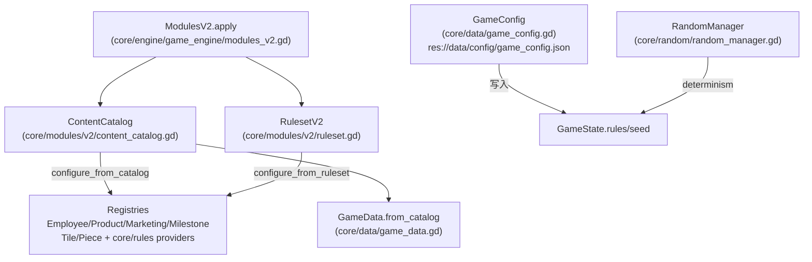

# 模块：数据与随机（GameConfig / ContentCatalog registries / RandomManager）

本仓库把“影响确定性的输入”分为两类：

1. **规则常量与初始配置**：`GameConfig`（来自 `res://data/config/game_config.json`）
2. **内容与可插拔规则**：模块系统 V2 装配出的 `ContentCatalog` 与 `RulesetV2`

随机由 `RandomManager` 统一封装，确保可回放一致性。

## 模块关系图（配置/内容/随机的装配路径）

```mermaid
flowchart TB
  CFG["GameConfig\n(core/data/game_config.gd)\nres://data/config/game_config.json"]
  MV2["ModulesV2.apply\n(core/engine/game_engine/modules_v2.gd)"]
  CC["ContentCatalog\n(core/modules/v2/content_catalog.gd)"]
  RS["RulesetV2\n(core/modules/v2/ruleset.gd)"]
  GD["GameData.from_catalog\n(core/data/game_data.gd)"]

  Regs["Registries\nEmployee/Product/Marketing/Milestone\nTile/Piece + core/rules providers"]

  RNG["RandomManager\n(core/random/random_manager.gd)"]
  GS["GameState.rules/seed"]

  CFG -->|"写入"| GS
  RNG -->|"determinism"| GS

  MV2 --> CC
  MV2 --> RS
  CC -->|"configure_from_catalog"| Regs
  RS -->|"configure_from_ruleset"| Regs
  CC --> GD
```

## GameConfig：规则常量与初始状态模板

代码：`core/data/game_config.gd`

- 从 `res://data/config/game_config.json` 读取
- 严格 schema 校验（版本不匹配 fail-fast）
- 初始化时写入 `GameState.rules`，保证存档/回放一致

## ContentCatalog + Registries（Strict Mode）

模块系统 V2 装配完成后，会把内容写入 `ContentCatalog`，并配置一组全局 registry（静态缓存）供 gameplay/actions、validators 与 UI 查询：

- `core/data/employee_registry.gd`
- `core/data/milestone_registry.gd`
- `core/data/product_registry.gd`
- `core/data/marketing_registry.gd`
- `core/map/tile_registry.gd`
- `core/map/piece_registry.gd`

这些 registry 都要求先由 `modules_v2` 装配配置，否则会 assert/fail-fast（避免隐式 fallback）。

## RandomManager：确定性随机

代码：`core/random/random_manager.gd`

- seed + call_count 可序列化（`to_dict`/`from_dict`）
- `from_dict` 通过 fast_forward 恢复状态
- 所有随机行为必须使用 `RandomManager`（禁止 `randi()`/真实时间等非确定性来源）

## 初始化的真实链路（入口指北）

新局初始化见：`core/engine/game_engine/initializer.gd`

- 若 `enabled_modules_v2` 为空，会回退到默认模块集合（`core/engine/game_defaults.gd`）
- 若 `modules_v2_base_dir` 为空，会回退到默认目录（通常 `res://modules`，可用 `;` 拼多个）
