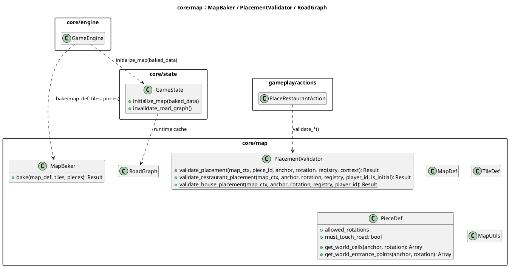
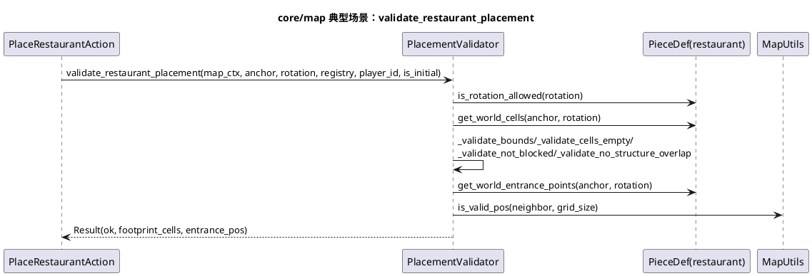

# 模块：core/map（地图系统：烘焙、放置校验与缓存）

## 系统概述 (System Overview)

core/map 管理地图从静态定义到运行时格子数据的构建（MapBaker），以及建筑放置的规则校验（PlacementValidator）。它还包含道路图等运行时缓存（RoadGraph），用于距离/可达性等计算加速。该模块是“空间规则”的唯一可信来源，动作层只应调用其公开 API，而不应自行复制校验逻辑。

## 静态结构图 (PlantUML)



## 核心流程图 (PlantUML Sequence)

典型场景：**放置餐厅前的校验链**（边界、格子可用、道路邻接、入口道路可达等）。



## 状态机/逻辑流 (Mermaid)

地图模块的关键“逻辑流”是：**地图烘焙 -> 写入 GameState.map -> 动作写入结构 -> 使道路缓存失效**。

```mermaid
flowchart TD
  A[GameData maps/tiles/pieces] --> B[MapBaker.bake]
  B --> C[GameState.initialize_map<br/>(write GameState.map)]
  C --> D[Actions write map structures<br/>(place/move/add_garden)]
  D --> E[GameState.invalidate_road_graph]
```

## 设计模式与要点 (Design Insights)

- **管道式校验链**：PlacementValidator 把放置规则拆成可组合的校验函数，便于扩展与定位错误。
- **缓存失效策略**：RoadGraph 等派生结构按需构建，写入地图后必须显式失效。

维护要点：

1. 放置相关规则（是否必须邻接道路、占地/入口定义）应该由 `PieceDef` 和 `PlacementValidator` 表达；动作层只负责“业务约束 + 写入结果”。
2. `map_ctx` 以 Dictionary 传递，字段缺失/类型错误可能在运行期才暴露；建议在校验入口处补齐关键字段的 Fail Fast 检查。
3. 初始放置限制（如“每板块只能有一个餐厅入口”）属于地图规则，应持续保持在 map 模块内，避免在多个动作里重复实现。

潜在耦合风险：

- map 数据结构同样是嵌套 Dictionary/Array，动作对其键名强耦合；地图 schema 演进时建议先定义“兼容层/迁移策略”，否则会牵一发而动全身。
