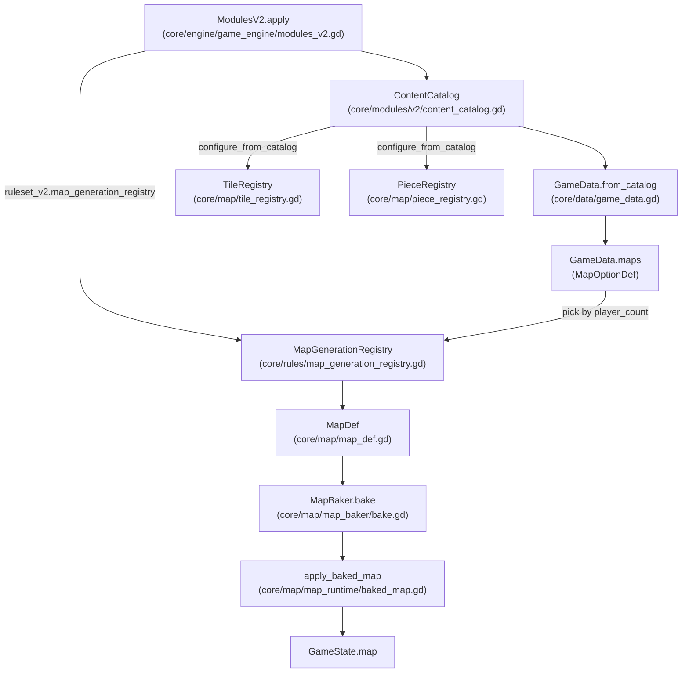

# 模块：core/map（地图生成/烘焙/运行时结构/放置校验/道路缓存）

地图系统把“静态地图定义/板块定义/棋子定义”转成 `GameState.map` 的运行时结构，并提供放置校验与道路图缓存。

## 模块关系图（模块内容 → 地图生成/烘焙 → state.map）

```mermaid
flowchart TB
  MV2["ModulesV2.apply\n(core/engine/game_engine/modules_v2.gd)"]
  CC["ContentCatalog\n(core/modules/v2/content_catalog.gd)"]
  GD["GameData.from_catalog\n(core/data/game_data.gd)"]

  TileReg["TileRegistry\n(core/map/tile_registry.gd)"]
  PieceReg["PieceRegistry\n(core/map/piece_registry.gd)"]
  MapOpts["GameData.maps\n(MapOptionDef)"]

  MapGen["MapGenerationRegistry\n(core/rules/map_generation_registry.gd)"]
  MapDef["MapDef\n(core/map/map_def.gd)"]
  Bake["MapBaker.bake\n(core/map/map_baker/bake.gd)"]
  Apply["apply_baked_map\n(core/map/map_runtime/baked_map.gd)"]
  StateMap["GameState.map"]

  MV2 --> CC
  CC -->|"configure_from_catalog"| TileReg
  CC -->|"configure_from_catalog"| PieceReg
  CC --> GD
  GD --> MapOpts

  MV2 -->|"ruleset_v2.map_generation_registry"| MapGen
  MapOpts -->|"pick by player_count"| MapGen
  MapGen --> MapDef
  MapDef --> Bake
  Bake --> Apply
  Apply --> StateMap
```

## 输入：内容来自模块系统 V2

地图相关内容通过 V2 装配进入 registry：

- tile：`core/map/tile_registry.gd`（`TileDef`）
- piece：`core/map/piece_registry.gd`（`PieceDef`）
- map option：`GameData.maps`（`MapOptionDef`，由 `GameData.from_catalog(...)` 聚合）

地图生成规则由模块注册到：

- `core/rules/map_generation_registry.gd`

## Map 生成与烘焙

- MapOption/MapDef：
  - `core/map/map_option_def.gd`
  - `core/map/map_def.gd`
- 烘焙入口：
  - `core/map/map_baker/bake.gd`：`MapBaker.bake(map_def, tile_registry, piece_registry)`
- 写入 GameState：
  - `core/map/map_runtime/baked_map.gd`：`apply_baked_map(state, baked_data)`（同时初始化 map 核心 key 并 invalidate RoadGraph）

## 放置校验（Placement Validator）

放置校验被拆分到 `core/map/placement_validator/*`：

- 通用放置入口：`core/map/placement_validator/placement.gd`
- 餐厅放置：`core/map/placement_validator/restaurant_placement.gd`
- 多个小校验器：`core/map/placement_validator/validators.gd`
- 访问器：`core/map/placement_validator/map_access.gd`

动作层（`gameplay/actions/*`）应调用这些校验函数，而不是复制校验逻辑。

## 道路图与缓存失效

- RoadGraph：`core/map/road_graph.gd` + `core/map/road_graph/*`
- 缓存容器：`core/map/map_runtime/road_graph_cache.gd`

约定：任何修改地图结构（放置/移动/添加花园/生成棋盘外组件）都必须 invalidate road graph，否则距离/路径计算可能错误。
