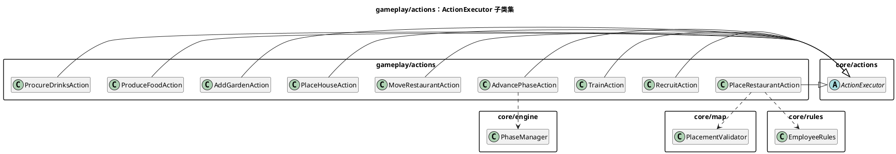
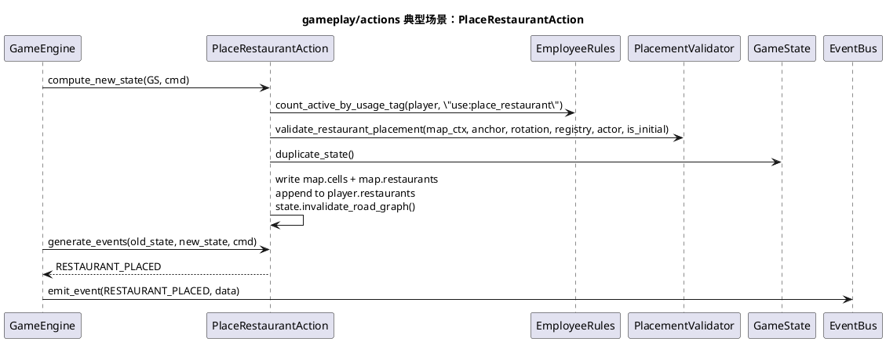
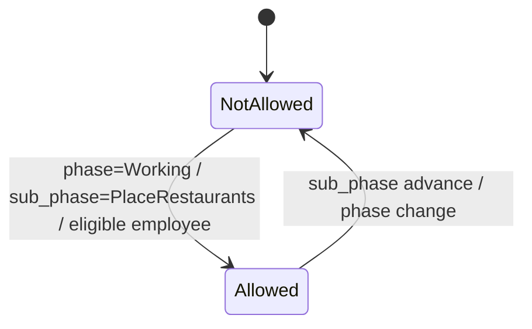

# 模块：gameplay/actions（规则动作实现）

## 系统概述 (System Overview)

gameplay/actions 以 `ActionExecutor` 子类的形式实现具体规则动作（如招聘、培训、放置、推进阶段等）。每个动作负责：参数校验、业务约束校验、对 `GameState` 的局部写入，以及生成对外事件。该模块是规则变化最频繁的区域，工程化目标是“新增动作不影响其他动作、且可被回放/测试验证”。

## 静态结构图 (PlantUML)

## 核心流程图 (PlantUML Sequence)

典型场景：**PlaceRestaurantAction 的“校验 + 写入 + 事件”**（该动作同时覆盖：子阶段限制、员工能力消耗、地图放置校验、道路缓存失效）。

## 状态机/逻辑流 (Mermaid)

动作实现的关键约束通常以“阶段/子阶段守卫条件”呈现（例如 PlaceRestaurant 仅允许在 `Working/PlaceRestaurants`）。

## 设计模式与要点 (Design Insights)

- **单一动作 = 单一写入单元**：一个 action_id 对应一个执行器，便于测试与回放定位。
- **Fail Fast 参数解析**：大量使用 `require_*_param` 进行严格类型解析，减少运行期隐式转换。

维护要点：

1. 事件生成以“old_state vs new_state”差分推导为主（例如找新增 restaurant_id），避免在 `_apply_changes` 里拼装事件数据时遗漏/不一致。
2. 动作里如果需要跨模块规则（例如公司结构、员工限制），优先调用 rules/validator 的公共函数，不在动作中复制逻辑。
3. Working 子阶段的“次数消耗/强制动作完成”等应统一走 `round_state.action_counts` 或专门规则函数，避免每个动作自行维护计数口径。

潜在耦合风险：

- 动作实现普遍对 `GameState` 的嵌套键名有强依赖（例如 `state.map.cells[y][x]`、`state.players[player_id]["restaurants"]`），大规模重构 schema 的成本很高；建议在动作层引入少量“领域访问器”作为缓冲。
