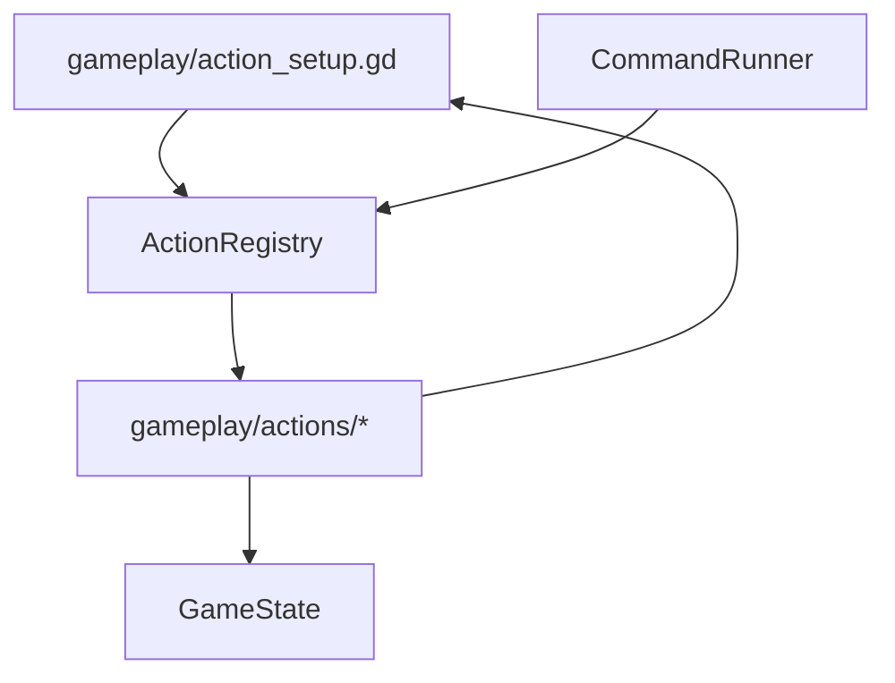

# 模块：`gameplay/actions`（内建动作实现）

`gameplay/actions` 提供当前项目的内建 `ActionExecutor` 实现，并由默认 action setup provider 统一注册到 `ActionRegistry`。

默认 provider：`res://gameplay/action_setup.gd`

## 模块关系图（actions 如何进入引擎执行链）

```mermaid
flowchart TB
  Provider["gameplay/action_setup.gd"]
  Actions["gameplay/actions/*"]
  AR["ActionRegistry"]
  Runner["CommandRunner"]
  State["GameState"]

  Actions --> Provider --> AR
  Runner --> AR --> Actions --> State
```

## 当前内建动作（以 `gameplay/action_setup.gd` 为准）

当前默认注册的动作包括：

- 阶段推进/跳过：`advance_phase`、`skip`、`skip_sub_phase`、`end_turn`
- Setup / 顺序：`select_reserve_card`、`choose_turn_order`
- 重组：`restructure_employee`、`set_company_structure_direct`、`set_company_structure_report`、`submit_restructuring`
- 招聘/培训/解雇：`recruit`、`train`、`fire`
- 地图放置：`place_restaurant`、`move_restaurant`、`place_house`、`add_garden`
- 经营：`initiate_marketing`、`set_price`、`set_discount`、`set_luxury_price`
- 生产/进货：`produce_food`、`procure_drinks`
- 结算/特殊选择：`confirm_dinnertime`、`choose_fridge_keep`、`choose_kimchi_storage`
- 联机/局面：`forfeit_player`
- 调试：`debug_give_money`、`debug_add_house_demand`、`debug_add_inventory`

> action id 常量统一见：`core/actions/action_ids.gd`

## 结构约定（通用）

动作实现应满足：

- `validate` 纯函数：不写 state、不触发随机、不发事件
- `compute_new_state` 默认 copy-on-write
- 地图相关动作在写入后必须失效相应运行时缓存（如 `RoadGraph`）
- `generate_events` 只根据 `old_state / new_state / command` 推导事件

## 与模块系统 V2 的关系

模块可通过 `RulesetV2` 扩展动作层：

- 注册新的 `ActionExecutor`
- 为内建/模块动作注册 validator
- 覆盖动作可用点位（availability override）

对应装配点：`core/engine/game_engine/action_wiring.gd`
