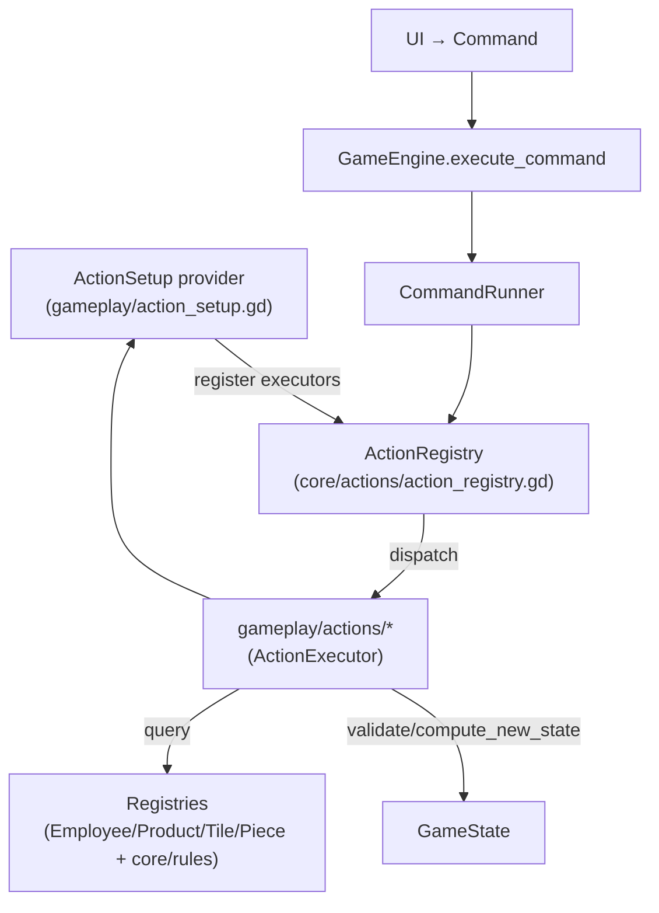

# 模块：gameplay/actions（内建动作实现）

`gameplay/actions` 提供内建 `ActionExecutor` 实现（玩法层），并由 action setup provider 统一注册到 `ActionRegistry`。

默认 provider：`res://gameplay/action_setup.gd`（由 `ProjectSettings["fcm/action_setup_provider_path"]` 指定）

## 模块关系图（actions 如何进入引擎执行链）

```mermaid
flowchart TB
  Provider["ActionSetup provider\n(gameplay/action_setup.gd)"]
  Actions["gameplay/actions/*\n(ActionExecutor)"]
  AR["ActionRegistry\n(core/actions/action_registry.gd)"]

  UI["UI → Command"]
  GE["GameEngine.execute_command"]
  Runner["CommandRunner"]
  GS["GameState"]
  Regs["Registries\n(Employee/Product/Tile/Piece + core/rules)"]

  Actions --> Provider
  Provider -->|"register executors"| AR

  UI --> GE --> Runner --> AR
  AR -->|"dispatch"| Actions
  Actions -->|"validate/compute_new_state"| GS
  Actions -->|"query"| Regs
```

## 当前内建动作（以 provider 注册列表为准）

参见：`gameplay/action_setup.gd`

包含但不限于：

- 阶段推进/跳过：`advance_phase`、`skip`、`skip_sub_phase`、`end_turn`
- Setup：`select_reserve_card`
- 重组/顺序：`choose_turn_order`、`submit_restructuring`、`restructure_employee`、`set_company_structure_*`
- 招聘/培训/解雇：`recruit`、`train`、`fire`
- 地图相关：`place_restaurant`、`move_restaurant`、`place_house`、`add_garden`
- 经营：`set_price`、`set_discount`、`set_luxury_price`
- 生产/进货：`produce_food`、`procure_drinks`
- 调试：`debug_give_money`、`debug_add_inventory`、`debug_add_house_demand`

> 以 `ActionIds` 常量为准：`core/actions/action_ids.gd`

## 结构约定（通用）

动作应满足：

- `validate` 纯函数（禁止写 state/触发随机/发事件）
- `compute_new_state` 默认 copy-on-write（写入局部结构，必要时 invalidate 缓存）
- `generate_events` 只基于 old/new state 与 command 推导事件（避免在 `_apply_changes` 里拼装不一致数据）

## 与模块系统 V2 的关系

模块可以通过 `RulesetV2.register_action_executor(...)` 注册额外动作，或通过 validator/availability override 对内建动作做门禁与校验增强。
