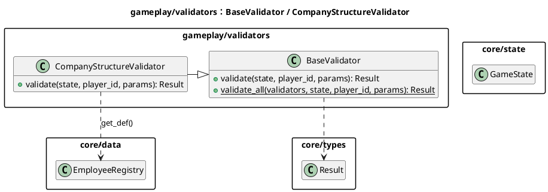
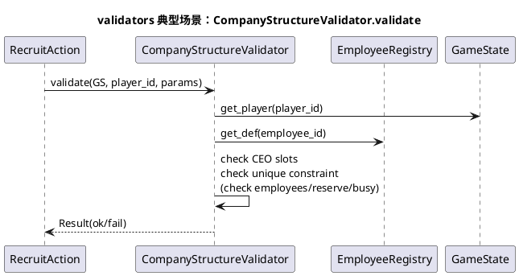
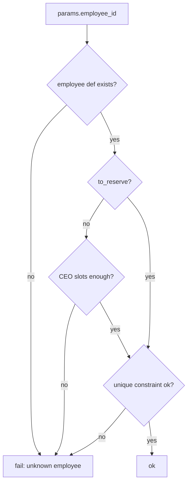

# 模块：gameplay/validators（动作前置校验）

## 系统概述 (System Overview)

gameplay/validators 提供可复用的“动作前置校验器”，用于在动作执行前快速拒绝非法请求。它们多为纯函数式校验，不修改状态，并返回 `Result` 说明失败原因。该模块的存在可以把复杂约束从动作实现中抽离，减少重复与分歧。

## 静态结构图 (PlantUML)

## 核心流程图 (PlantUML Sequence)

典型场景：**招聘动作执行前，公司结构校验（CEO 卡槽 + 唯一员工约束）**。

## 状态机/逻辑流 (Mermaid)

校验器不维护状态机；其逻辑通常表现为“守卫条件”。

## 设计模式与要点 (Design Insights)

- **职责分离**：把“可复用、跨动作”的约束放到 validators/rules，让动作实现更聚焦于状态写入。
- **Fail Fast + 可读错误信息**：校验失败原因会直接影响 UI 反馈与调试效率。

维护要点：

1. 校验器应保持纯函数：不写 state、不触发随机、不发事件。
2. 校验器的参数解析要与动作保持一致（同一参数名/同一兼容策略），否则会出现“动作能执行但 validator 拒绝”的割裂体验。
3. 当校验依赖数据表（EmployeeRegistry 等）时，需明确数据加载时机与缺失策略（缺失应明确失败，不要 silent fallback）。

潜在耦合风险：

- validator 过多且分散会导致“规则在哪里判断”不透明；建议按领域聚合（公司结构/地图放置/经济系统）并在索引中给出入口。

