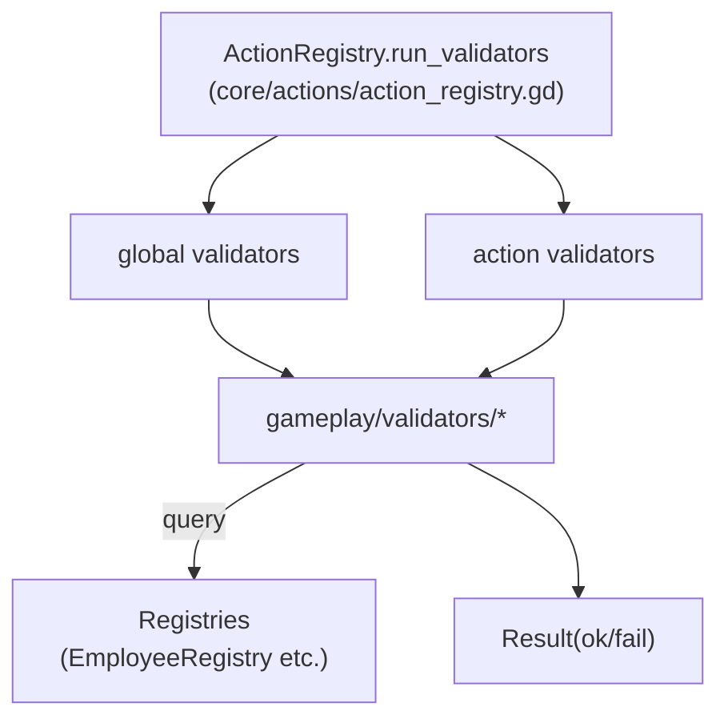

# 模块：gameplay/validators（复用校验器）

`gameplay/validators` 提供可复用的“动作前置校验器”，目标是减少 actions 内的重复约束与分歧。

当前包含：

- `gameplay/validators/base_validator.gd`：通用参数解析与组合调用
- `gameplay/validators/company_structure_validator.gd`：公司结构约束（CEO 卡槽、唯一员工等）

## 模块关系图（validators 在哪里运行）

```mermaid
flowchart TB
  AR["ActionRegistry.run_validators\n(core/actions/action_registry.gd)"]
  GV["global validators"]
  AV["action validators"]
  V["gameplay/validators/*"]
  Regs["Registries\n(EmployeeRegistry etc.)"]
  Result["Result(ok/fail)"]

  AR --> GV
  AR --> AV
  GV --> V
  AV --> V
  V -->|"query"| Regs
  V --> Result
```

## 约定

- 纯函数：不写 `GameState`、不触发随机、不发事件
- Fail fast：对 params/玩家字段做严格类型校验，直接返回可读错误
- 依赖 registry：例如 `EmployeeRegistry` 必须已由模块系统 V2 配置完成（否则应 fail-fast）

## 与 ActionRegistry validators 的分工

- “动作内部的领域约束”可以由 validators 复用（例如公司结构）
- “跨动作的全局约束/门禁”更适合用 `ActionRegistry.register_global_validator` 或 `register_validator(action_id, ...)`
  - 模块系统 V2 也可以注入这些 validators（见 `RulesetV2.register_*_action_validator`）
