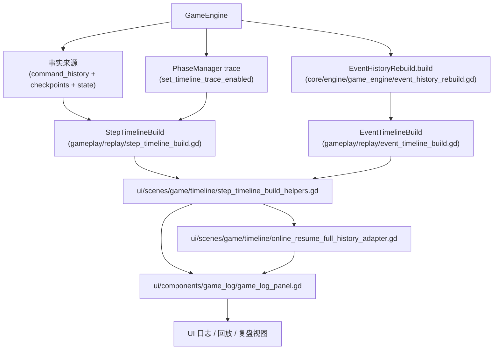

# 模块：gameplay/replay（派生时间线：StepTimeline / EventTimeline）

`gameplay/replay/` 属于 gameplay 层：它不负责改变规则与执行命令，而是从 `GameEngine` 的“命令历史 + 状态”派生出 **UI / 回放 / 复盘 / 日志** 需要的稳定时间线视图。

核心目标：

- 把“命令（Command）时间线”提升为“可停留的语义 step 时间线”（跨 phase 的切分点）
- 构建一条“完整事件时间线”，用于日志面板稳定排序与回放展示
- 保持确定性：时间线构建不依赖实时信号订阅，而是以引擎内部事实来源重建
- 在联机恢复房中支持：
  - **prebuilt timeline 复用**
  - **prebuilt timeline entries 复用**
  - **增量 append**

## 模块关系图（从引擎事实来源派生时间线）



## StepTimeline：语义步进时间线（step_index）

入口：`gameplay/replay/step_timeline_build.gd`

返回结构（以当前实现为准）：

```text
{
  initial_state_dict,
  steps: Array[Dictionary],
  events: Array[Dictionary]
}
```

关键约定（摘要，详见实现文件头注释）：

- `step_index = -1` 表示初始状态（来自 `checkpoints[0].state_dict`），不计入 `steps`
- phase 变化会插入新的 step；Working 内的 sub_phase 自动推进尽量“打包”到同一个 step（只更新快照）
- 事件会被标注 `command_index` 与 `step_index`，并带 `sequence/timestamp` 以便 UI 稳定排序
- 部分“离开阶段时发射”的事件（例如 `*_REPORT`）会归属到旧阶段（`phase_segment`），避免显示落在新阶段标题下

step 的基本字段由 helper 构建（`gameplay/replay/step_timeline_build/helpers.gd`）：

- `kind`：step 类型（例如 `"command"` / `"phase"`）
- `anchor_command_index`：该 step 锚定的命令 index
- `round / phase / sub_phase`
- `state_dict`：该 step 的状态快照（`GameState.to_dict()`）

## EventTimeline：完整事件时间线（command_index）

入口：`gameplay/replay/event_timeline_build.gd`

语义：

- 永远包含初始化事件（`command_index = -1`，`GAME_STARTED`）
- 其余事件通过 `EventHistoryRebuild` 按命令重建，并为每条事件补齐 `command_index`
- 为 UI 提供稳定的 `sequence/timestamp`（纯确定性序号），避免依赖 `real_time_msec`

相关实现：

- 事件重建：`core/engine/game_engine/event_history_rebuild.gd`
- 初始化事件数据：`core/engine/game_engine/game_started_event_build.gd`

## StepTimelineBuildHelpers：UI 侧装配层

代码：`ui/scenes/game/timeline/step_timeline_build_helpers.gd`

它负责把 gameplay 层构建出的 `timeline` 装配成 UI 可直接消费的结构：

```text
{
  timeline,
  entries,
  appended_entries,
  append_applied,
  steps,
  head_step_index,
}
```

当前支持三条主要路径：

### 1. 全量构建

- `build_step_timeline(engine, previous_timeline, false)`
- `build_info_from_timeline(timeline)`

用途：

- 普通对局初次构建
- 无可复用 baseline 时的 fallback

### 2. 预构建 timeline + entries 直载

- `load_prebuilt_timeline(timeline, ...)`
- `load_prebuilt_timeline_with_entries(timeline, entries, ...)`

用途：

- 恢复房完整历史已经预构建完成
- 避免再次从 `events` 重新格式化整份日志 entries

### 3. 增量 append

- `build_step_timeline(engine, previous_timeline, true)`
- 内部调用 `StepTimelineBuild.append_from_existing(...)`

输出：

- `append_applied = true`
- `appended_entries`

用途：

- 只在尾部新增了少量命令时，避免 full rebuild

## 联机恢复房：完整历史适配层

代码：`ui/scenes/game/timeline/online_resume_full_history_adapter.gd`

这个适配层的目标是：

- **保持 `runtime_engine` 作为 live active engine**
- **让 `full_replay_engine` 只承担按需完整历史视图**

当前实现要点：

1. 从 `OnlineResumeSessionState` 读取：
   - `full_replay_step_timeline`
   - `full_replay_step_timeline_entries`
   - `full_replay_live_tail_commands`
2. 在 `previous_timeline` 与 `cached_timeline` 之间选择更合适的 baseline
3. 当 processed command count 一致时，优先复用 prebuilt entries
4. 当只新增尾部命令时，优先走 incremental append
5. 把 runtime command index 映射到 full-history step index，用于恢复房下的日志 cursor / seek / replay 显示

### 当前已确认的问题（历史结论）

最新联机日志表明：把**实时日志视图**也默认建立在 `full_replay_engine + cached timeline / entries` 之上，仍然会造成明显卡顿。

根因不是服务器慢，而是以下链路仍会在 live `command_applied` 后发生：

- 完整历史 timeline cache refresh
- 日志 timeline / entries 再装配
- `GameLogPanel.load_step_timeline(...)` 或 append path 的大对象比较
- descriptor 计算与主线程 UI layout

因此，这一适配层虽然已经减少了重复 full rebuild，但**默认依赖 full-history 作为 live 日志源**本身仍是热路径风险点。

### P0 第一阶段后的读源边界（当前实现）

当前代码已经收敛为：

- `build_live_history_view(...)`
  - 只从 `runtime_engine` 构建 live step timeline
- `build_online_resume_full_history_view_for_command(...)`
  - 只在用户显式进入 History View / seek 历史时读取 `full_replay_engine`
- 从完整历史返回最新时
  - `GameTimelineController` 会重新恢复 runtime live timeline

换句话说：

- `full_replay_engine` 仍保留，用于“完整历史可看”
- 但它已经不再默认承担“每条 live 命令都要立刻驱动日志 UI”的职责

## 日志面板如何消费 timeline

代码：

- `ui/components/game_log/game_log_panel.gd`
- `ui/components/game_log/game_log_unified_timeline_builder.gd`
- `ui/components/game_log/game_log_timeline_background_worker.gd`

当前日志面板支持两种时间线消费模式：

### 1. `load_step_timeline(...)`

- 用于首次载入 timeline
- 可走同步 rebuild，也可走后台 descriptor rebuild

### 2. `append_step_timeline(...)`

- 用于尾部 append
- 当前实现已支持：
  - 只传 **新增 timeline entries**
  - descriptor append
  - 后台 append job
  - item pool 复用
  - visible entry count cache

### 3. timeline state 局部刷新

`GameLogPanel` 当前还会维护一层轻量 UI index，用于把“日志项结构构建”和“cursor/head 状态刷新”拆开：

- `timeline_index -> exact items`
- `timeline_index -> first visible item`
- 小规模 `phase_header / round_header` 缓存

这样在常见的 live 场景里：

- `cursor/head: n -> n+1`
  - 不再全量扫描所有日志项
  - 只刷新受影响的 exact items 与少量 headers
- 历史视图停留在旧 cursor 时，若只是 `head` 前进且 future/past 关系未变化
  - `apply_timeline_state` 可直接 skip
- `scroll_to_cursor`
  - 也优先复用 first visible item index，而不是重新线性扫描整列日志

这意味着时间线层与日志 UI 层现在是显式分离的：

- timeline / entries 负责“数据语义”
- descriptor / items 负责“展示结构”

## UI 如何使用

`ui/scenes/game/timeline/controller.gd` 会在以下场景中消费这些派生时间线：

- 回放（Replay）
- 复盘（History view）
- 联机恢复房完整历史查看
- 实时日志视图（`apply_live_log_timeline_from_engine()`）

恢复房下，live 与 history 的数据源不一定是同一个 engine：

- **live action / authoritative client view**：`runtime_engine`
- **full history timeline / replay / on-demand history log**：`full_replay_engine` + cached timeline / entries

### P0 演进方向

后续为根治卡顿，恢复房将进一步收敛为：

- **实时联机默认只消费 runtime 侧增量**
  - 实时日志 append
  - 实时 timeline head / cursor
  - 当前可操作界面
- **完整历史 timeline / log 只在按需模式消费**
  - Replay
  - History View
  - 完整历史 seek

也就是说：

- `full_replay_engine` 仍然保留，用于“完整历史可看”
- 但它不再默认承担“每条 live 命令都要立刻驱动日志 UI”的职责

## 测试

基础时间线构建测试：

- `core/tests/event_timeline_build_test.gd`
- `core/tests/step_timeline_build_test.gd`
- `core/tests/step_timeline_incremental_append_test.gd`

恢复房完整历史 / cache / append 相关测试：

- `core/tests/net_client_online_resume_cached_timeline_forwarding_test.gd`
- `core/tests/online_resume_full_history_tail_append_test.gd`
- `ui/scenes/tests/game_log_panel_step_timeline_append_test.gd`

这些测试覆盖：

- prebuilt timeline 转发
- prebuilt entries 转发
- full-history tail append
- 日志面板同步 / 异步 append
