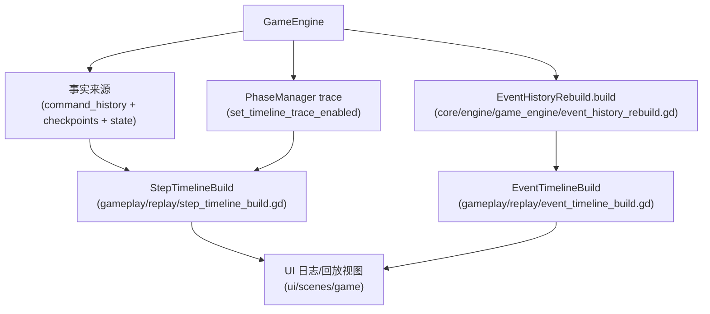

# 模块：gameplay/replay（派生时间线：StepTimeline / EventTimeline）

`gameplay/replay/` 属于 gameplay 层：它不负责改变规则与执行命令，而是从 `GameEngine` 的“命令历史 + 状态”派生出 **UI/回放/日志** 需要的稳定时间线视图。

核心目标：

- 把“命令（Command）时间线”提升为“可停留的语义 step 时间线”（跨 phase 的切分点）；
- 构建一条“完整事件时间线”，用于日志面板稳定排序与回放展示；
- 保持确定性：时间线构建不依赖实时信号订阅，而是以引擎内部事实来源重建。

## 模块关系图（从引擎事实来源派生时间线）



## StepTimeline：语义步进时间线（step_index）

入口：`gameplay/replay/step_timeline_build.gd`

返回结构（以当前实现为准）：

```text
{
  initial_state_dict,
  steps: Array[Dictionary],
  events: Array[Dictionary]
}
```

关键约定（摘要，详见实现文件头注释）：

- `step_index = -1` 表示初始状态（来自 `checkpoints[0].state_dict`），不计入 `steps`；
- phase 变化会插入新的 step；Working 内的 sub_phase 自动推进尽量“打包”到同一个 step（只更新快照）；
- 事件会被标注 `command_index` 与 `step_index`，并带 `sequence/timestamp` 以便 UI 稳定排序；
- 部分“离开阶段时发射”的事件（例如 `*_REPORT`）会归属到旧阶段（`phase_segment`），避免显示落在新阶段标题下。

step 的基本字段由 helper 构建（`gameplay/replay/step_timeline_build/helpers.gd`）：

- `kind`：step 类型（例如 `"command"`/`"phase"`）
- `anchor_command_index`：该 step 锚定的命令 index
- `round/phase/sub_phase`
- `state_dict`：该 step 的状态快照（`GameState.to_dict()`）

## EventTimeline：完整事件时间线（command_index）

入口：`gameplay/replay/event_timeline_build.gd`

语义：

- 永远包含初始化事件（`command_index = -1`，`GAME_STARTED`）；
- 其余事件通过 `EventHistoryRebuild` 按命令重建，并为每条事件补齐 `command_index`；
- 为 UI 提供稳定的 `sequence/timestamp`（纯确定性序号），避免依赖 `real_time_msec`。

相关实现：

- 事件重建：`core/engine/game_engine/event_history_rebuild.gd`
- 初始化事件数据：`core/engine/game_engine/game_started_event_build.gd`

## UI 如何使用

`ui/scenes/game/game.gd` 会在回放/复盘（seek 历史）场景中构建这些派生时间线，用于：

- 日志面板顶部 ReplayBar 的 seek
- 历史指针位置的只读浏览（避免未显式进入编辑模式就分叉时间线）

## 测试

时间线构建有对应的 headless 测试（入口汇总在 `ui/scenes/tests/all_tests.gd`）：

- `core/tests/event_timeline_build_test.gd`
- `core/tests/step_timeline_build_test.gd`
