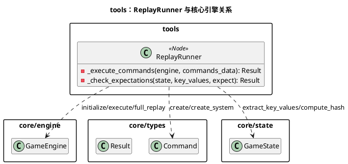
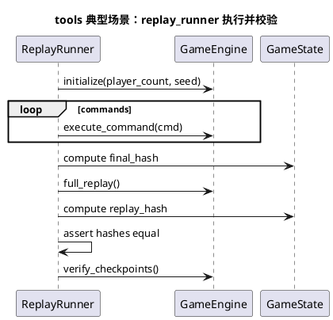
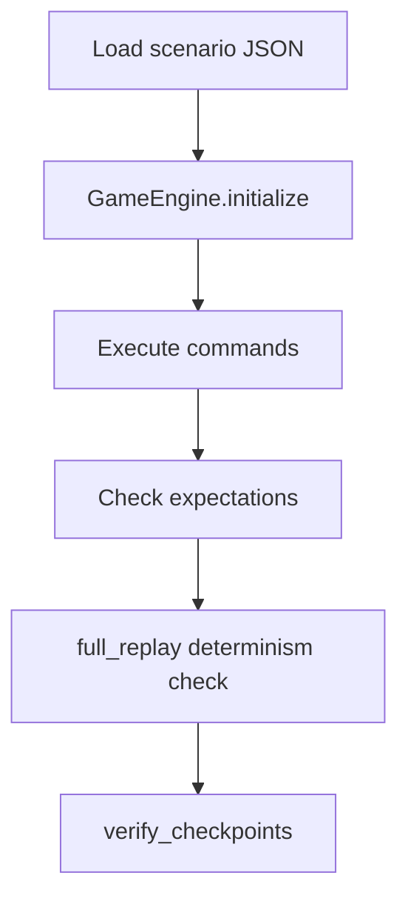

# 模块：tools（回放/确定性验证工具）

## 系统概述 (System Overview)

tools 模块提供开发期脚本，用于在 headless 模式下执行一组命令并验证最终状态与确定性。`tools/replay_runner.gd` 会加载 JSON 场景、初始化引擎、逐条执行命令、校验期望值，并进行一次 `full_replay` 哈希一致性检查。它是定位“非确定性/回放不一致”问题的第一入口。

## 静态结构图 (PlantUML)

## 核心流程图 (PlantUML Sequence)

典型场景：**运行一个 replay 场景并验证确定性**。

## 状态机/逻辑流 (Mermaid)

## 设计模式与要点 (Design Insights)

- **黄金回放（Golden Replay）**：用固定命令序列与期望值锁定规则行为，辅助回归与确定性排查。
- **确定性护栏**：通过“二次重放哈希一致”快速发现隐藏的非确定性来源。

维护要点：

1. 场景 JSON 中 actor 可用 `system/current/数字`，建议在新增测试场景时优先用 `current` 降低对 turn_order 的耦合。
2. 若新增规则引入随机或时间依赖，必须把影响显式纳入 `Command.params` 或 `RandomManager`；否则该工具会第一时间报哈希不一致。
3. `expect.key_values` 是子集匹配：适合做稳定断言，但不要把易变字段（例如调试字段）纳入断言集。

潜在耦合风险：

- 如果 `extract_key_values()` 口径变化，会导致大量场景期望需要更新；建议把关键值定义视为“测试 API”，变更需谨慎并同步更新文档/场景。
