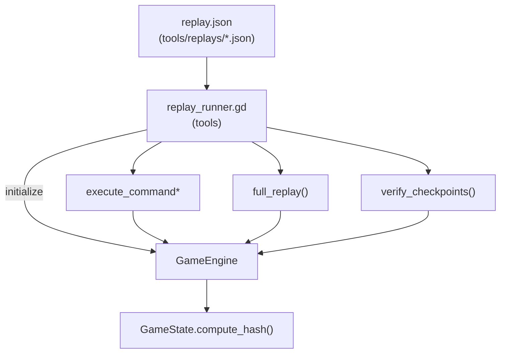

# 模块：tools（回放/确定性验证工具）

本仓库提供一个开发期 replay runner，用于在 headless 模式下执行一组命令并验证确定性：

- 脚本：`tools/replay_runner.gd`
- replay 数据：`tools/replays/`（`*.json`）

## 模块关系图（replay_runner 做了什么）


```mermaid
flowchart TB
  ReplayFile["replay.json\n(tools/replays/*.json)"]
  Runner["replay_runner.gd\n(tools)"]
  Engine["GameEngine"]
  Exec["execute_command*"]
  Replay["full_replay()"]
  Hash["GameState.compute_hash()"]
  Checkpoints["verify_checkpoints()"]

  ReplayFile --> Runner
  Runner -->|"initialize"| Engine
  Runner --> Exec --> Engine
  Runner --> Replay --> Engine
  Engine --> Hash
  Runner --> Checkpoints --> Engine
```

## 用法

```bash
godot --headless --path . --script res://tools/replay_runner.gd -- res://tools/replays/m1_phase_cycle_22.json
```

runner 会：

1. `GameEngine.initialize(player_count, seed)`（若未显式传 modules，会使用默认模块集合）
2. 逐条 `execute_command`
3. 校验 `expect`（可选）
4. `full_replay()` 后对比 `GameState.compute_hash()`（确定性检查）
5. `verify_checkpoints()`（校验点 hash 检查）

## 场景 JSON 约定（以脚本解析为准）

- `actor` 支持：
  - `"system"`：系统命令（等价于 `Command.create_system`）
  - `"current"`：当前玩家（运行期从 `state.get_current_player_id()` 推导）
  - 数字：直接作为 player_id
