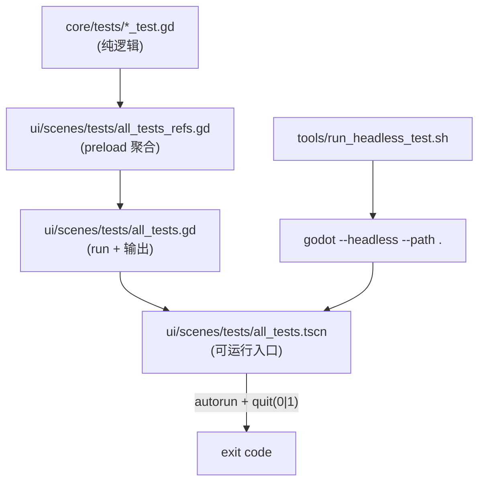

# 测试分层（core/tests + ui/scenes/tests）

本仓库的测试主要分为两层：

1. **纯逻辑测试**：`core/tests/`（`*_test.gd`；RefCounted，直接返回 `Result`）
2. **可运行测试场景（headless）**：`ui/scenes/tests/`（`*.tscn`；负责 autorun、日志输出与退出码）

更完整的 CLI 约定与脚本化执行方式见：`docs/testing.md`

## 模块关系图（core/tests 与 headless 场景的关系）

## core/tests：纯逻辑测试

特点：

- 不依赖 UI/Node 场景树（避免 headless 环境差异）
- 固定 seed/固定输入，优先验证 determinism（hash/关键值）
- 覆盖 Strict Mode 的 fail-fast 行为（解析/存档/模块装配/不变量等）

调用方式（典型）：

- `SomeTestClass.run(...) -> Result`

聚合入口（当前默认）：

- `ui/scenes/tests/all_tests.gd` 通过 preload 引入大量 `core/tests/` 下的测试类，并按固定顺序执行。

## ui/scenes/tests：headless 可运行入口

推荐入口：

- 全部测试：`ui/scenes/tests/all_tests.tscn`（脚本 `ui/scenes/tests/all_tests.gd`）

运行约定：

- 支持 `-- --autorun`（从 `OS.get_cmdline_user_args()` 解析）
- 机器可解析输出（例如 `"[AllTests] START ..."`、`PASS/FAIL`）
- 完成后 `get_tree().quit(0|1)`

脚本化执行（带超时/日志抓取）：

- `tools/run_headless_test.sh`

## UI 回归类测试的边界

`ui/scenes/tests/` 中也包含部分 UI/渲染/交互回归测试脚本（仍应尽量保持确定性），用于覆盖：

- 面板布局与交互（拖拽/尺寸/切换）
- 地图 overlay/可视化一致性
- 回放播放器与日志时间线 UI

这类测试应避免依赖真实时间与帧率，并尽量把“规则判断”下沉到 `core/tests`。
