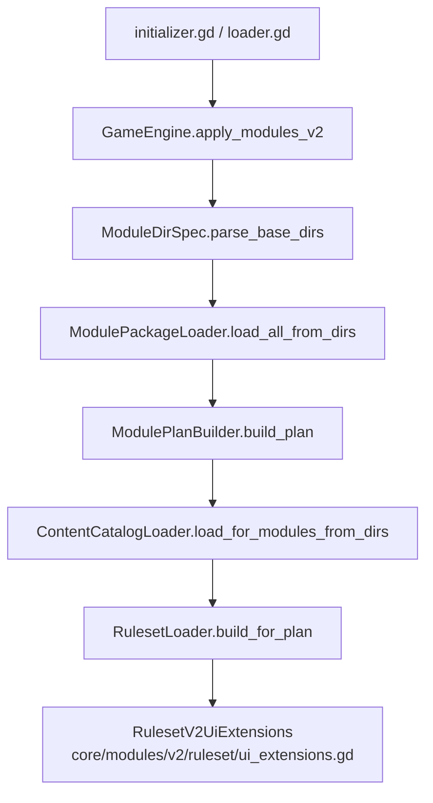
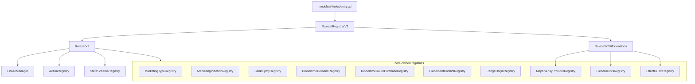
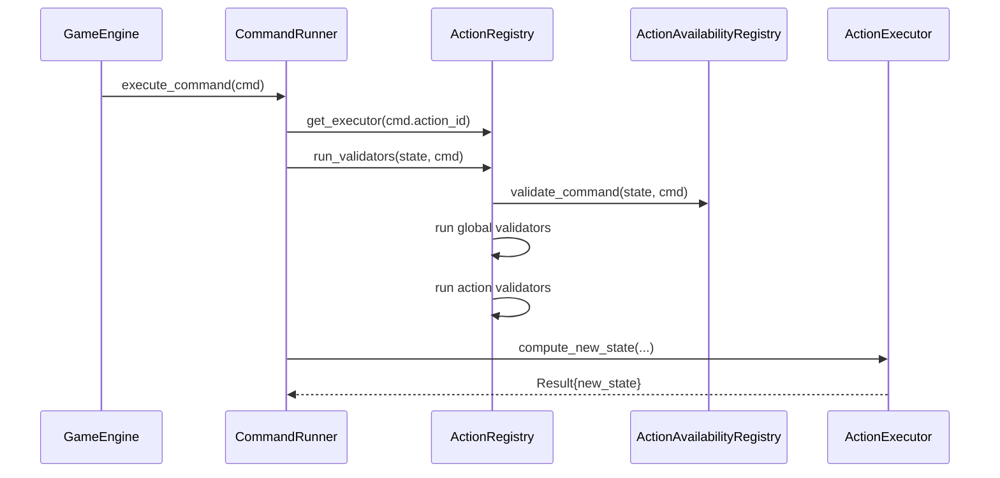

# 模块系统 V2（Strict Mode）：当前实现说明

当前仓库已经完整落地模块系统 V2：内容、规则、UI 扩展都由 **启用模块集合** 装配，缺失依赖、重复注册、无效引用会在初始化阶段直接失败。

## 模块关系图（装配流水线：base_dir → plan → catalog → ruleset → 注入）

## 模块关系图（注入点总览：RulesetV2 影响哪些系统）

## 注入点（按 Action 展开）

动作相关扩展点在 `RulesetV2` 中以列表保存，并在 `core/engine/game_engine/action_wiring.gd` 中一次性装配到 `ActionRegistry`。

关键路径：

- 注册入口：`core/modules/v2/ruleset_builder.gd`
- 聚合容器：`core/modules/v2/ruleset.gd`
- 装配入口：`core/engine/game_engine/action_wiring.gd`
- 内建 provider：`gameplay/action_setup.gd`

支持的注入类型：

- `register_action_executor(executor)`
- `register_action_validator(action_id, validator_id, callback, priority)`
- `register_global_action_validator(validator_id, callback, priority)`
- `register_action_availability_override(action_id, points, priority)`

### 运行时执行时序（gating → validators → executor）

## 注入点（按 Phase 展开）

Phase 相关扩展主要落在 `PhaseManager`：

- settlement / effect registry 注入
- phase hooks / sub phase hooks / named hooks
- phase order / working sub phase order / cleanup sub phase order / phase_sub_phase_orders
- settlement trigger overrides

关键路径：

- 注册入口：`core/modules/v2/ruleset_builder.gd`
- 聚合容器：`core/modules/v2/ruleset.gd`
- 应用入口：`core/engine/game_engine/modules_v2.gd`
- 应用实现：`core/modules/v2/ruleset/phase_hooks.gd`、`state_and_order.gd`、`sub_phase_registration.gd`

常用 API：

- `register_primary_settlement` / `register_extension_settlement`
- `register_phase_hook` / `register_sub_phase_hook` / `register_named_sub_phase_hook`
- `register_working_sub_phase_insertion` / `register_cleanup_sub_phase_insertion`
- `register_phase_order_override` / `register_working_sub_phase_order_override` / `register_cleanup_sub_phase_order_override`
- `register_settlement_triggers_override`

## 目录结构

模块目录示例：`modules/<module_id>/`

- `module.json`：manifest
- `content/*`：内容 JSON
- `rules/entry.gd`：规则入口（可选）
- `ui/*`：模块自定义 UI 脚本（可选）

base dir 支持多个，以 `;` 分隔，例如：`res://modules;res://modules_test`

## 运行时装配入口

装配入口：`core/engine/game_engine/modules_v2.gd`

新局初始化与读档都会先调用：

- `engine.apply_modules_v2(enabled_modules_v2, modules_v2_base_dir)`

装配完成后，引擎会持有：

- `module_plan_v2`
- `module_manifests_v2`
- `content_catalog_v2`
- `ruleset_v2`
- `module_ui_extensions_v2`

## module.json（当前 schema）

manifest 解析器：`core/modules/v2/module_manifest.gd`

当前字段：

- `schema_version`
- `id`
- `name`
- `version`
- `priority`
- `dependencies`
- `conflicts`
- `entry_script`
- `provides`

其中 `provides.ui.*` 目前会被 UI 直接读取，用于隐藏动作、注册地图交互模式、放置 overlay、模块选择器分组与 setup 约束。

## RulesetV2：模块可注册的扩展点（节选）

代码：`core/modules/v2/ruleset.gd`

RulesetV2 当前承载的扩展主要包括：

- `settlement_registry`
- `effect_registry`
- `milestone_effect_registry`
- `map_generation_registry`
- `action_executors` / validators / availability overrides
- 各类 provider 注册（营销、晚餐需求、路上购买、破产、冲突检测、range origin 等）
- `state_initializers`
- `state_int_key_dict_schemas`
- phase/subphase order 与 hooks

与规则层分离的 UI 扩展 holder 为：`core/modules/v2/ruleset/ui_extensions.gd`，当前包含：

- `phase_action_ui_modals`
- `map_overlay_providers`
- `piece_ui_hints`
- `effect_ui_texts`
- `milestone_effect_ui_texts`

## 与 `core/data` 的关系

模块内容经 `ContentCatalogLoader` 加载后，会进一步驱动：

- `ProductRegistry`
- `EmployeeRegistry`
- `MarketingRegistry`
- `MilestoneRegistry`
- `TileRegistry`
- `PieceRegistry`
- `GameData.from_catalog(...)`

因此在 Strict Mode 下，动作、规则、UI 最终查询到的数据，都以当前 module plan 装配结果为准。
