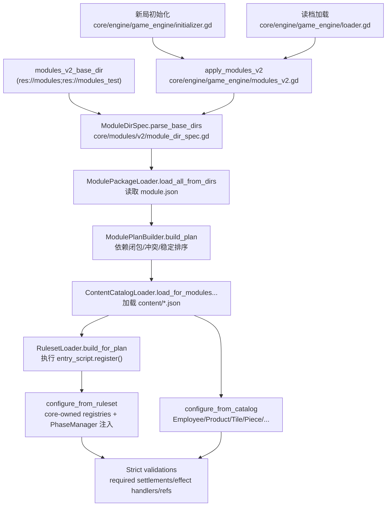
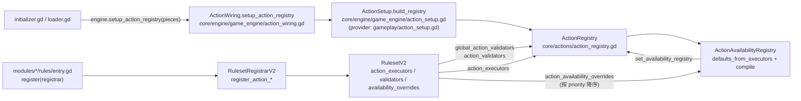
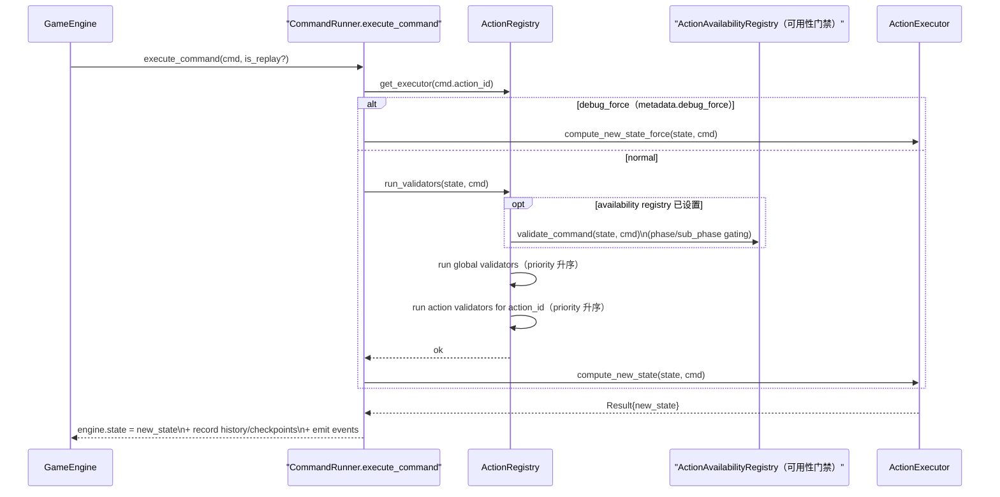
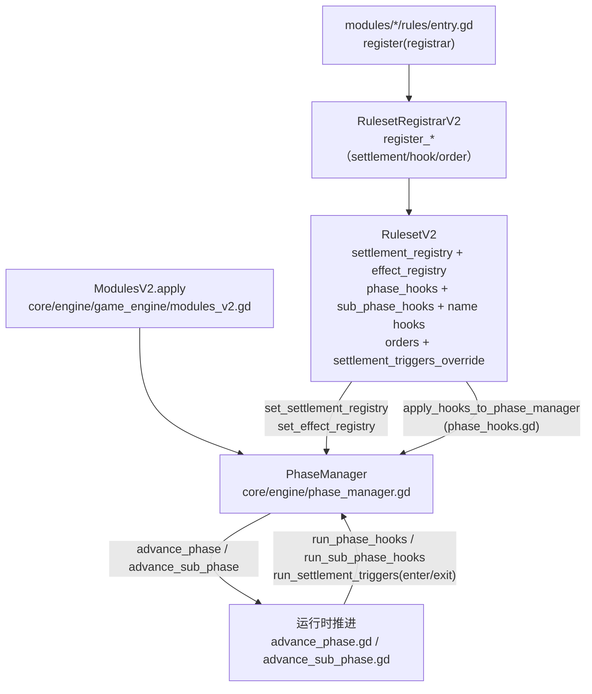
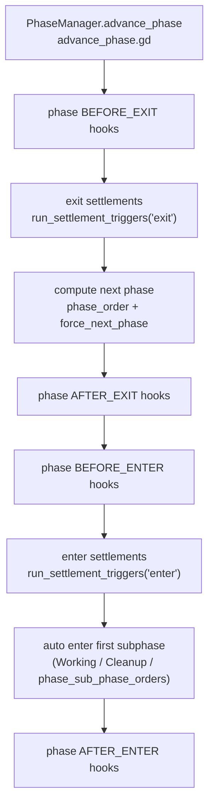
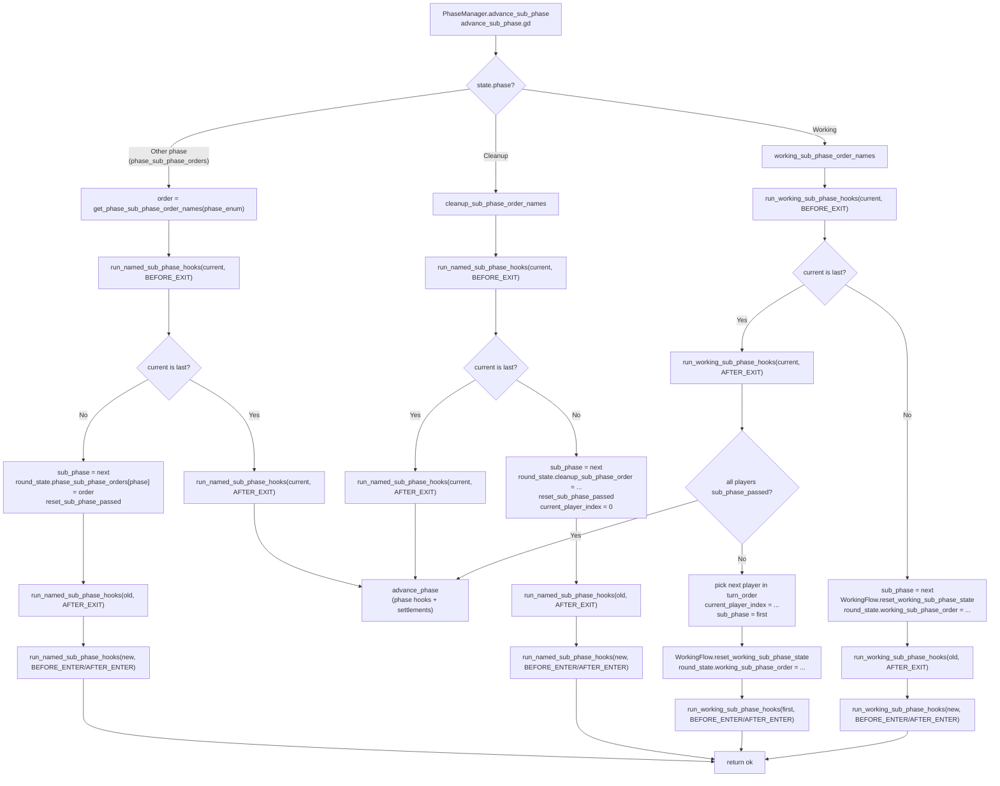

# 模块系统 V2（Strict Mode）：当前实现说明

本仓库已落地“模块系统 V2（Strict Mode）”：内容与规则均由**启用模块集合**装配，缺失依赖/重复注册/引用不存在的内容会直接初始化失败。

## 模块关系图（装配流水线：base_dir → plan → catalog → ruleset → 注入）



## 模块关系图（注入点总览：RulesetV2 影响哪些系统）

```mermaid
flowchart TB
  Entry["module rules entry<br/>modules/*/rules/entry.gd"]
  Registrar["RulesetRegistrarV2<br/>core/modules/v2/ruleset_builder.gd"]
  Ruleset["RulesetV2<br/>core/modules/v2/ruleset.gd"]
  Apply["ModulesV2.apply<br/>core/engine/game_engine/modules_v2.gd"]

  PM["PhaseManager<br/>阶段推进 + settlement triggers + hooks"]
  AR["ActionRegistry<br/>executors + validators + availability"]
  Schema["StateSchemaRegistry<br/>int-key dict schemas"]
  UIHooks["UI 集成点<br/>phase_action_ui_modal / overlay / ui texts"]

  subgraph CoreRegs["core-owned registries（被规则/动作/UI 查询）"]
    MkType["MarketingTypeRegistry"]
    MkInit["MarketingInitiationRegistry"]
    Bankruptcy["BankruptcyRegistry"]
    Demand["DinnertimeDemandRegistry"]
    Route["DinnertimeRoutePurchaseRegistry"]
    Conflict["PlacementConflictRegistry"]
    RangeOrigin["RangeOriginRegistry"]
    PieceHints["PieceUiHintsRegistry"]
    EffectText["EffectUiTextRegistry"]
    MapOverlay["MapOverlayProviderRegistry"]
    DataRegs["Employee/Product/Marketing/Milestone registries"]
    MapRegs["Tile/Piece registries"]
  end

  Entry --> Registrar --> Ruleset
  Apply --> Ruleset

  Ruleset --> PM
  Ruleset --> AR
  Ruleset --> Schema
  Ruleset --> UIHooks

  Ruleset --> MkType
  Ruleset --> MkInit
  Ruleset --> Bankruptcy
  Ruleset --> Demand
  Ruleset --> Route
  Ruleset --> Conflict
  Ruleset --> RangeOrigin
  Ruleset --> PieceHints
  Ruleset --> EffectText
  Ruleset --> MapOverlay

  Ruleset -.通过 catalog 校验引用.-> DataRegs
  Ruleset -.通过 catalog 校验引用.-> MapRegs
```



## 注入点（按 Action 展开）

动作相关扩展点在 ruleset 中以“注入列表”的形式保存，并在 **GameEngine.setup_action_registry** 时一次性装配进 `ActionRegistry`。

关键代码路径：

- 注册入口：`core/modules/v2/ruleset_builder.gd`（`RulesetRegistrarV2.register_action_*`）
- 存放位置：`core/modules/v2/ruleset.gd`（`action_executors/action_validators/...`）
- 消费/装配：`core/engine/game_engine/action_wiring.gd`
- 内建动作提供者：`gameplay/action_setup.gd`（由 `project.godot` 的 `fcm/action_setup_provider_path` 指定）



常用注入 API（与装配点对照）：

- `register_action_executor(executor)` → `ActionRegistry.register_executor(executor)`（Strict：重复 `action_id` 直接失败）
- `register_action_validator(action_id, validator_id, callback, priority)` → `ActionRegistry.register_validator(...)`（priority 参与排序）
- `register_global_action_validator(validator_id, callback, priority)` → `ActionRegistry.register_global_validator(...)`
- `register_action_availability_override(action_id, points, priority)` → `ActionAvailabilityRegistry.register_action_points_override(...)`（同 action_id 取 priority 最高者）

### 运行时执行时序（gating → validators → executor）



## 注入点（按 Phase 展开）

Phase 相关注入点主要落在 `PhaseManager`：

1) 把 `SettlementRegistry` / `EffectRegistry` 注入到 `PhaseManager`（供推进阶段时触发结算、以及结算内部查询 effect handler）。
2) 把 hooks / 顺序覆盖 / settlement trigger overrides 应用到 `PhaseManager`（供 `advance_phase/advance_sub_phase` 运行时使用）。

关键代码路径：

 - 注册入口：`core/modules/v2/ruleset_builder.gd`（`RulesetRegistrarV2.register_*（settlement/hook/order）`）
- 应用入口：`core/engine/game_engine/modules_v2.gd`（`ruleset_v2.apply_hooks_to_phase_manager(...)`）
- 应用实现：`core/modules/v2/ruleset/phase_hooks.gd`
- 运行时触发：`core/engine/phase_manager/advance_phase.gd`、`core/engine/phase_manager/advance_sub_phase.gd`



常用注入 API（按“触发点/顺序”分类）：

- 结算与触发点：
  - `register_primary_settlement(phase, point, callback)`
  - `register_extension_settlement(phase, point, callback, priority)`
  - `register_settlement_triggers_override(phase, timing, points, priority)`（timing: `"enter"` / `"exit"`）
- phase/subphase hooks：
  - `register_phase_hook(phase, hook_type, callback, priority)`
  - `register_sub_phase_hook(sub_phase_enum, hook_type, callback, priority)`
  - `register_named_sub_phase_hook(sub_phase_name, hook_type, callback, priority)`
  - `register_working_sub_phase_hook(sub_phase_name, hook_type, callback, priority)`
  - `register_cleanup_sub_phase_hook(sub_phase_name, hook_type, callback, priority)`
- 顺序覆盖（order overrides / insertions）：
  - `register_phase_order_override(phase_order_names, priority)`
  - `register_phase_sub_phase_order_override(phase, order_names, priority)`（为非 Working/Cleanup 阶段定义“按名子阶段序列”）
  - `register_working_sub_phase_insertion(name, after, before, priority)` / `register_cleanup_sub_phase_insertion(...)`
  - `register_working_sub_phase_order_override(order_names, priority)` / `register_cleanup_sub_phase_order_override(...)`

> Strict 约束提醒：`working_sub_phase_order_override` 与 `working_sub_phase_insertions` 不能同时使用（同理 cleanup）；缺少必需的 primary settlement 会在装配阶段 fail-fast（`PhaseManager.validate_required_primary_settlements()`）。



### 运行时子阶段推进（advance_sub_phase）



> 备注：Working 子阶段推进使用 `run_working_sub_phase_hooks`，它会同时运行“枚举 hooks（register_sub_phase_hook）”与“按名 hooks（register_working_sub_phase_hook / register_named_sub_phase_hook）”；Cleanup/其它阶段子阶段推进使用 `run_named_sub_phase_hooks`（只按名）。

## 目录结构

模块目录示例：`modules/<module_id>/`

- `module.json`：manifest（见 `core/modules/v2/module_manifest.gd`）
- `content/*`：内容 JSON（employees/products/milestones/tiles/maps/pieces/visuals...）
- 规则入口脚本（可选，由 `entry_script` 指定；示例：`modules/base_rules/rules/entry.gd`）

base 目录支持多个，用 `;` 分隔：

- `Globals.modules_v2_base_dir`
  - 示例：`res://modules` 与 `res://modules_test`
  - 存档中会保存为单个字符串：`res://modules;res://modules_test`

## 运行时装配入口

装配入口：`core/engine/game_engine/modules_v2.gd`

初始化新局时（`core/engine/game_engine/initializer.gd`）会调用：

- `engine.apply_modules_v2(enabled_modules_v2, modules_v2_base_dir)`

装配会完成：

1. 解析 base dirs（`core/modules/v2/module_dir_spec.gd`）
2. 加载所有 `module.json`（`core/modules/v2/module_package_loader.gd`）
3. 构建 module plan（依赖闭包/冲突检查/稳定排序）（`core/modules/v2/module_plan_builder.gd`）
4. 加载 `ContentCatalog`（`core/modules/v2/content_catalog_loader.gd`）
5. 加载并执行 rules entry，构建 `RulesetV2`（`core/modules/v2/ruleset_loader.gd`）
6. 配置各类 registry（员工/里程碑/产品/营销、tile/piece 等）
7. 把结算/效果 registry 注入 `PhaseManager`，并应用 hooks/顺序覆盖/结算触发点覆盖
8. strict 校验（例如：必需 settlement、content 引用的 effect handler 必须存在等）

## module.json（当前 schema）

manifest 由 `core/modules/v2/module_manifest.gd` 解析，示例（取自 `modules/base_rules/module.json`）：

```json
{
  "schema_version": 1,
  "id": "base_rules",
  "name": "Base Rules",
  "version": "0.1.0",
  "priority": 50,
  "dependencies": [],
  "conflicts": [],
  "entry_script": "res://modules/base_rules/rules/entry.gd",
  "provides": {
    "settlements": ["settlement:phase:Dinnertime:enter"]
  }
}
```

## RulesetV2：模块可注册的扩展点（节选）

规则集合类型：`core/modules/v2/ruleset.gd`

模块可通过 rules entry 注册（节选）：

- 结算器：`settlement_registry`（`core/rules/settlement_registry.gd`）
- effects：`effect_registry`、`milestone_effect_registry`
- phase/subphase hooks（含 named subphase hooks）
- action executors / validators / availability overrides
- map generation providers（`map_generation_registry`）
- 规则 providers：营销发起、破产、晚餐需求、路上购买、放置冲突等
- 顺序覆盖：phase/subphase order overrides、settlement trigger overrides
- 状态扩展：
  - `state_initializers`：在 map bake 后补充 state 字段
  - `state_int_key_dict_schemas`：注册“int-key Dictionary 归一化路径”（供读档）

## 与 core/data 的关系

- `GameConfig` 仍来自 `data/config/game_config.json`
- 模块系统 V2 会校验 `GameConfig` 的起始库存/产品是否都存在于当前 `ContentCatalog`（避免“配置引用不存在内容”）

内容 JSON 的字段规范与约束见：`docs/architecture/61-content-catalog-schema.md`

开发新模块（从 module.json、content 到 rules/UI/存档兼容）的实操指南见：

- `docs/architecture/62-module-development-guide.md`
