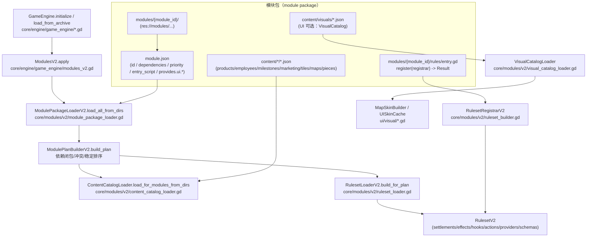
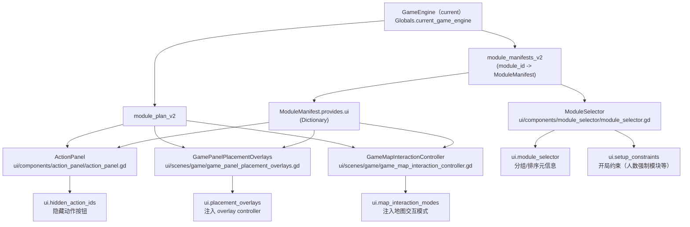
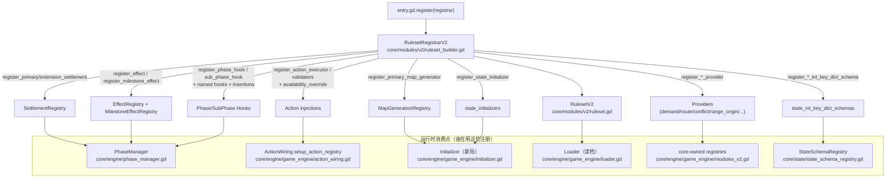

# 开发新模块指南（模块系统 V2 / Strict Mode）

本指南面向“我要新增一个 module（内容/规则/视觉/UI 扩展）”的开发流程，基于当前仓库已落地的模块系统 V2（Strict Mode）实现。

相关背景文档：

- 模块装配与 ruleset 扩展点：`docs/architecture/60-modules-v2.md`
- 内容格式（content/*.json）：`docs/architecture/61-content-catalog-schema.md`
- 状态扩展契约（map/round_state）：`docs/architecture/33a-core-state-schema-contract.md`
- 序列化/读档归一化（int-key dict）：`docs/architecture/33b-core-state-serialization.md`

## 模块关系图（从模块包到引擎装配/注入）



## 模块关系图（UI 扩展点：module.json.provides.ui.* 被谁读取）



---

## 0. 先做选择：你要做哪一类模块？

模块包可以是下面几种（可混合）：

1. **内容模块（content-only）**：只提供 `content/*/*.json`，不写规则脚本（`entry_script=""`）。
2. **规则模块（rules-only）**：主要提供 `modules/<module_id>/rules/entry.gd` 注册结算/效果/providers/hooks 等，可不带 content。
3. **混合模块（content + rules）**：既提供内容，又提供规则/效果处理器（最常见）。
4. **UI 扩展模块（可选）**：通过 `module.json.provides.ui.*` 注入一些 UI 行为（隐藏按钮/自定义放置 overlay/自定义地图交互模式）。
5. **视觉模块（可选）**：通过 `content/visuals/*.json` 提供 VisualCatalog（贴图路径等，不影响 core 初始化）。

> 建议：先从 content-only 开始跑通“装配/选择/Strict 校验”，再逐步加入 rules 与 UI 扩展，避免一次性引入过多失败点。

---

## 1. 创建模块目录（module package）

约定路径（生产内容）：

- `res://modules/<module_id>/`

测试专用模块包（避免污染可发布内容）：

- `res://modules_test/<module_id>/`

最小文件集（强烈建议）：

- `modules/<module_id>/module.json`
- `modules/<module_id>/README.md`

注意事项：

- **目录名必须等于 manifest 的 `id`**，否则加载会 fail-fast（见 `core/modules/v2/module_package_loader.gd`）。
- 模块根目录由 `Globals.modules_v2_base_dir` 决定，支持 `;` 分隔多个目录（例如 `res://modules;res://modules_test`）。

---

## 2. 编写 module.json（manifest）

解析器：`core/modules/v2/module_manifest.gd`（严格解析，schema_version 目前只支持 `1`）。

一个“内容 + rules”的典型示例（精简）：

```json
{
	"schema_version": 1,
	"id": "<module_id>",
	"name": "我的新模块",
	"version": "0.1.0",
	"priority": 150,
	"dependencies": ["base_rules", "base_products"],
	"conflicts": [],
	"entry_script": "res://modules/<module_id>/rules/entry.gd",
	"provides": {
		"content": ["employees", "milestones"],
		"ui": {
			"hidden_action_ids": ["debug_give_money"]
		}
	}
}
```

字段说明（以当前实现为准）：

- `schema_version`：必须为 `1`。
- `id`：模块 id，必须与目录名一致。
- `priority`：影响 module plan 的确定性排序（拓扑排序同层按 `priority` 升序，再按 `id` 字典序）。
  - **越小越早加载**；想做覆盖/追加通常用更大的 priority（但注意不同子系统的“覆盖语义”可能不同）。
- `dependencies`：依赖闭包会自动加入 plan；缺失依赖直接失败。
- `conflicts`：冲突是对称语义（任一方声明 conflicts，且两者同时出现在 wanted 闭包中就失败）。
- `entry_script`：规则入口脚本路径；内容模块可填 `""`。
- `provides`：必须为 Dictionary，但 key 的语义由上层约定决定。
  - 当前仓库 **UI 会读取** `provides.ui.*`（见下文“UI 扩展点”）。
  - `provides.content` 当前不参与 `ContentCatalogLoader` 的“选择”（loader 按目录约定加载）；可作为元信息用于 UI/文档提示。

命名建议：

- **不要用 `base_` 前缀**，除非你确实要做“基础模块”（UI 会把 `base_*` 视作默认集合的一部分，并在可选模块列表中跳过它们）。
- 若你要“替换某个 base 模块”，除了设置 `conflicts`，通常还需要同步调整默认启用模块列表（见 `core/engine/game_defaults.gd`）或对应 UI 逻辑（示例：`new_milestones` 会移除 `base_milestones`）。

---

## 3. 添加 content（内容 JSON）

内容入口由模块系统 V2 装配（loader：`core/modules/v2/content_catalog_loader.gd`）。

> 注意：当前实现是“按目录约定扫描”；不会读取 `module.json.provides.content` 来决定加载哪些子目录。

目录约定（不存在则跳过）：

- `content/products/*.json`
- `content/employees/*.json`
- `content/milestones/*.json`
- `content/marketing/*.json`
- `content/tiles/*.json`
- `content/maps/*.json`
- `content/pieces/*.json`

详细 schema 见：`docs/architecture/61-content-catalog-schema.md`

Strict Mode 的常见 fail-fast 点：

- 同一类型 ID 重复（例如两个 ProductDef 同 id）。
- content 引用的 effect handler 不存在（effects/里程碑 effects 等；详见 `docs/architecture/37-core-rules.md`）。
- `GameConfig` 引用的起始内容在当前 ContentCatalog 中不存在（装配阶段直接失败）。

---

## 4. 添加 rules（规则入口与注册）

规则入口由 loader 实例化并调用 `register(registrar)`：

- loader：`core/modules/v2/ruleset_loader.gd`
- registrar：`core/modules/v2/ruleset_builder.gd`（`RulesetRegistrarV2`）

最小入口脚本模板：

```gdscript
extends RefCounted

func register(registrar) -> Result:
	# registrar 提供一组 register_* API（见 ruleset_builder.gd）
	return Result.success()
```

推荐拆分方式：把“注册逻辑”拆成多个 part，然后在 entry 中组装（仓库已提供样板消除工具）：

- 工具：`modules/module_entry_helpers.gd`
- 示例：`modules/base_rules/rules/entry.gd`

示例（entry 组装）：

```gdscript
extends RefCounted

const EffectsPart = preload("res://modules/<module_id>/rules/effects.gd")
const ModuleEntryHelpers = preload("res://modules/module_entry_helpers.gd")

func register(registrar) -> Result:
	return ModuleEntryHelpers.register_parts(registrar, [
		EffectsPart.new(),
	])
```

### 4.1 重要：保活 entry/part 实例（避免 Callable 失效）

GDScript 的 `Callable` **不会自动保活对象实例**。如果你注册的是“绑定到对象方法”的回调（例如 `Callable(self, "_on_settle")`），而该对象在 register 结束后被释放，就会在运行时报 `Callable target is null` 之类的问题。

- 推荐做法：在注册前调用 `registrar.retain_entry_instance(obj)` 保活实例。
- 若你使用 `ModuleEntryHelpers.register_parts(...)`，它会自动对每个 part 执行 `retain_entry_instance(part)`。

### 4.2 模块注入点如何落到运行时系统？（RulesetRegistrarV2 → Engine）



### registrar 能注册什么？（常用子集）

你在 `register(registrar)` 中拿到的 `registrar` 是模块隔离后的注册门面，常用 API 包括：

- 结算：
  - `register_primary_settlement(phase, point, callback)`
  - `register_extension_settlement(phase, point, callback, priority := 100)`
- effects：
  - `register_effect(effect_id: String, callback)`
  - `register_milestone_effect(effect_type: String, callback)`
- hooks / 子阶段插入：
  - `register_phase_hook(...)` / `register_sub_phase_hook(...)` / `register_named_sub_phase_hook(...)`
  - `register_working_sub_phase_insertion(...)` / `register_cleanup_sub_phase_insertion(...)`
- actions：
  - `register_action_executor(executor)`
  - `register_action_validator(...)` / `register_global_action_validator(...)`
  - `register_action_availability_override(...)`
- providers（跨模块协作扩展点）：
  - `register_dinnertime_demand_provider(...)`、`register_placement_conflict_provider(...)` 等
- 状态扩展（强烈建议配合下文的 schema 归一化）：
  - `register_state_initializer(initializer_id, callback, priority := 100)`
  - `register_round_state_int_key_dict_schema(schema_id, path, priority := 100)`
  - `register_map_int_key_dict_schema(schema_id, path, priority := 100)`

完整列表以源码为准：`core/modules/v2/ruleset_builder.gd`

---

## 5. UI 扩展点（module.json.provides.ui）

当前 UI 会读取 `module.json.provides.ui` 这几个可选字段：

### 5.1 隐藏某些动作按钮：ui.hidden_action_ids

读取位置：`ui/components/action_panel/action_panel.gd`

```json
{
	"provides": {
		"ui": {
			"hidden_action_ids": ["debug_give_money"]
		}
	}
}
```

用途：把某些 action_id 从 ActionPanel 中隐藏（仍可由 DebugPanel/脚本触发）。

### 5.2 注入自定义放置 overlay controller：ui.placement_overlays

读取位置：`ui/scenes/game/game_panel_placement_overlays.gd`

```json
{
	"provides": {
		"ui": {
			"placement_overlays": [
				"res://modules/lobbyists/ui/lobbyists_extra_tile_flow_controller.gd"
			]
		}
	}
}
```

约定（以当前实现为准）：

- UI 会对每个脚本执行 `new(scene, map_controller, overlay_controller, execute_command, hide_all)`；
- 若对象提供 `sync(state, force_full_refresh)`，会在每次 `_update_ui()` 时调用同步。

### 5.3 注入自定义地图交互模式：ui.map_interaction_modes

读取位置：`ui/scenes/game/game_map_interaction_controller.gd`

```json
{
	"provides": {
		"ui": {
			"map_interaction_modes": [
				{
					"id": "rural_marketeers_offramp",
					"script": "res://modules/rural_marketeers/ui/game_map_interaction_rural_offramp_mode.gd"
				}
			]
		}
	}
}
```

约定（以当前实现为准）：

- UI 会对脚本执行 `new(map_interaction_controller)`；
- handler 可选实现：
  - `reset()`
  - `on_cell_selected(world_pos: Vector2i)`
  - `on_highlight_requested(tile_id: String, rotation: int)`
  - `get_outside_margin_override() -> int`（用于启用“地图外围 UI-only 空圈”）

### 5.4 模块选择器分组/排序元信息：ui.module_selector

读取位置：`ui/components/module_selector/module_selector.gd`

示例：

```json
{
	"provides": {
		"ui": {
			"module_selector": {
				"group_id": "marketing",
				"group_title": "营销相关",
				"group_order": 200,
				"order": 10
			}
		}
	}
}
```

语义（以当前实现为准）：

- `group_id`：分组 id；空则落到 “其他”。
- `group_title`：分组标题；空则使用 `group_id`。
- `group_order`：分组排序（越小越靠前）。
- `order`：组内排序（越小越靠前）。

### 5.5 开局约束（人数强制模块等）：ui.setup_constraints

读取位置：`ui/components/module_selector/module_selector.gd`

支持两类约束（以当前实现为准）：

1) **固定人数强制启用该模块本身**：`required_player_counts`

```json
{
	"provides": {
		"ui": {
			"setup_constraints": {
				"required_player_counts": [5, 6],
				"reason": "5–6 人局需要该模块。"
			}
		}
	}
}
```

2) **当该模块启用且人数匹配时，强制启用其它可选模块**：`requires_optional_modules`

```json
{
	"provides": {
		"ui": {
			"setup_constraints": {
				"requires_optional_modules": [
					{
						"required_player_counts": [5, 6],
						"module_ids": ["some_optional_module_id"],
						"reason": "5–6 人局启用本模块时需要额外模块。"
					}
				]
			}
		}
	}
}
```

---

## 6. 状态扩展与存档兼容（非常重要）

如果你的模块需要在 `state.map` 或 `state.round_state` 下挂载模块自有数据：

1. 先阅读契约：`docs/architecture/33a-core-state-schema-contract.md`
2. 建议使用 module-owned key 命名：
   - key 等于 `module_id`，或以 `module_id_` 前缀开头（便于工具做扫描与告警）
3. 若你引入了“以 player_id 为 key 的 Dictionary”（例如 `{0: {...}, 1: {...}}`），必须处理 **读档 key 归一化**：
   - JSON 会把 int key 变成字符串 `"0"`/`"1"`；
   - 需要注册 int-key dict schema（见下文）。

### 6.1 在 map bake 后补齐字段：state_initializers

入口：`RulesetRegistrarV2.register_state_initializer(...)`

- initializer 会在地图烘焙写入 `state.map` 后执行（用于补齐模块字段、缓存、衍生结构等）
- callback 约定：`callback(state: GameState, rng_manager) -> Result`

### 6.2 注册 int-key Dictionary schema（读档归一化）

入口（registrar 侧）：

- `register_round_state_int_key_dict_schema(schema_id, path, ...)`
- `register_map_int_key_dict_schema(schema_id, path, ...)`

其中 `path` 是从 root（`round_state` 或 `map`）开始的字段路径数组，例如：

```gdscript
registrar.register_round_state_int_key_dict_schema(
	"my_module:per_player_cache",
	["my_module", "per_player_cache"]
)
```

底层实现与告警逻辑见：`core/state/state_schema_registry.gd`

---

## 7. 让模块在游戏里“可选择/可装配”

你通常不需要改任何 core 代码：

- `ModuleSelector` 会从 `Globals.modules_v2_base_dir` 指定的 base dirs 扫描模块目录并读取 `module.json`
- 只要 `modules/<module_id>/module.json` 存在且合法，就会出现在选择列表中（非 `base_*` 会进入可选模块区）

如果你把模块放在 `modules_test/`：

- 把 `Globals.modules_v2_base_dir` 设为 `res://modules;res://modules_test`
- 然后在新游戏设置或联机大厅里刷新/选择该模块

---

## 8. 测试与调试建议

快速验证装配（推荐）：

- headless 全量测试：`tools/run_headless_test.sh res://ui/scenes/tests/all_tests.tscn AllTests 60`
- replay runner（确定性验证）：`godot --headless --path . --script res://tools/replay_runner.gd -- <replay.json>`

模块开发期常见策略：

- **内容校验先行**：先只加 content，跑通初始化与 UI 展示，再加 rules（效果/结算/providers）。
- **用 modules_test 做“故意失败用例”**：例如写一个缺失依赖/重复 ID 的模块，用来覆盖 Strict Mode 的 fail-fast 测试。

---

## 9. 常见坑（Checklist）

- [ ] `module.json.id` 与目录名一致（必需）
- [ ] `dependencies/conflicts` 写对（缺失依赖/冲突会 fail-fast）
- [ ] 需要替换 base 模块时，同步调整默认启用列表或 UI 的“替换逻辑”
- [ ] 新增 module-owned 状态字段时，遵守 state 契约（不得覆盖 core-owned key）
- [ ] 引入 per-player Dictionary 时注册 int-key schema（否则读档后 key 变字符串）
- [ ] effect handler/里程碑 effect type 注册完整（避免 content 引用缺失）
- [ ] priority 合理（尤其是视觉覆盖/顺序覆盖/触发点覆盖等依赖加载顺序的场景）
