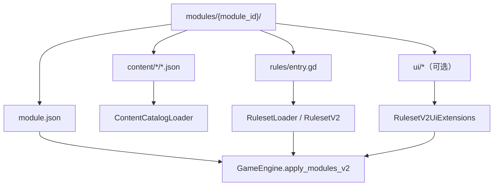
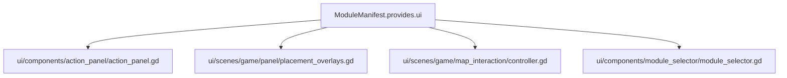

# 开发新模块指南（模块系统 V2 / Strict Mode）

本指南基于当前仓库已经落地的模块系统 V2，总结“从一个 module package 到可运行内容/规则/UI 扩展”的最短路径。

相关文档：

- 模块装配与扩展点：`docs/architecture/60-modules-v2.md`
- 内容格式：`docs/architecture/61-content-catalog-schema.md`
- 状态扩展契约：`docs/architecture/33a-core-state-schema-contract.md`
- 序列化/归一化：`docs/architecture/33b-core-state-serialization.md`

## 模块关系图（从模块包到引擎装配/注入）



## 模块关系图（UI 扩展点：`module.json.provides.ui.*` 被谁读取）



## 0. 先做选择：你要做哪一类模块？

常见类型：

1. **content-only**：只提供 `content/*/*.json`
2. **rules-only**：只提供 `rules/entry.gd`
3. **content + rules**：最常见
4. **UI 扩展模块**：通过 `provides.ui.*` 注入 UI 行为
5. **视觉模块**：通过 `content/visuals/*.json` 提供 VisualCatalog

## 1. 创建模块目录（module package）

生产模块：`res://modules/<module_id>/`

测试模块：`res://modules_test/<module_id>/`

最小建议文件：

- `module.json`
- `README.md`
- `rules/entry.gd`（若有规则）

注意：目录名必须与 `module.json.id` 一致。

## 2. 编写 module.json（manifest）

解析器：`core/modules/v2/module_manifest.gd`

当前 schema：

```json
{
  "schema_version": 1,
  "id": "my_module",
  "name": "My Module",
  "version": "0.1.0",
  "priority": 150,
  "dependencies": ["base_rules"],
  "conflicts": [],
  "entry_script": "res://modules/my_module/rules/entry.gd",
  "provides": {
    "ui": {}
  }
}
```

字段要点：

- `priority` 越小越早参与 plan 的稳定排序
- `dependencies` / `conflicts` 都是 strict 约束
- `entry_script` 可为空字符串
- `provides.ui.*` 当前会被 UI 直接读取

## 3. 添加 content（内容 JSON）

按目录约定放置：

- `content/products/*.json`
- `content/employees/*.json`
- `content/milestones/*.json`
- `content/marketing/*.json`
- `content/tiles/*.json`
- `content/maps/*.json`
- `content/pieces/*.json`
- `content/visuals/*.json`（可选）

Strict Mode 常见失败点：

- 同类 ID 重复
- content 引用的 effect / milestone effect handler 缺失
- 起始内容或地图依赖的模块未启用

## 4. 添加 rules（规则入口与注册）

规则入口由 `RulesetLoader` 调用 `register(registrar)`：

```gdscript
extends RefCounted

func register(registrar) -> Result:
	return Result.success()
```

推荐拆分方式：

- `core/modules/v2/module_entry_helpers.gd`
- `rules/entry.gd` 负责组合多个 part

### 4.1 重要：保活 entry / part 实例（避免 Callable 失效）

如果注册的是对象方法回调（`Callable(self, ...)`），需要显式保活对象：

- 调用 `registrar.retain_entry_instance(obj)`
- 或直接使用 `ModuleEntryHelpers.register_parts(...)`

### 4.2 模块注入点如何落到运行时系统？

- `RulesetRegistrarV2` 负责收集注册项
- `RulesetV2` / `RulesetV2UiExtensions` 负责聚合
- `modules_v2.gd` / `action_wiring.gd` / `initializer.gd` / `loader.gd` 负责运行时消费

### registrar 能注册什么？（常用子集）

- 结算：`register_primary_settlement` / `register_extension_settlement`
- effects：`register_effect` / `register_milestone_effect`
- hooks：`register_phase_hook` / `register_sub_phase_hook` / `register_named_sub_phase_hook`
- 子阶段插入：`register_working_sub_phase_insertion` / `register_cleanup_sub_phase_insertion`
- actions：`register_action_executor` / `register_action_validator` / `register_global_action_validator`
- availability：`register_action_availability_override`
- providers：营销、晚餐需求、路线购买、放置冲突、range origin 等
- 状态扩展：`register_state_initializer` / `register_round_state_int_key_dict_schema` / `register_map_int_key_dict_schema`

## 5. UI 扩展点（`module.json.provides.ui`）

### 5.1 隐藏某些动作按钮：`ui.hidden_action_ids`

读取位置：`ui/components/action_panel/action_panel.gd`

```json
{
  "provides": {
    "ui": {
      "hidden_action_ids": ["debug_give_money"]
    }
  }
}
```

### 5.2 注入自定义放置 overlay controller：`ui.placement_overlays`

读取位置：`ui/scenes/game/panel/placement_overlays.gd`

```json
{
  "provides": {
    "ui": {
      "placement_overlays": [
        "res://modules/lobbyists/ui/lobbyists_extra_tile_flow_controller.gd"
      ]
    }
  }
}
```

当前构造约定：

- `new(scene, map_controller, overlay_controller, execute_command, hide_all)`
- 可选实现：`sync(state, force_full_refresh)`、`hide()`、`dispose()`、`get_context_overlay()`

### 5.3 注入自定义地图交互模式：`ui.map_interaction_modes`

读取位置：`ui/scenes/game/map_interaction/controller.gd`

```json
{
  "provides": {
    "ui": {
      "map_interaction_modes": [
        {
          "id": "rural_marketeers_offramp",
          "script": "res://modules/rural_marketeers/ui/game_map_interaction_rural_offramp_mode.gd"
        }
      ]
    }
  }
}
```

当前构造约定：

- `new(map_interaction_controller)`
- 常见可选方法：`reset()`、`on_cell_selected()`、`on_highlight_requested()`、`get_outside_margin_override()`

### 5.4 模块选择器分组/排序元信息：`ui.module_selector`

读取位置：`ui/components/module_selector/module_selector.gd`

常用字段：

- `group_id`
- `group_title`
- `group_order`
- `order`

### 5.5 开局约束：`ui.setup_constraints`

读取位置：`ui/components/module_selector/module_selector.gd`

当前支持：

- `required_player_counts`
- `requires_optional_modules`
- `reason`

## 6. 状态扩展与存档兼容（非常重要）

模块自有状态只应写入 `state.map` / `state.round_state` 的 module-owned key。

建议：

- key 等于 `module_id`，或以 `module_id_` 前缀开头
- 新局时通过 `register_state_initializer(...)` 补齐缺省结构
- 若存在 `{player_id -> ...}` 这类 int-key Dictionary，必须注册 schema

### 6.1 在 map bake 后补齐字段：`state_initializers`

- 入口：`register_state_initializer(initializer_id, callback, priority)`
- 执行时机：地图烘焙并写入 `state.map` 之后

### 6.2 注册 int-key Dictionary schema（读档归一化）

- `register_round_state_int_key_dict_schema(schema_id, path, ...)`
- `register_map_int_key_dict_schema(schema_id, path, ...)`

示例：

```gdscript
registrar.register_round_state_int_key_dict_schema(
	"my_module:per_player_cache",
	["my_module", "per_player_cache"]
)
```

## 7. 让模块在游戏里“可选择/可装配”

通常无需改 core：

- `ModuleSelector` 会按 `Globals.modules_v2_base_dir` 扫描模块
- `base_*` 模块一般视为基础集合，不进入普通可选列表
- 测试模块可放在 `modules_test/`，并把 base dir 设为 `res://modules;res://modules_test`

## 8. 测试与调试建议

推荐流程：

- headless 全量：`tools/run_headless_test.sh res://ui/scenes/tests/all_tests.tscn AllTests 60`
- 单模块 / 单问题复现：写专用测试场景或 `modules_test/*`
- 确定性验证：`godot --headless --path . --script res://tools/replay_runner.gd -- <replay.json>`

## 9. 常见坑（Checklist）

- [ ] `module.json.id` 与目录名一致
- [ ] `dependencies` / `conflicts` 写对
- [ ] 替换 base 模块时同步处理默认启用列表或 UI 替换逻辑
- [ ] module-owned 状态不覆盖 core-owned key
- [ ] per-player Dict 注册 int-key schema
- [ ] effect / milestone effect handler 注册完整
- [ ] UI 扩展脚本路径使用 `res://`
- [ ] 需要对象回调时记得 `retain_entry_instance`
