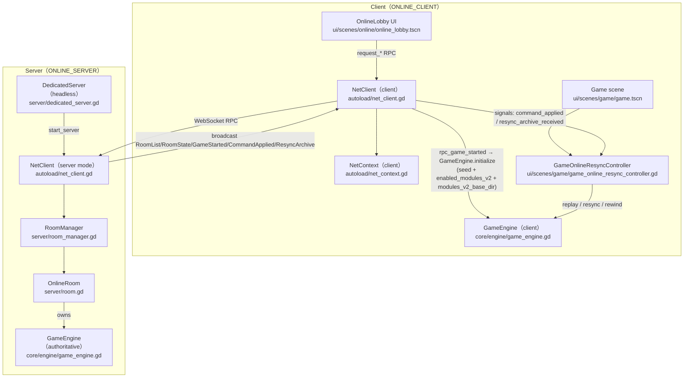
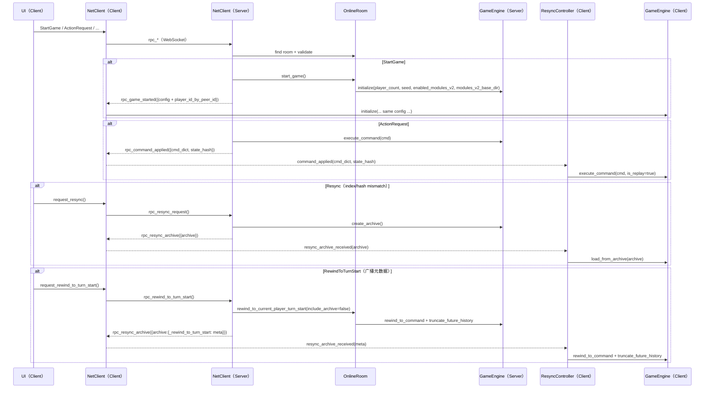

# 联机（Online Multiplayer）

状态：已落地 **M5（联机大厅 UI 改版 + 公开房间列表 + 配置自动同步 + 模块选择复用）**。

## 模块关系图（联机的主要对象与依赖）

## 模块关系图（命令广播回放 + Resync/Rewind 消息流）

已实现内容（M1–M3）：
- Dedicated Server（ws）：`server/dedicated_server.tscn`、`server/dedicated_server.gd`
- 房间逻辑（纯逻辑类）：`server/room_manager.gd`、`server/room.gd`
- Client 会话层（共用 RPC 节点）：`autoload/net_client.gd`、`autoload/net_context.gd`
- 联机大厅 UI：`ui/scenes/online/online_lobby.tscn`
- StartGame：server 创建 `GameEngine` 并广播 `GameStarted`，client 初始化并进入 `ui/scenes/game/game.tscn`
- ActionRequest：client 发送 `ActionRequest`，server 广播 `CommandApplied`，client 回放执行更新 UI
- 输入权限收口（禁止代操）：`ui/scenes/game/game.gd`、`ui/scenes/game/game_panel_controller.gd`
- 储备卡保密：非本人显示等待、历史/导出脱敏：`ui/components/modal_panel/reserve_card_selection_modal.gd`、`core/utils/command_privacy.gd`

新增实现内容（M4）：
- Resync：client index/hash mismatch 自动 `ResyncRequest`；server 下发 `ResyncArchive`（`engine.create_archive()`）
- 回退到回合开始：client `RewindToTurnStart`；server 通过 `ResyncArchive` 通道广播 `_rewind_to_turn_start` 元数据，各客户端本地 rewind + truncate（避免发送大 archive 导致 WebSocket buffer 溢出）
- 掉线弃权：`forfeit_player`（移除餐厅/营销/玩家资产；保留房屋/花园；现金清零并计入 `bank.removed_total`；弃权玩家不得获胜）
- 旁观者：InGame 允许 JoinRoom 作为 spectator；弃权玩家座位保留在 RoomState（只读）
- Archive 回灌稳定性修复：`ModulesV2.reset` 会清空 `PhaseManager` hooks，避免 `load_from_archive` 回放时调用到失效 Callable target

新增实现内容（M5）：
- 公开房间列表：server 维护 `updated_at_ms` 并对所有客户端广播 `RoomList`（`RoomSummary` 含 `password_required/allow_spectators/updated_at_ms`，按更新时间倒序）
- 联机大厅 UI：拆分 Connect/Rooms/Create/Room 分页；Rooms 支持加入/观战（密码房间需输入密码；房主可关观战）
- 房主配置自动同步：Room 页房主编辑配置并 debounce 自动 `UpdateRoomConfig` 广播
- 模块选择复用：抽取 `ModuleSelector`/`RoomConfigEditor` 并在 Hotseat/Online 复用

本项目的 `core/` 已具备“命令广播回放”所需的关键基础设施：

- `core/types/command.gd`：命令可序列化/可严格反序列化
- `core/engine/game_engine/command_runner.gd`：支持 `is_replay=true` 的回放执行
- `core/state/game_state.gd`：`compute_hash()` 可用于联机一致性校验

联机设计/改造计划请见：

- `docs/refactors/multiplayer_websocket_plan.md`（整体方案、协议、UI 改造点、里程碑）
- `docs/refactors/multiplayer_public_deployment.md`（公网 `wss://` 部署与最小鉴权建议）
- `docs/refactors/multiplayer_implementation_guide.md`（按文件与 RPC 列表的实现指南）
- `docs/refactors/multiplayer_lobby_ui_redesign.md`（联机大厅 UI 改版：拆分页面/模块选择复用/房主配置广播）
