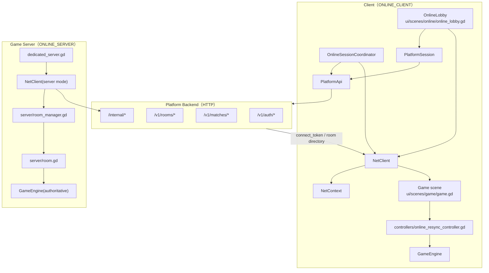
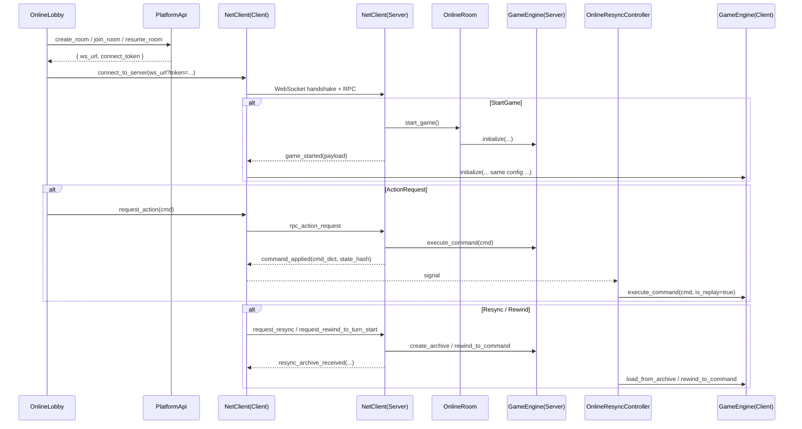

# 联机（Online Multiplayer）

状态：已落地 **平台化房间联机链路**：平台后端负责账号/房间目录/connect_token，Godot 房间服负责实时权威对局，客户端支持 resync、rewind 与启动恢复。

## 模块关系图（联机的主要对象与依赖）

## 模块关系图（房间创建 / 实时命令 / Resync / Reconnect）

当前已落地内容：

- 房间服：`server/dedicated_server.gd`、`server/room_manager.gd`、`server/room.gd`
- WebSocket 会话层：`autoload/net_client.gd`
- 联机大厅：`ui/scenes/online/online_lobby.gd`
- 游戏内重同步：`ui/scenes/game/controllers/online_resync_controller.gd`
- 启动自动恢复：`autoload/online_session_coordinator.gd` + `ui/scenes/game/controllers/startup_online_resume_controller.gd`
- 旁观 / rewind_to_turn_start / forfeit_player / delta & snapshot 恢复链路

补充说明：

- 当前已不再走“纯直连大厅”模式；房间创建、加入、恢复都以平台后端返回的 `connect_token` 为入口
- 客户端对局内 hash / index 不一致时，会优先走 resync，而不是直接强退回大厅
- `NetContext.online_resume_state` 会持续记录 room_code、cursor、state_hash，用于冷恢复 / 场景切换恢复
