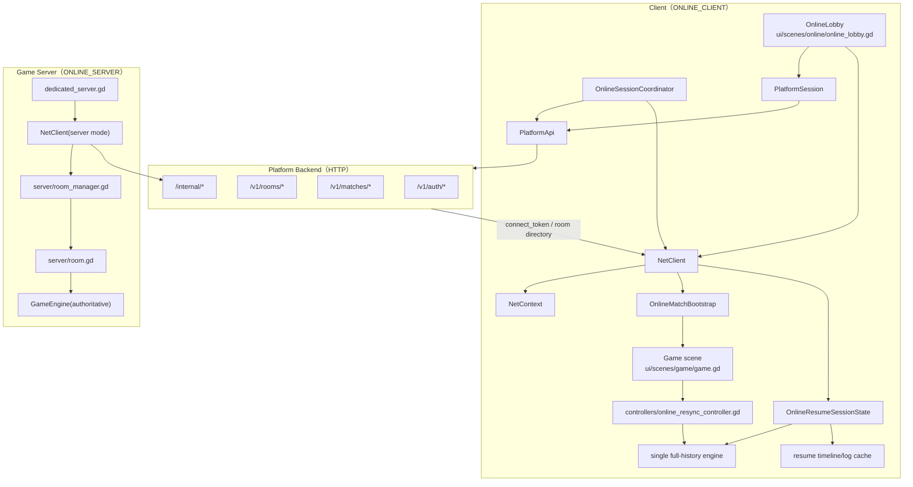
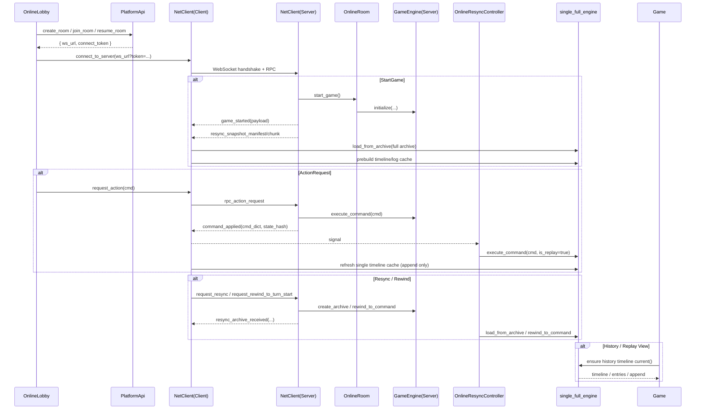

# 联机（Online Multiplayer）

状态：已落地 **平台化房间联机链路**。平台后端负责账号 / 房间目录 / `connect_token`，Godot 房间服负责实时权威对局。客户端当前支持：

- 平台房间创建 / 加入 / 恢复
- 游戏内 resync / rewind
- 启动恢复
- 恢复房完整 archive 本地回放 + 启动期 timeline/log cache 预构建

## 模块关系图（联机的主要对象与依赖）

## 模块关系图（房间创建 / 实时命令 / Resync / 恢复房单引擎启动）

## 当前已落地内容

- 房间服：
  - `server/dedicated_server.gd`
  - `server/room_manager.gd`
  - `server/room.gd`
- WebSocket 会话层：
  - `autoload/net_client.gd`
  - `autoload/net_client/client.gd`
  - `autoload/net_client_internal.gd`
- 联机大厅：
  - `ui/scenes/online/online_lobby.gd`
- 游戏内重同步：
  - `ui/scenes/game/controllers/online_resync_controller.gd`
- 启动自动恢复：
  - `autoload/online_session_coordinator.gd`
  - `autoload/online_match_bootstrap.gd`
  - `ui/scenes/game/controllers/startup_online_resume_controller.gd`
- 恢复房单引擎恢复与缓存：
  - `autoload/net_client_online_resume_support.gd`
  - `autoload/online_resume_session_state.gd`
  - `ui/scenes/game/timeline/online_resume_full_history_adapter.gd`

## 恢复房单引擎模型（当前实现）

### 1. 服务器权威轨

- `OnlineRoom.game_engine`
- 持有完整命令历史
- 负责权威执行、resync、archive 导出

### 2. 客户端 full live 轨

- 恢复房客户端常态只保留一个完整历史 engine
- 启动时直接对完整 archive 执行 `load_from_archive()`
- 该 engine 同时承担：
  - 当前 live 对局
  - 日志 / timeline 的历史真相
  - Replay / History View 的基础数据源

### 3. 预构建缓存

- 启动后立即预构建：
  - `full_replay_step_timeline`
  - `full_replay_step_timeline_entries`
- 这些字段仍保留在 `OnlineResumeSessionState` 中，但语义已从“双轨 full-side cache”收敛为“单 full-engine cache”

## OnlineResumeSessionState

代码：`autoload/online_resume_session_state.gd`

这是当前恢复房状态的中心存储，主要持有：

- `runtime_engine`（在恢复房单引擎模式下，它就是完整历史 live engine）
- `full_replay_engine`（兼容字段，当前与 `runtime_engine` 指向同一实例）
- `runtime_anchor`（恢复房单引擎模式下固定从 `0` 开始）
- `full_replay_step_timeline`
- `full_replay_step_timeline_entries`
- `single_full_engine_mode`

补充说明：

- `snapshot()` 现在会基于 engine/state signature 缓存 `runtime_state_hash` / `full_replay_state_hash`
- `single_full_engine_mode=true` 时表示恢复房已完成“完整 archive 本地回放 + cache 预构建”
- `full_replay_step_timeline_entries` 用于避免进入游戏场景后再次 full rebuild 日志 entries

## 恢复房进入策略

当前恢复房重新改回“本地完整 bootstrap 完成后再进入”的模式。

现状：

- 客户端收到 `game_started` 后，不再 fast-start
- 改为等待完整 archive snapshot 分块到达
- 本地完成：
  - archive replay
  - timeline/log cache 预构建
- `OnlineMatchBootstrap` / `OnlineSessionCoordinator` 会把这一步重新作为 ready gate
- 代价是进入更慢，但坐标、日志与时间线语义显著简化

## timeline / log 的数据源选择

截至 `2026-04-17` 的最新实现，恢复房 timeline / log 已调整为“单引擎 + 预构建 cache”：

- `ui/scenes/game/timeline/controller.gd`
- `ui/scenes/game/timeline/online_resume_history_view_support.gd`
- `ui/scenes/game/timeline/online_resume_full_history_adapter.gd`

- **live 热路径默认仍标记为 runtime source**
  - 但恢复房此时的 live engine 已经是完整历史 engine
  - `apply_live_log_timeline_from_engine()` 启动后优先复用 prebuilt timeline / entries cache
- **历史查看仍只在按需场景启用**
  - Replay
  - History View
  - 完整历史 seek / 复盘

完整历史适配层当前仍会优先复用：

- cached full-history timeline
- cached full-history timeline entries
- incremental append

### 当前约束

- 启动时允许一次性承担完整 archive replay 与 full timeline/log build 成本
- 进入游戏后，不允许重新回到“双轨同步推进”的热路径
- 启动后收到新 `command_applied` 时，仍必须走：
  - 单引擎状态推进
  - 单 timeline cache append / refresh

## 补充说明

- 当前已不再走“纯直连大厅”模式；房间创建、加入、恢复都以平台后端返回的 `connect_token` 为入口
- 客户端对局内 hash / index 不一致时，会优先走 resync，而不是直接强退回大厅
- `NetContext.online_resume_state` 会持续记录 room_code、cursor、state_hash，用于冷恢复 / 场景切换恢复
- 联机热路径性能分析统一使用 `core/debug/online_perf_trace.gd`
