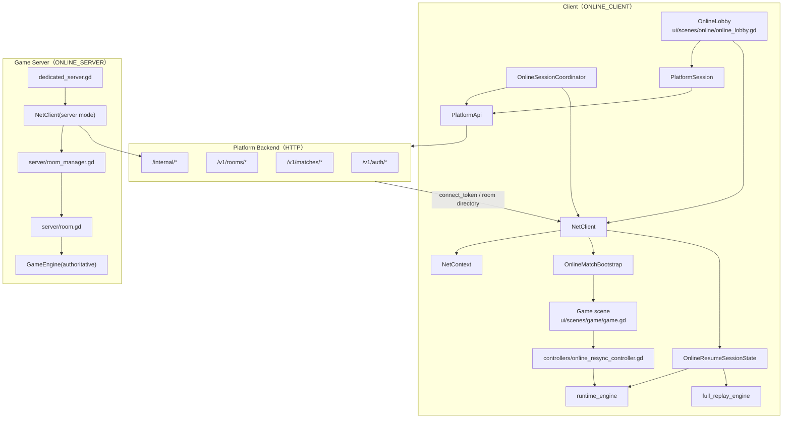
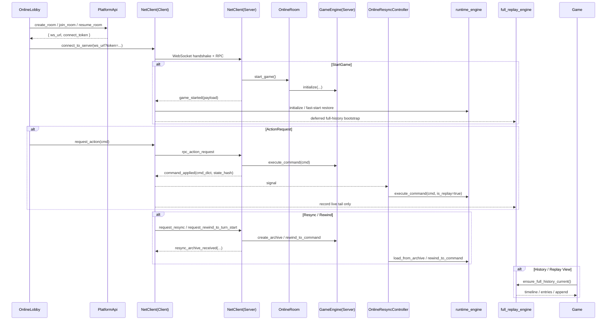

# 联机（Online Multiplayer）

状态：已落地 **平台化房间联机链路**。平台后端负责账号 / 房间目录 / `connect_token`，Godot 房间服负责实时权威对局。客户端当前支持：

- 平台房间创建 / 加入 / 恢复
- 游戏内 resync / rewind
- 启动恢复
- 恢复房快启动 + 完整历史后台构建

## 模块关系图（联机的主要对象与依赖）

## 模块关系图（房间创建 / 实时命令 / Resync / 恢复房双轨）

## 当前已落地内容

- 房间服：
  - `server/dedicated_server.gd`
  - `server/room_manager.gd`
  - `server/room.gd`
- WebSocket 会话层：
  - `autoload/net_client.gd`
  - `autoload/net_client/client.gd`
  - `autoload/net_client_internal.gd`
- 联机大厅：
  - `ui/scenes/online/online_lobby.gd`
- 游戏内重同步：
  - `ui/scenes/game/controllers/online_resync_controller.gd`
- 启动自动恢复：
  - `autoload/online_session_coordinator.gd`
  - `autoload/online_match_bootstrap.gd`
  - `ui/scenes/game/controllers/startup_online_resume_controller.gd`
- 恢复房完整历史双轨：
  - `autoload/net_client_online_resume_support.gd`
  - `autoload/online_resume_session_state.gd`
  - `ui/scenes/game/timeline/online_resume_full_history_adapter.gd`

## 恢复房双轨模型（当前实现）

### 1. 服务器权威轨

- `OnlineRoom.game_engine`
- 持有完整命令历史
- 负责权威执行、resync、archive 导出

### 2. 客户端 runtime 轨

- `runtime_engine`
- 用于当前 live 对局
- 接收 `command_applied` 后立即更新
- 是玩家操作与 UI 主视图的实时数据源

### 3. 客户端 full history 轨

- `full_replay_engine`
- 用于日志、timeline、回放、复盘
- 恢复房中不再要求每条 live 命令都同步推进到这个 engine
- 当前做法是：
  - 先记录 `live_tail`
  - 在完整历史查看 / timeline 构建前按需补齐

## OnlineResumeSessionState

代码：`autoload/online_resume_session_state.gd`

这是当前恢复房双轨状态的中心存储，主要持有：

- `runtime_engine`
- `full_replay_engine`
- `full_archive`
- `runtime_anchor`
- `full_replay_live_tail_commands`
- `full_replay_step_timeline`
- `full_replay_step_timeline_entries`

补充说明：

- `snapshot()` 现在会基于 engine/state signature 缓存 `runtime_state_hash` / `full_replay_state_hash`
- `full_replay_step_timeline_entries` 用于避免恢复房每次都重新格式化完整日志 entries

## 恢复房进入策略

当前恢复房已不是“必须等完整历史 ready 才能进游戏”的模式。

现状：

- 快启动优先把 `runtime_engine` 拉起
- 进入对局后，完整历史在后台继续准备
- `OnlineSessionCoordinator` / `OnlineMatchBootstrap` 仍保留完整历史 ready 的状态通知
- 但默认不再把它作为进入主对局的硬 gate

## timeline / log 的数据源选择

截至 `2026-04-17` 的最新实现，恢复房 timeline / log 已开始按 P0 分层：

- `ui/scenes/game/timeline/controller.gd`
- `ui/scenes/game/timeline/online_resume_history_view_support.gd`
- `ui/scenes/game/timeline/online_resume_full_history_adapter.gd`

- **live 热路径默认走 runtime 侧**
  - `apply_live_log_timeline_from_engine()` 只读取 `runtime_engine`
  - `resume_full_history_ready` 不再自动接管 live log
- **完整历史只在按需场景启用**
  - Replay
  - History View
  - 完整历史 seek / 复盘

完整历史适配层仍会优先复用：

- cached full-history timeline
- cached full-history timeline entries
- incremental append

### 已确认的问题（2026-04-17）

最新实测日志表明，这一“live 日志默认优先走完整历史侧”的实现仍会把完整历史成本带回实时联机热路径。

典型现象：

- `client_request_to_rx_ms` 与 `server_exec_ms` 都不高；
- 但在客户端收到 `command_applied` 之后，仍会出现：
  - `resume_cache.timeline_cache_refresh.done` 数百毫秒
  - `ui.game_log.append_step_timeline` 数百毫秒
  - `ui.game_log.load_step_timeline` 近秒级
  - `ui.timeline.apply_live_log` 秒级

这说明当前问题的根因不是服务器慢，而是：

> **实时联机 UI 仍然默认依赖 full-history timeline / log 资产。**

### P0 收敛结果（当前）

为彻底解决这一问题，当前架构已先落地 P0 第一阶段：

- **实时联机热路径默认只依赖 `runtime_engine`**
  - 当前操作 UI
  - 地图 / 面板 / overlay
  - 实时日志 append
  - 实时 timeline head / cursor
- **完整历史资产只在按需场景接管**
  - Replay
  - History View
  - 完整历史 seek / 复盘
  - 完整 archive 导出 / 校验

当前仍需继续验证与收敛的部分：

- 显式进入完整历史时的 timeline / log 装配成本
- 通用 `panel_controller.sync` / `map_view` / overlay 刷新成本

## 补充说明

- 当前已不再走“纯直连大厅”模式；房间创建、加入、恢复都以平台后端返回的 `connect_token` 为入口
- 客户端对局内 hash / index 不一致时，会优先走 resync，而不是直接强退回大厅
- `NetContext.online_resume_state` 会持续记录 room_code、cursor、state_hash，用于冷恢复 / 场景切换恢复
- 联机热路径性能分析统一使用 `core/debug/online_perf_trace.gd`
