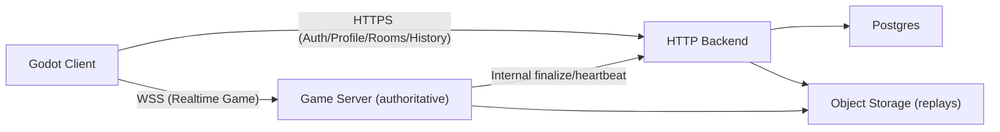

# 在线平台后端（HTTP）+ 账号体系 + 历史对局（房间制）

状态：规划（未落地）。

> 本文描述一个“独立 HTTP 后端 + 独立 game server”的线上化方案，用于支持：
>
> - 房间制联机（无天梯匹配）
> - 游客账号（可升级/绑定到正式账号）
> - 实时同步（权威服务器、命令广播回放）
> - 强需求观战（旁观者中途加入/只读）
> - 历史对局与回放：沿用现有 `GameEngine.create_archive()` 的 archive 格式（不改回放协议）
>
> 当前仓库已落地的联机能力请先读：`docs/architecture/70-online-multiplayer.md`。

## 1. 背景：本仓库现状（可复用的基础）

本项目已经具备“桌游线上化”的关键基础设施：

- **确定性引擎与命令历史**：`core/engine/game_engine.gd`
  - `execute_command` 是唯一写入口
  - `command_history` + `full_replay/rewind_to_command` 支持回放/倒带
- **在线同步（WebSocket + RPC）**：`autoload/net_client.gd`（client/server 共用）
  - server 侧在 `autoload/net_client/server.gd`：执行命令并广播 `CommandApplied`
  - client 侧在 `autoload/net_client/client.gd`：接收命令并回放到本地 `GameEngine`
- **存档/回放格式（Archive）**：`core/engine/game_engine/archive.gd`
  - `initial_state + rng + commands (+ checkpoints metadata)` 是事实来源
  - 可用于：断线重连 resync、观战追平、历史回放文件
- **房间与旁观者**（现有 dedicated server）：
  - `server/room_manager.gd`、`server/room.gd`
  - InGame 允许 JoinRoom 作为 spectator（只读）
  - 断线处理当前会触发 `forfeit_player`（可在后续演进为“保座位+超时弃权”）

本文只引入一个新概念：**平台后端（HTTP Backend）**，用于管理账号/会话/房间目录/历史索引等“平台能力”。

## 2. 目标与约束（已确认）

- 对局形态：房间制（不做天梯匹配）
- 账号：需要游客账号（可绑定/升级为正式账号）
- 同步：实时同步为主（权威服务器、命令回放）
- 观战：强需求（中途加入、只读、尽量不影响对局）
- 回放：沿用现有 archive（不重做 event-sourcing 格式）
- 部署：独立 HTTP 后端 + 独立 game server（可多实例）

## 3. 总体架构（平台后端 + game server）

职责边界（最重要）：

- **HTTP Backend**：身份/账号/会话、房间目录（room_code → ws_url）、权限（是否允许观战/密码房间）、对局索引、回放文件存储入口、风控/封禁。
- **Game Server**：房间与对局的运行时状态机、命令校验与广播、断线重连、观战接入、生成 archive 并上报/上传。

> 备注：game server 可以继续用当前 Godot headless dedicated server 形态（`server/dedicated_server.gd` + `NetClient.start_server`），只是把“账号/房间目录”迁出到 HTTP Backend。

## 4. 账号体系（Identity / Auth / Session）

### 4.1 身份模型：User + 多种登录方式（含 Guest）

建议数据模型（Postgres）：

- `users`
  - `user_id`（UUID/雪花）
  - `status`（active/banned/deleted）
  - `created_at`
- `auth_identities`
  - `provider`：`guest` / `email` / `steam` / `apple` ...
  - `provider_user_id`：guest 可用 `device_id`，email 用 email，第三方用 `sub`
  - `user_id` 外键
  - `verified`（email/第三方）
  - 唯一约束：`(provider, provider_user_id)`
- `sessions`
  - `session_id`（高熵随机不透明串）
  - `user_id`
  - `expires_at`、`revoked_at`
  - `device_id`、`ip`、`ua`（风控/审计）

### 4.2 游客账号（推荐默认静默登录）

流程建议：

1. 客户端首次启动生成并持久化 `device_id`（UUID，存 `user://`）。
2. 进入在线模式时，若无有效 session：
   - `POST /v1/auth/guest { device_id }`
   - 后端返回 `{ user_id, session_id, profile }`
3. 客户端进入在线大厅（无需用户手动注册）。

### 4.3 注册/登录/绑定（Guest → 正式账号）

最小闭环（先做 email+password 或 任一第三方）：

- `POST /v1/auth/register`：创建 email identity（可要求邮箱验证）
- `POST /v1/auth/login`：返回 session
- `POST /v1/auth/bind`：把当前 guest user 绑定到 email/第三方（或合并账号）
- `POST /v1/auth/logout`：吊销 session

关键语义：**Guest 只是身份来源之一**，并不是“另一套用户表”。绑定等价于“给同一个 user 增加一个 identity”。

## 5. 连接 game server 的鉴权：connect_token

为了让 game server 与 HTTP Backend 解耦，建议用短效连接票据：

- Backend 签发 **`connect_token`**（JWT 或 HMAC 签名的不透明串）
- Client 连接 game server 时携带该 token（作为 ClientHello/Handshake 的字段）
- Game server 验签后确认：`user_id`、`room_code`、`role`、`exp`

`connect_token` 最少包含：

- `room_code`
- `user_id`
- `role`：`host` / `player` / `spectator`
- `exp`（30–60s）
- 可选：`seat_index`（若要固定座位）、`display_name`（防止客户端伪造昵称）、`ban_flags`

> 安全要点：connect_token 只用于“连接/加入房间”，不要长期有效；长期会话仍由 Backend 的 `session_id` 负责。

## 6. 房间目录（Directory）与观战策略

### 6.1 为什么需要“房间目录”

当前实现中，房间存在于某个 dedicated server 的内存里；要做多实例/扩容，必须有一个中心把：

- `room_code` 映射到 `game_server_ws_url`
- 管控权限（是否允许观战/是否需要密码/是否封禁）

这就是 HTTP Backend 的 `rooms` 表与 API。

### 6.2 房间/观战相关数据模型（建议）

- `rooms`
  - `room_id`
  - `room_code`
  - `owner_user_id`
  - `game_server_id`
  - `status`（Lobby/InGame/Ended）
  - `join_policy`（password/public）
  - `password_hash`（可选：只存 hash）
  - `config_json`（desired_player_count、modules_v2_base_dir、enabled_modules_v2、allow_spectators...）
  - `created_at` / `updated_at`
- `room_members`
  - `room_id`
  - `user_id`
  - `role`（host/player/spectator）
  - `seat_index`（player 才有；spectator 为 null）
  - `joined_at` / `left_at`

### 6.3 观战策略（强需求必须先定口径）

建议在 `rooms.config_json` 固化：

- `allow_spectators: bool`
- `spectator_policy: "public" | "code_only"`（先做两档足够）
- `max_spectators: int`（可选）
- `spectator_delay_sec: int`（可选，未来竞技/防窥）

## 7. Game server：实时同步、观战加入、断线重连

### 7.1 实时同步：继续使用“命令广播回放”

不改变现有事实来源与同步范式：

- client → server：`ActionRequest(action_id, params, request_id)`
- server：执行 `engine.execute_command(cmd)`（权威校验）
- server → clients：广播 `CommandApplied{ cmd_dict, state_hash }`
- client：本地 `execute_command(cmd, is_replay=true)` 回放，hash 不一致则 `ResyncRequest`

### 7.2 观战中途加入（spectator join InGame）

旁观者加入正在进行的对局时，体验目标：

1. 快速追平到当前状态
2. 之后持续接收实时 `CommandApplied`

推荐做法（沿用现有能力）：

- spectator join 成功后，game server 立即下发 `ResyncArchive(engine.create_archive())`
- 客户端加载 archive 后进入“观战视角”，再开始接收命令流

### 7.3 隐信息与旁观者（不要泄漏）

本项目存在隐信息（例如储备卡选择），并且已经有脱敏路径（见 `docs/architecture/70-online-multiplayer.md` 的“储备卡保密”条目）。

当引入旁观者时，建议明确规则：

- spectator **不应**看到任何玩家的隐信息；
- server 广播的 `CommandApplied`/事件必须按接收者裁剪（player vs spectator），或确保 payload 在客户端侧必经 `command_privacy` 脱敏并且 spectator 视为“非本人”。

> 结论：观战不是“把所有消息广播给更多人”这么简单，必须把隐信息裁剪纳入协议与实现检查清单。

### 7.4 断线重连（建议比当前更成熟）

当前 server 侧掉线会 `forfeit_player`。若目标是“成熟线上体验”，建议演进为：

- `grace_period_sec`：断线保座位（例如 120s）
- grace 内同 `user_id` 重连可恢复 seat，并下发 `ResyncArchive`
- 超时仍未回：再执行 `forfeit_player`

这部分不影响本文的架构分层，只影响 game server 的房间状态机策略。

## 8. 历史对局与回放（沿用 archive）

### 8.1 存什么：Match Summary + ReplayArchive

- `Match Summary`：用于列表/筛选/显示（谁 vs 谁、开始/结束、胜负、模块、seed、命令数、final_hash）
- `ReplayArchive`：直接使用 `GameEngine.create_archive()` 生成的 dict（建议压缩存对象存储）

### 8.2 存储与写入流程

对局结束时（game server）：

1. `archive = engine.create_archive()`（事实来源）
2. `archive` 压缩并上传对象存储，得到 `storage_uri + checksum`
3. 调用 Backend 内网接口写入：
   - match summary
   - replay 指针（uri/checksum/size）

Backend 对外提供：

- 查询历史：`GET /v1/matches`
- 获取回放：`GET /v1/matches/{match_id}/replay`（直传或签名 URL）

### 8.3 对局数据模型（建议）

- `matches`
  - `match_id`
  - `room_id`、`room_code`
  - `game_server_id`
  - `started_at` / `ended_at`
  - `seed`、`modules_json`、`schema_version`、`game_version`
  - `final_hash`
  - `summary_json`
- `match_players`
  - `match_id`
  - `user_id`
  - `seat_index`
  - `result`、`score_json`、`disconnect_count`
- `match_replays`
  - `match_id`
  - `storage_uri`
  - `checksum`、`size_bytes`
  - `created_at`

权限建议（默认安全）：

- 只有 `match_players` 可访问 replay；
- 若要支持“公开分享回放”，在后端增加 `share_id`（高熵随机）并可撤销。

## 9. 客户端账号注册/登录 UI：放在哪、怎么接（补齐缺失）

本仓库 UI 的常见组织方式：

- 入口场景：`ui/scenes/main_menu.tscn`（脚本：`ui/scenes/menus/main_menu.gd`）
- 在线大厅：`ui/scenes/online/online_lobby.tscn`
- 可复用弹窗：`ui/dialogs/*`
- 可复用组件：`ui/components/*`

因此账号相关 UI 推荐两层：

### 9.1 “账号弹窗”（优先推荐：放在 dialogs）

放置位置（建议）：

- `ui/dialogs/auth_dialog.tscn`
- `ui/dialogs/auth_dialog.gd`

使用方式：

- 主菜单右上角/底部加一个“账号”入口（可选）
- 在线大厅（`online_lobby.tscn`）必有账号入口：
  - 若是 guest：显示“游客（未绑定）” + “注册/绑定”按钮
  - 若已登录：显示昵称 + “切换账号/退出登录”

弹窗功能分片（MVP）：

- Tab A：登录（email+password 或 第三方按钮）
- Tab B：注册（email+password）
- Tab C：绑定（当当前身份为 guest 时展示：把 guest 绑定到正式账号）

### 9.2 “账号组件”（可选：放在 ui/components）

如果在线大厅/主菜单都需要显示账号状态，可抽组件：

- `ui/components/account/account_badge.tscn`：显示头像/昵称/状态
- `ui/components/account/account_menu.tscn`：下拉菜单（绑定/登出）

### 9.3 客户端逻辑放哪（建议放 autoload）

账号/会话/HTTP API 不应塞进 UI 脚本里，建议新增：

- `autoload/platform_session.gd`：保存 session、负责 guest 自动登录、登出、持久化到 `user://`
- `autoload/platform_api.gd`：封装 Backend HTTP 调用（`/auth/*`、`/rooms/*`、`/matches/*`）

UI 只订阅状态并触发调用：

- 在线大厅进入时：确保 `platform_session.ensure_guest_or_login()` 已完成
- 加入/观战：走 Backend 获取 `{ ws_url, connect_token }`，再连接 game server

## 10. HTTP API 清单（建议的最小闭环）

### 10.1 对外（Client → Backend）

- `POST /v1/auth/guest`：`{ device_id }` → `{ session_id, user_id, profile }`
- `POST /v1/auth/register`：`{ email, password }` → `{ session_id, user_id }`
- `POST /v1/auth/login`：`{ email, password }` → `{ session_id, user_id }`
- `POST /v1/auth/bind`：`{ session_id, ... }` → `{ user_id }`
- `POST /v1/auth/logout`

- `POST /v1/rooms`：创建房间 → `{ room_code, ws_url, connect_token }`
- `POST /v1/rooms/{room_code}/join`：加入房间 → `{ ws_url, connect_token }`
- `POST /v1/rooms/{room_code}/spectate`：观战 → `{ ws_url, connect_token }`
- `GET /v1/matches`：历史对局列表
- `GET /v1/matches/{match_id}`：详情/summary
- `GET /v1/matches/{match_id}/replay`：回放下载（或签名 URL）

### 10.2 内网（Game server ↔ Backend）

- `POST /internal/game_servers/heartbeat`
- `POST /internal/matches/finalize`：写入 summary + replay uri

> 房间创建是否需要“backend → game server 预创建”取决于实现选型：
> - 简化：room 仍由 game server 自己生成 code，backend 只做目录缓存（实现快，但多实例下更复杂）
> - 推荐：backend 生成 room_code 并选择 server，再请求 server 创建（目录强一致、易扩容）

