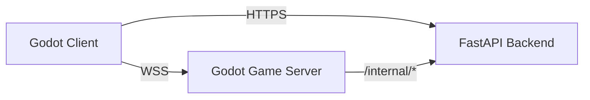

# 在线平台后端（HTTP）+ 账号体系 + 历史对局（房间制）

状态：**已落地**。当前仓库已经包含一套可运行的平台后端与客户端接入层：

- 后端：`backend/app/*.py`（FastAPI）
- 客户端平台会话：`autoload/platform_session.gd`
- 客户端 HTTP API：`autoload/platform_api.gd`
- 联机恢复编排：`autoload/online_session_coordinator.gd`

## 1. 背景：本仓库现状（可复用的基础）

当前在线链路由三部分组成：

1. **平台后端（HTTP）**
   - 账号、游客登录、device auth、房间目录、connect_token、历史对局、后台管理
2. **房间服（Godot headless）**
   - 权威 `GameEngine`、实时命令广播、resync / rewind / reconnect
3. **客户端（Godot）**
   - `PlatformSession` 维护登录态，`OnlineLobby` 通过 HTTP 获取 ticket，再用 `NetClient` 连 WS

## 2. 目标与约束（当前实现口径）

- 对局形态：房间制
- 身份体系：游客账号 + 正式账号（email/password）+ device auth 辅助流
- 同步方式：平台后端签发短时 `connect_token`，房间服负责实时权威对局
- 历史对局：平台后端保存 summary / replay pointer，并提供下载接口
- 恢复能力：客户端支持 resume ticket、WS 重连、对局 resync、启动时自动恢复

## 3. 总体架构（平台后端 + game server）

职责边界：

- **Backend**：身份、会话、房间目录、connect_token、match index、replay download、admin API
- **Game Server**：房间内权威规则执行、实时同步、断线重连、观战、rewind / resync

## 4. 账号体系（Identity / Auth / Session）

### 4.1 身份模型：User + 多种登录方式（含 Guest）

后端模型位于：`backend/app/models.py`

当前主要实体：

- `User`
- `AuthIdentity`
- `Session`
- `DeviceCode`

客户端持久化字段位于：`autoload/platform_session.gd`

- `user_id`
- `session_id`
- `is_guest`
- `display_name`
- `device_id`
- `email`
- `is_admin`

### 4.2 游客账号（默认静默登录）

当前流程：

1. 客户端启动后确保本地 `device_id`
2. 进入在线模式时调用 `PlatformSession.auto_guest_login()`
3. 实际请求：`POST /v1/auth/guest`
4. 返回：`{ user_id, session_id, display_name, is_guest }`

### 4.3 注册 / 登录 / 绑定

当前已实现：

- `POST /v1/auth/register`
- `POST /v1/auth/login`
- `POST /v1/auth/bind`
- `GET /v1/auth/me`
- `PUT /v1/auth/profile`
- `PUT /v1/auth/email`
- `PUT /v1/auth/password`
- `POST /v1/auth/logout`

## 5. 连接 game server 的鉴权：`connect_token`

平台后端在房间相关接口中返回：

- `room_code`
- `ws_url`
- `connect_token`

客户端把 token 直接拼到 WS URL 查询串，由 `NetClient.connect_to_server(...)` 解析并写入 `NetContext.connect_token`。

后端签发逻辑位于：`backend/app/connect_token.py`，房间接口位于：`backend/app/rooms.py`。

## 6. 房间目录（Directory）与观战策略

### 6.1 为什么需要“房间目录”

房间目录已由后端落地：

- 房间列表：`GET /v1/rooms`
- 房间详情：`GET /v1/rooms/{room_code}`
- 房间创建：`POST /v1/rooms`
- 加入：`POST /v1/rooms/{room_code}/join`
- 恢复：`POST /v1/rooms/{room_code}/resume`
- 观战：`POST /v1/rooms/{room_code}/spectate`

### 6.2 房间 / 观战相关数据模型（当前实现）

后端核心模型：

- `Room`
  - `status`：至少覆盖 `Pending / Lobby / InGame / Ended`
  - `join_policy`
  - `password_hash`
  - `config_json`
  - `ws_url`
  - `game_server_id`
- `RoomMember`
  - `role`
  - `seat_index`
  - `member_status`
  - `generation`

### 6.3 观战策略（当前实现）

- InGame 加入时，`RoomManager.join_room(...)` 会把新加入者作为 spectator
- 平台层 `spectate_room` 会为 spectator 签发 `connect_token`
- 房间状态与是否允许观战由 `config_json.allow_spectators` 控制

## 7. Game server：实时同步、观战加入、断线重连

### 7.1 实时同步：继续使用“命令广播回放”

当前实时同步链路：

- client 发 action request
- server 权威 `execute_command`
- server 广播 `command_applied(cmd_dict, state_hash)`
- client 本地 `execute_command(cmd, is_replay=true)`

### 7.2 观战中途加入（spectator join InGame）

当前实现中，spectator 加入后会通过 resync / archive 追平状态，再继续接收命令流。

### 7.3 隐信息与旁观者

当前仍沿用 `core/utils/command_privacy.gd` 的脱敏路径；`NetContext.get_command_privacy_viewer_player_id()` 会把 spectator 视为“非本人视角”。

### 7.4 断线重连（当前实现）

当前恢复链路已经落地：

- 平台后端：`POST /v1/rooms/{room_code}/resume`
- 客户端协调：`autoload/online_session_coordinator.gd`
- Lobby 恢复：`ui/scenes/online/online_lobby_resume_controller.gd`
- 游戏场景启动恢复：`ui/scenes/game/controllers/startup_online_resume_controller.gd`
- InGame 重同步：`ui/scenes/game/controllers/online_resync_controller.gd`

### 7.5 回退操作与观战者（`rewind_to_turn_start`）

当前实现支持：

- client 请求回退到当前玩家回合开始
- server 在权威引擎上 rewind 并广播元数据或 resync 结果
- 其他 client（包括 spectator）本地同步回退

## 8. 历史对局与回放（沿用 archive）

### 8.1 存什么：Match Summary + ReplayArchive

后端接口位于：`backend/app/matches.py`

当前对外接口：

- `GET /v1/matches`
- `GET /v1/matches/{match_id}`
- `GET /v1/matches/{match_id}/replay`
- `GET /v1/matches/{match_id}/replay/download`

### 8.2 存储与写入流程

房间服通过内网接口上报：

- `POST /internal/matches/finalize`

后端再把 replay 保存到本地或对象存储抽象（见 `backend/app/replay_storage.py`）。

### 8.3 对局数据模型（当前实现）

主要模型：

- `Match`
- `MatchParticipant`
- `MatchReplay`

后端已额外从 replay 中提取部分对局统计，用于 summary / detail 展示。

## 9. 客户端账号注册 / 登录 UI：放在哪、怎么接（当前实现）

当前入口主要在联机大厅：

- `ui/scenes/online/online_lobby.gd`
- `ui/dialogs/auth_dialog.gd`
- `ui/dialogs/account_settings_dialog.gd`

`PlatformSession` 是 Godot 客户端的账号事实来源；`NetContext.player_profile` 仅承载“当前房间中的公开对局身份”。

## 10. HTTP API 清单（当前最小闭环）

### 10.1 Client → Backend

认证：

- `/v1/auth/guest`
- `/v1/auth/register`
- `/v1/auth/login`
- `/v1/auth/bind`
- `/v1/auth/me`
- `/v1/auth/profile`
- `/v1/auth/email`
- `/v1/auth/password`
- `/v1/auth/logout`

Device Auth：

- `/v1/auth/device/code`
- `/v1/auth/device/token`

房间：

- `/v1/rooms`
- `/v1/rooms/{room_code}`
- `/v1/rooms/{room_code}/join`
- `/v1/rooms/{room_code}/resume`
- `/v1/rooms/{room_code}/spectate`

历史对局：

- `/v1/matches`
- `/v1/matches/{match_id}`
- `/v1/matches/{match_id}/replay`
- `/v1/matches/{match_id}/replay/download`

### 10.2 Game server ↔ Backend（内网）

- `/internal/game_servers/heartbeat`
- `/internal/game_servers/{game_server_id}/rooms/active`
- `/internal/game_servers/{game_server_id}/rooms/sync`
- `/internal/matches/finalize`

### 10.3 Admin API

当前后端已实现后台管理接口：

- `/admin/users*`
- `/admin/rooms*`
- `/admin/matches*`

## 11. 当前实现：仅平台模式（已移除直连）

当前代码口径：

- 联机入口默认先走平台后端，再进入 WebSocket 房间服
- 不再维护“用户手填 ws 地址后直接进房”的主流程语义
- `OnlineLobby` 仍保留自定义服务器选择 UI，但平台后端仍是房间创建/加入/恢复的事实来源

## 12. 部署与 TLS

当前后端提供：

- `backend/Dockerfile`
- `server/Dockerfile`

客户端 `PlatformApi` 已支持：

- 环境变量或项目设置指定 `platform_backend_url`
- HTTPS 连接
- 调试时通过 `FCM_PLATFORM_TLS_INSECURE=1` 放宽 TLS 校验

健康检查接口：`GET /health`
