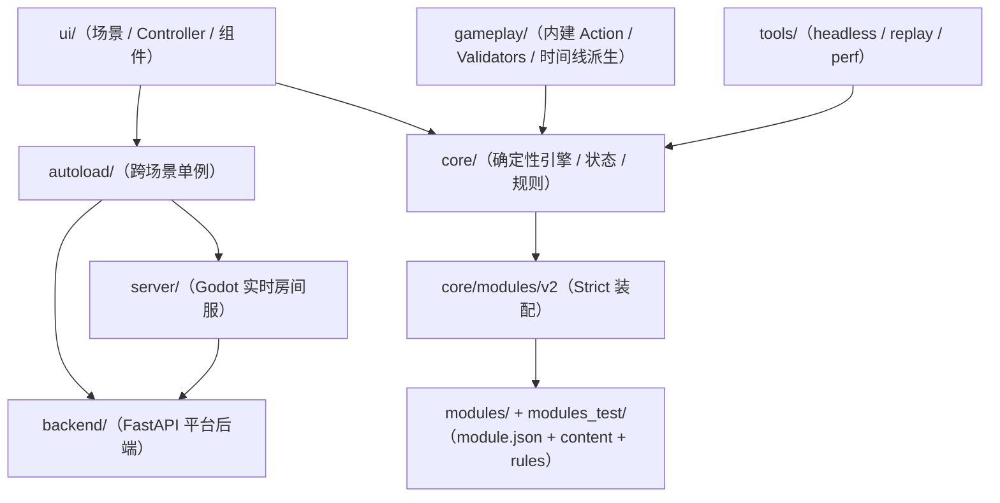

# 架构文档（对照当前代码的索引）

本文档集只描述 **当前仓库已落地** 的结构与约定：以 `core/` 的确定性引擎、`modules/` 的 Strict Mode 装配、以及 `backend/ + server/ + autoload/` 组成的在线平台链路为中心。

## 总览关系图（目录级）

建议阅读顺序：

1. `docs/architecture/00-system-overview.md`：系统总览（命令驱动、模块装配、回放/存档/联机平台）
2. `docs/architecture/10-autoload.md`：全局单例（`GameLog`/`Globals`/`SceneManager`/`EventBus`/`DebugFlags`/`NetContext`/`NetClient`/`OnlineSessionCoordinator`/`PlatformApi`/`PlatformSession`）
3. `docs/architecture/20-ui.md`：UI 入口（主菜单/设置/本地开局/联机大厅/自动恢复）与 `GameEngine` 的交互方式
4. `docs/architecture/21-ui-game-scene.md`：Game 场景 controller 拆分（`ui/scenes/game/*`）
5. `docs/architecture/25-debug-and-profiling.md`：调试与性能打点（`DebugFlags` / `ui/debug/*` / `PerfTrace`）
6. `docs/architecture/30-core-engine.md`：`GameEngine`（初始化、命令执行、回放、倒带、校验点、依赖注入）
7. `docs/architecture/30a-core-engine-auto-advance.md`：自动推进（AutoAdvance）与阶段门禁（`pending_phase_actions`）
8. `docs/architecture/30b-core-engine-archive.md`：存档格式（archive）与加载语义
9. `docs/architecture/31-core-phase-manager.md`：`PhaseManager`（阶段/子阶段推进、结算触发、Hooks 与顺序覆盖）
10. `docs/architecture/32-core-actions-framework.md`：动作框架（`ActionRegistry` / `ActionExecutor` / 可用性门禁 / 校验链）
11. `docs/architecture/33-core-state-model.md`：`GameState`（schema、序列化/哈希、运行时缓存）
12. `docs/architecture/33a-core-state-schema-contract.md`：状态扩展契约（模块如何扩展 `state.map` / `state.round_state`）
13. `docs/architecture/33b-core-state-serialization.md`：序列化/反序列化与 schema 归一化
14. `docs/architecture/34-core-events.md`：`EventBus`（事件历史与重建历史）
15. `docs/architecture/35-core-data-random.md`：数据与随机（`GameConfig`、内容 registries、`RandomManager`）
16. `docs/architecture/36-core-map.md`：地图系统（Map 生成/烘焙/运行时结构、放置校验、道路缓存）
17. `docs/architecture/37-core-rules.md`：规则系统（Settlement / Effects / Providers / registries）
18. `docs/architecture/40-gameplay-actions.md`：内建动作实现（`gameplay/actions`）
19. `docs/architecture/41-gameplay-validators.md`：复用校验器（`gameplay/validators`）
20. `docs/architecture/42-gameplay-replay-timelines.md`：派生时间线（`StepTimeline` / `EventTimeline`）
21. `docs/architecture/50-tools-replay.md`：回放与确定性验证工具（`tools/replay_runner.gd`）
22. `docs/architecture/52-testing.md`：测试分层（`core/tests` + `ui/scenes/tests`）
23. `docs/architecture/60-modules-v2.md`：模块系统 V2（Strict Mode 的实际实现与扩展点）
24. `docs/architecture/61-content-catalog-schema.md`：ContentCatalog 内容格式（`modules/*/content/*.json`）
25. `docs/architecture/62-module-development-guide.md`：开发新模块指南（从 `module.json` 到 rules/UI/存档兼容）
26. `docs/architecture/70-online-multiplayer.md`：联机实时层（平台后端 + 房间服 + 客户端恢复）
27. `docs/architecture/71-online-platform-backend-and-accounts.md`：平台后端、账号体系、房间目录与历史对局

补充：

- 测试与 headless 运行：`docs/testing.md`
