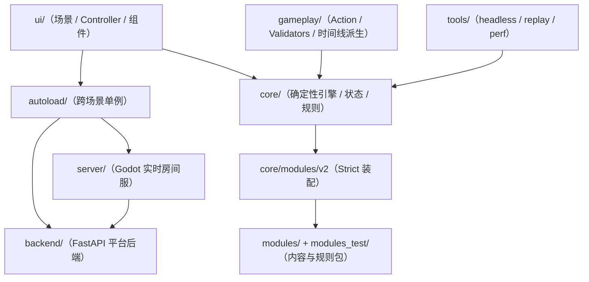

# 当前架构索引

本目录只描述当前仓库已经落地的结构与约定：以 `core/` 的确定性引擎、`modules/` 的 Strict Mode 装配，以及 `backend/ + server/ + autoload/` 的在线平台链路为中心。方案和计划不能覆盖这里的实现事实；高影响取舍同时记录在 [ADR](../decisions/README.md)。

## 推荐阅读顺序

### 总览与 UI

1. [系统总览](00-system-overview.md)
2. [Autoload 单例](10-autoload.md)
3. [UI 入口](20-ui.md)
4. [Game 场景](21-ui-game-scene.md)
5. [Onboarding / Tutorials](22-ui-onboarding-tutorials.md)
6. [Overlay Guidelines](23-ui-overlay-guidelines.md)
7. [调试与性能](25-debug-and-profiling.md)

### Core 与数据

1. [GameEngine](30-core-engine.md)
2. [Auto Advance](30a-core-engine-auto-advance.md)
3. [Archive 语义](30b-core-engine-archive.md)
4. [PhaseManager](31-core-phase-manager.md)
5. [Actions Framework](32-core-actions-framework.md)
6. [State Model](33-core-state-model.md)
7. [State Extension Contract](33a-core-state-schema-contract.md)
8. [State Serialization](33b-core-state-serialization.md)
9. [Events](34-core-events.md)
10. [Data and Random](35-core-data-random.md)
11. [Map](36-core-map.md)
12. [Rules](37-core-rules.md)

### Gameplay、测试与模块

1. [Gameplay Actions](40-gameplay-actions.md)
2. [Gameplay Validators](41-gameplay-validators.md)
3. [Replay Timelines](42-gameplay-replay-timelines.md)
4. [Replay Tools](50-tools-replay.md)
5. [Testing Architecture](52-testing.md)
6. [Modules V2](60-modules-v2.md)
7. [Content Catalog Schema](61-content-catalog-schema.md)
8. [Module Development Guide](62-module-development-guide.md)

### 联机与平台

1. [Online Multiplayer](70-online-multiplayer.md)
2. [Platform Backend and Accounts](71-online-platform-backend-and-accounts.md)
3. [F-002 聚合页](../features/F-002-online-resume-bootstrap.md)
4. [联机专题导航](../online/README.md)

测试命令、日志语义与 headless 约定见 [测试规范](../testing.md)。Architecture 发生实质变化时，必须同步对应 Feature；改变长期取舍时先创建或替代 ADR。
