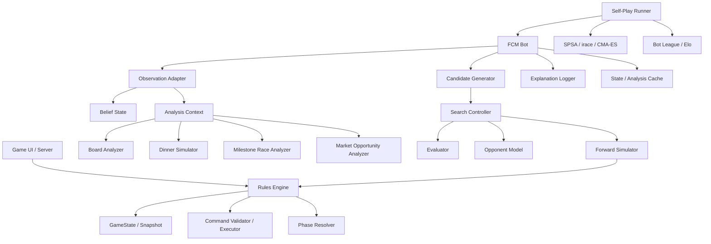

# 《快餐连锁大亨》启发式人机对手实现方案

> 目标：在已有规则引擎、且每个合法动作都可表示为命令的前提下，实现一个**不使用深度学习、不使用强化学习**的启发式规则 bot。该 bot 应能稳定完成游戏、具备可解释决策、支持难度调节，并可通过自对弈自动调参。
>
> 本文档按“开发可执行规格”编写。读完后应能直接拆任务、建数据结构、写测试、实现搜索与调参管线。

---

## 0. 文档适用范围与核心结论

### 0.1 适用前提

本文假设你已经有以下能力：

1. 一个完整的《Food Chain Magnate / 快餐连锁大亨》规则引擎。
2. 所有玩家动作都能表示为 `Command`，例如：
   - `ChooseReserveCardCommand`
   - `PlaceInitialRestaurantCommand`
   - `SubmitCompanyStructureCommand`
   - `ChooseTurnOrderSlotCommand`
   - `HireCommand`
   - `TrainCommand`
   - `PlaceCampaignCommand`
   - `ProduceFoodCommand`
   - `CollectDrinksCommand`
   - `PlaceGardenCommand`
   - `PlaceOrMoveRestaurantCommand`
   - `FireEmployeeCommand`
3. 规则引擎能验证命令是否合法，并能推进强制阶段。
4. 游戏状态可复制、回放，最好能 hash。
5. 你希望 bot 是启发式、可解释、可自对弈调参，而不是神经网络 agent。

### 0.2 核心结论

可以实现，而且推荐路线是：

```text
规则引擎
+ 快速状态快照 / 回放
+ 精确晚餐模拟器
+ 地图与需求分析器
+ 里程碑竞速分析器
+ 宏行动生成器
+ 一回合 OSLA / Beam Search
+ 多回合 Rolling Horizon 搜索
+ 对手采样模型
+ 自对弈调参系统
```

不要把 bot 写成一个巨大 if-else 脚本。正确的工程结构是：

```text
观察状态 -> 分析局面 -> 生成少量高质量候选宏行动 -> 模拟 -> 评价 -> 选择
```

其中最关键的不是 MCTS、SPSA 这些算法名，而是三件事：

1. **候选行动生成质量**：FCM 合法行动空间太大，不能直接枚举。
2. **晚餐阶段精确模拟**：收入、抢房、价格、距离、库存消耗必须算准。
3. **里程碑与银行长度建模**：FCM 的胜负经常由“是否抢到某个里程碑”和“游戏还剩几轮”决定。

---

### 0.3 规则书依据与页码索引

本文的 FCM 规则细节基于用户上传的 `FCM_Rules_EN_v3.pdf`。开发时建议把下列页码作为规则测试来源：

| 规则书位置 | 对 AI 实现最重要的内容 |
|---|---|
| 第 3 页 | 核心概念：员工卡、open slot、range、餐厅入口、地图 tile、需求 token 与库存 token。 |
| 第 4 页 | 开局 setup 表：玩家人数、员工卡数量、移除 billboard、地图尺寸；右侧里程碑总览图。 |
| 第 5 页 | 员工升级树视觉图：管理线、营销线、厨房线、饮料线、价格线、扩张线、CFO 等。AI 的培训路径模板应直接对应该图。 |
| 第 6-7 页 | 银行、初始 turn order、初始餐厅放置、reserve card、Phase 1/2、公司结构、open slot 与 turn order 选择。 |
| 第 7-9 页 | Phase 3 工作阶段：招聘、培训、营销、生产/取饮料、放房屋/花园、放置/移动餐厅。 |
| 第 10 页 | Phase 4 晚餐阶段：房屋编号顺序、完整供应、道路连接、`unit price + distance`、waitress 与 turn order 平局、花园收入、CFO、银行破产。 |
| 第 11 页 | Phase 5-7：工资、招聘经理工资折扣、广告运行、需求容量、清理、库存丢弃、Coming Soon 餐厅打开、里程碑移除。 |
| 第 12-13 页 | 全部里程碑的触发时机与效果，尤其同回合多人领取、First billboard、First to train、First to lower prices、First to have $100、First to pay $20 salaries。 |
| 第 14 页 | 规则书策略提示：策略强依赖版图、位置、对手行动；里程碑是规划核心；后期加速；广告可能帮对手；价格战有效但昂贵；花园房利润高但会吸引竞争。 |


## 1. 规则约束摘要：AI 必须显式建模的内容

这一节不是重写规则书，而是列出 AI 设计必须依赖的规则点。开发时应把这些点做成规则测试。

### 1.1 游戏阶段

规则书中的完整回合结构是：

```text
Phase 1: Restructuring          同时选择本回合上班员工，并组成公司结构
Phase 2: Order of business      根据 open slots 选择回合顺序
Phase 3: Working 9:00–5:00      按回合顺序执行招聘、培训、营销、生产、扩张等动作
Phase 4: Dinnertime             房屋按编号吃饭，玩家不决策
Phase 5: Payday                 可裁员，然后支付工资
Phase 6: Marketing campaigns    广告按编号运行，给房屋加需求
Phase 7: Clean up               清理、翻开 Coming Soon 餐厅、处理里程碑移除
```

AI 实现时要注意一个容易出错的点：**Phase 3 放置的广告不会影响同一回合 Phase 4 的晚餐，而是在 Phase 6 运行，通常为下一回合创造需求。** 但 Phase 3 中放花园、移动餐厅、生产商品会影响同回合晚餐。

### 1.2 同时行动与隐藏信息

AI 必须处理两类不完全信息：

1. **Phase 1 公司结构同时秘密选择**：玩家提交结构前不知道对手本回合员工结构。
2. **银行储备卡隐藏**：开局每个玩家选择一张 reserve card，直到第一次银行破产才公开；拿到 “First to have $20” 里程碑的玩家可以查看。

因此，AI 不能在真实对局中读取隐藏信息。它需要一个 `BeliefState`，对未知银行长度和对手结构进行采样。

### 1.3 晚餐阶段是 AI 的核心模拟对象

晚餐阶段玩家不决策，但它决定现金流。AI 必须精确实现：

1. 房屋按编号从小到大处理。
2. 没有需求的房屋不吃饭。
3. 有需求的房屋要求餐厅能够一次性完整供应所有 demand tokens。
4. 必须有道路连接；没有距离上限。
5. 多家连锁都能服务时，比较 `unit price + road distance`。
6. 平局时比较本回合上班的 waitresses 数量。
7. 再平局时按 turn order。
8. 被选择的连锁扣除对应库存并获得收入。
9. 花园房收入中 unit price 翻倍，但商品里程碑 bonus 不翻倍。
10. 晚餐结束后 waitress 收小费，CFO / First to have $100 的 CEO 触发 50% 现金 bonus。
11. 银行在晚餐发钱时可能第一次或第二次破产。

这意味着 bot 的主评估器必须能回答：

```text
如果我本回合这么排员工、这么生产、这么放花园、这么改价格，
每个房屋会买谁的？我能赚多少？对手能赚多少？库存会如何消耗？
```

### 1.4 里程碑立即领取、同回合可多人领取

里程碑在满足条件时立即获得。其他玩家在同一回合内仍可获得同类里程碑；回合清理阶段才移除未领取副本。

AI 要避免把里程碑建模成“第一个人拿到后立刻关闭”。正确建模方式是：

```text
milestone.claimed_this_turn = true
milestone.available_until_cleanup = true
milestone.unavailable_from_next_turn = true
```

### 1.5 员工、工资与忙碌市场人员

关键细节：

1. CEO 永远上班，并有招聘能力。
2. 非 CEO 员工只有放进公司结构才上班。
3. Busy marketeer 不占公司结构槽位，但不可训练；通常不可裁员。
4. 一些员工需要工资，Phase 5 支付。
5. Recruiting Manager / HR Director 未使用的招聘能力可强制抵扣工资。
6. “First to train someone” 的 $15 工资折扣强制使用。
7. “First billboard placed” 会导致该玩家的营销活动永久化；对应市场人员永久不可用。
8. “First billboard placed” 同时使若干市场人员免工资，但永久广告有严重机会成本。

AI 的候选生成器必须把“短期收益”和“员工永久锁死 / 工资压力 / 牌堆稀缺”一起评估。

---

## 2. 成熟实现可借鉴的模式

本文建议借鉴这些成熟游戏 AI 工程模式，而不是照搬某个具体游戏 bot。

### 2.1 Tabletop Games Framework / TAG

TAG 的设计非常适合现代桌游 AI：游戏提供 forward model，agent 在 forward model 上运行 OSLA、RMHC、MCTS，并可替换自定义 heuristic。FCM 也应采用这个结构：规则引擎只负责合法推进，AI 负责候选生成、搜索和评价。[^tag-heuristics]

### 2.2 OpenSpiel

OpenSpiel 的抽象覆盖 n-player、general-sum、simultaneous-move、imperfect-information games。FCM 正好具备多人、非零和、同时选公司结构、隐藏 reserve 等特征，所以它的“状态、行动、玩家、同时节点、信息状态”抽象值得参考。[^openspiel]

### 2.3 Stockfish / Fishtest

从 Stockfish 借鉴搜索工程纪律：

- 迭代加深
- 置换表 / 状态缓存
- 行动排序
- 剪枝
- time control
- 自对弈评估

从 Fishtest 借鉴参数调优方法：用 SPSA 在自对弈中调评价函数权重和搜索参数。[^stockfish-terminology] [^fishtest-spsa]

### 2.4 irace 与 CMA-ES

SPSA 适合连续权重局部调优。若参数中有大量离散开关、候选生成器启停、搜索模式选择，irace 更合适。若连续参数较多且目标函数噪声大、非凸、非光滑，CMA-ES 可作为后续方案。[^irace] [^cmaes]

---

## 3. 总体架构

### 3.1 模块图



### 3.2 推荐目录结构

```text
src/
  rules/
    GameState.*
    Command.*
    PhaseResolver.*
    RuleValidation.*

  ai/
    FcmBot.*
    BotConfig.*
    AiDecisionContext.*

    observation/
      ObservationAdapter.*
      BeliefState.*
      ReserveBeliefModel.*
      OpponentPublicState.*

    analysis/
      AnalysisContext.*
      BoardAnalyzer.*
      RoadGraph.*
      CampaignReachAnalyzer.*
      DrinkRouteAnalyzer.*
      RestaurantDistanceMap.*
      DinnerSimulator.*
      MarketOpportunityAnalyzer.*
      MilestoneRaceAnalyzer.*

    candidates/
      MacroAction.*
      CandidateGenerator.*
      InitialRestaurantCandidates.*
      ReserveChoiceCandidates.*
      StructureCandidates.*
      TurnOrderCandidates.*
      RecruitTrainCandidates.*
      MarketingCandidates.*
      ProductionCandidates.*
      ExpansionCandidates.*
      SalaryFireCandidates.*

    evaluation/
      Evaluator.*
      FeatureExtractor.*
      FeatureWeights.*
      MilestoneValueModel.*
      BankClockModel.*
      RiskModel.*

    search/
      SearchController.*
      GreedySearch.*
      OslaSearch.*
      BeamSearch.*
      RollingHorizonSearch.*
      MctsSearch.*
      TranspositionTable.*
      TimeBudget.*

    opponent/
      OpponentModel.*
      ArchetypePolicy.*
      RandomPolicy.*
      ScriptPolicies.*
      PolicyMixture.*

    tuning/
      SelfPlayRunner.*
      MatchScheduler.*
      ParameterVector.*
      SpsaTuner.*
      IraceTargetRunner.*
      CmaesRunner.*
      EloEstimator.*
      LeagueManager.*

    logging/
      DecisionTrace.*
      ReplayLog.*
      ExplanationFormatter.*
      Metrics.*

tests/
  rules_golden/
  ai_analysis/
  ai_candidates/
  ai_search/
  ai_selfplay/

configs/
  bot_easy.yaml
  bot_normal.yaml
  bot_hard.yaml
  bot_expert.yaml
  tuning_spsa.yaml
  league.yaml

scripts/
  run_selfplay.*
  run_spsa.*
  run_irace_target.*
  analyze_league.*
```

---

## 4. AI 与规则引擎的接口契约

### 4.1 Command 接口

你的规则引擎已有命令系统。AI 只应输出命令，不应直接修改状态。

推荐接口：

```ts
interface Command {
  readonly type: string;
  readonly playerId: PlayerId;
  validate(state: GameState): ValidationResult;
  apply(state: MutableGameState): ApplyResult;
}
```

如果规则引擎已有接口，不必重写。但 AI 需要依赖以下能力：

```ts
interface RulesEngine {
  clone(state: GameState): GameState;
  hash(state: GameState, visibility?: VisibilityMode): string;

  getCurrentDecisionPoint(state: GameState): DecisionPoint;
  getLegalCommands(state: GameState, playerId: PlayerId): Command[];

  applyCommand(state: GameState, command: Command): ApplyResult;
  applyCommands(state: GameState, commands: Command[]): ApplyResult;

  resolveForcedSteps(state: GameState): ForcedResolutionResult;
  isTerminal(state: GameState): boolean;
  getScores(state: GameState): ScoreVector;
}
```

### 4.2 DecisionPoint

AI 不一定每次都要从零开始决策。推荐把规则引擎的决策点分类。

```ts
type DecisionPointType =
  | "CHOOSE_RESERVE_CARD"
  | "PLACE_INITIAL_RESTAURANT"
  | "SUBMIT_COMPANY_STRUCTURE"
  | "CHOOSE_TURN_ORDER_SLOT"
  | "WORK_PHASE_TURN"
  | "RECRUIT_DECISION"
  | "TRAIN_DECISION"
  | "MARKETING_DECISION"
  | "PRODUCTION_DECISION"
  | "DRINK_ROUTE_DECISION"
  | "EXPANSION_DECISION"
  | "RESTAURANT_PLACEMENT_DECISION"
  | "FIRE_EMPLOYEE_DECISION"
  | "FREEZER_KEEP_DECISION"
  | "NO_DECISION";
```

推荐做法：

- Phase 1 生成一个本回合 `TurnPlan`。
- Phase 2 根据公开结构重新评估 turn order。
- Phase 3 到自己行动时，根据真实局面校验并修正 `TurnPlan`。
- 后续子决策优先执行 `TurnPlan` 中的命令，若命令非法或局面变化过大，则局部重规划。

### 4.3 AI 主接口

```ts
interface GameBot {
  chooseCommands(
    state: GameState,
    playerId: PlayerId,
    decisionPoint: DecisionPoint,
    budget: TimeBudget
  ): BotDecision;
}

interface BotDecision {
  commands: Command[];
  explanation: DecisionExplanation;
  debug?: DecisionDebugData;
}
```

### 4.4 不允许 AI 读取的信息

真实对局中，AI 必须只通过 `ObservationAdapter` 读取信息。

```ts
interface ObservationAdapter {
  observeForPlayer(state: GameState, playerId: PlayerId): ObservationState;
}
```

`ObservationState` 应隐藏：

- 未公开 reserve cards。
- Phase 1 中尚未揭示的其他玩家结构。
- 其他任何规则上不可见的信息。

自对弈训练时可以有 omniscient debug 模式，但正式 bot 不能依赖它。

---

## 5. 状态数据模型

这里给出 AI 侧需要读取或缓存的状态结构。字段名可按你的项目风格调整。

### 5.1 GameState 摘要

```ts
interface GameState {
  phase: Phase;
  turnNumber: number;
  playerOrder: PlayerId[];
  bank: BankState;
  board: BoardState;
  players: Record<PlayerId, PlayerState>;
  cardSupply: CardSupplyState;
  milestones: MilestoneState;
  campaigns: CampaignState[];
  rngState: RngState;
  eventLog: GameEvent[];
}
```

### 5.2 PlayerState

```ts
interface PlayerState {
  id: PlayerId;
  cash: number;

  hand: EmployeeCardInstance[];
  atWork: EmployeeCardInstance[];
  onBeach: EmployeeCardInstance[];
  busyMarketeers: BusyMarketeer[];

  companyStructure?: CompanyStructure;
  milestones: Set<MilestoneId>;

  restaurants: RestaurantInstance[];
  stock: Stock;

  permanentPriceDelta: number;  // First to lower prices: -1
  ceoSlotCount: number;         // reserve cards may change it after first bank break
  hasSeenReserveCards: boolean; // First to have $20
}
```

### 5.3 BoardState

```ts
interface BoardState {
  widthTiles: number;
  heightTiles: number;
  tiles: MapTileInstance[];
  squares: BoardSquare[][];
  houses: HouseInstance[];
  placedHouses: HouseInstance[];
  gardens: GardenInstance[];
  drinkSources: DrinkSource[];
  roads: RoadSegment[];
}
```

### 5.4 HouseInstance

```ts
interface HouseInstance {
  id: HouseId;
  printedNumber: number;
  origin: "PRINTED" | "PLACED_BY_NBD";
  squares: Coord[];
  garden?: GardenInstance;
  demand: DemandToken[];

  // AI cache only
  demandCapacity?: number; // 3 normally, 5 with garden
  adjacentRoadSquares?: Coord[];
}
```

### 5.5 Stock 与 Demand

```ts
type Good = "BURGER" | "PIZZA" | "SOFT_DRINK" | "LEMONADE" | "BEER";

type Stock = Record<Good, number>;

type DemandToken = {
  good: Good;
};
```

### 5.6 CampaignState

```ts
interface CampaignState {
  id: CampaignId;
  owner: PlayerId;
  type: "BILLBOARD" | "MAILBOX" | "AIRPLANE" | "RADIO";
  printedNumber: number;
  advertisedGood: Good;
  remainingTokens: number;
  eternal: boolean;
  occupiedSquares?: Coord[];
  airplaneLine?: AirplaneLine;
  linkedMarketeerCardId: CardInstanceId;
}
```

---

## 6. AI 内部核心对象

### 6.1 AiDecisionContext

每次决策先构造：

```ts
interface AiDecisionContext {
  playerId: PlayerId;
  decisionPoint: DecisionPoint;
  observation: ObservationState;
  belief: BeliefState;
  analysis: AnalysisContext;
  config: BotConfig;
  budget: TimeBudget;
  rng: Random;
}
```

### 6.2 AnalysisContext

`AnalysisContext` 是 bot 的局面分析缓存。它应尽可能纯函数化，给定状态就能重建。

```ts
interface AnalysisContext {
  stateHash: string;
  board: BoardAnalysis;
  dinner: DinnerAnalysis;
  market: MarketOpportunityAnalysis;
  milestones: MilestoneRaceAnalysis;
  bankClock: BankClockAnalysis;
  playerFeatures: Record<PlayerId, PlayerFeatureSummary>;
}
```

### 6.3 MacroAction

AI 搜索不要直接枚举原子命令。FCM 的有效行动通常是一整套组合，称为宏行动。

```ts
interface MacroAction {
  id: string;
  playerId: PlayerId;
  target: StrategicTarget;

  reserveChoice?: ReserveChoicePlan;
  initialRestaurant?: InitialRestaurantPlan;
  structure?: StructurePlan;
  turnOrder?: TurnOrderPlan;
  recruitTrain?: RecruitTrainPlan;
  marketing?: MarketingPlan;
  production?: ProductionPlan;
  drinks?: DrinkCollectionPlan;
  expansion?: ExpansionPlan;
  restaurantPlacement?: RestaurantPlacementPlan;
  salaryFire?: SalaryFirePlan;
  freezer?: FreezerPlan;

  priorScore: number;
  tags: string[];
  explanationSeeds: ExplanationSeed[];

  compile(state: GameState): Command[];
}
```

### 6.4 StrategicTarget

宏行动生成应先确定战略目标，再生成对应候选。

```ts
type StrategicTarget =
  | "OPENING_RESTAURANT_POSITION"
  | "SHORT_TERM_CASH"
  | "MILESTONE_RACE"
  | "RECRUITMENT_RAMP"
  | "TRAINING_RAMP"
  | "MARKETING_RAMP"
  | "FOOD_PRODUCTION_RAMP"
  | "DRINK_LOGISTICS_RAMP"
  | "PRICE_ATTACK"
  | "LUXURY_GARDEN"
  | "RESTAURANT_EXPANSION"
  | "BANK_ENDGAME_CASHOUT"
  | "SALARY_CONTROL";
```

---

## 7. BoardAnalyzer：地图分析器

### 7.1 目标

`BoardAnalyzer` 应把棋盘转成 AI 可快速查询的数据。

需要支持：

1. 房屋与道路连接。
2. 餐厅到房屋距离。
3. 员工 range 计算。
4. 营销活动 reach 计算。
5. 饮料路线候选。
6. 餐厅、花园、新房可放置位置。
7. 地图控制与竞争热点。

### 7.2 RoadGraph

构建道路图：

```ts
interface RoadGraph {
  nodes: RoadNode[];
  edges: RoadEdge[];

  distanceTiles(from: RoadAnchor, to: RoadAnchor): number | Infinity;
  reachableTilesByRoad(from: RoadAnchor, maxTileCrossings: number): Set<TileCoord>;
  shortestRoadPath(from: RoadAnchor, to: RoadAnchor): RoadPath | null;
}
```

注意 FCM 的 range/distance 通常按“跨 tile 次数”计算，而不是按 road squares 步数。开发时要统一：

```text
same tile connected by road => distance 0
cross one tile boundary => +1
```

### 7.3 餐厅入口与 drive-in

餐厅通常只有印刷入口。Local Manager / Regional Manager 在本回合上班时，使该连锁的餐厅具有 drive-in，可视为四角都有入口。

AI 的距离查询必须接收一个 `RestaurantAccessMode`：

```ts
type RestaurantAccessMode = "NORMAL_ENTRANCE" | "DRIVE_IN_ACTIVE";
```

查询示例：

```ts
getDistanceHouseToChain(
  houseId: HouseId,
  playerId: PlayerId,
  accessMode: RestaurantAccessMode
): number | Infinity
```

### 7.4 HouseAnalysis

```ts
interface HouseAnalysis {
  houseId: HouseId;
  printedNumber: number;
  hasGarden: boolean;
  capacity: number;
  demand: Stock;
  adjacentRoadAnchors: RoadAnchor[];

  distanceToPlayer: Record<PlayerId, number | Infinity>;
  closestRestaurantByPlayer: Record<PlayerId, RestaurantId | null>;
  reachableByPlayer: Record<PlayerId, boolean>;

  currentDemandValue: Record<PlayerId, number>;
  bestCompetitor: Record<PlayerId, PlayerId | null>;
  priceDistanceMargin: Record<PlayerId, number | null>;
}
```

### 7.5 营销 reach 预计算

对所有可能广告位置预计算 reach。

```ts
interface CampaignPlacementCandidate {
  type: CampaignType;
  placement: CampaignPlacement;
  campaignTileId?: number;
  reachableByPlayerMarketeer: Record<PlayerId, boolean>;
  reachedHouses: HouseId[];
  adjacentRoadAnchor?: RoadAnchor;
}
```

#### Billboard

- 放在空格。
- 邻接道路。
- reach 为正交相邻房屋或花园。

#### Mailbox

- 放在空格。
- 邻接道路。
- reach 为同一 block 内所有房屋。
- block 由道路与棋盘边界围出，穿过房屋、餐厅、空地不受阻。

#### Airplane

- 放在棋盘边缘。
- 不受道路 range 约束。
- 覆盖 1、3、5 行或列。
- reach 为飞过区域中所有房屋或花园。

#### Radio

- 放在空格。
- 邻接道路。
- reach 为自身 tile 与周围 8 个 tile 上的房屋或花园。

### 7.6 饮料路线候选

饮料路线对 bot 强度影响很大，但不用穷举所有路径。

```ts
interface DrinkRouteCandidate {
  buyerCard: EmployeeCardInstance;
  startRestaurantId: RestaurantId;
  path: TileCoord[] | RoadPath;
  collected: Stock;
  routeScore: number;
}
```

#### Errand Boy

候选很简单：

```text
每种饮料各一个候选；若有 First errand boy played，则数量 +1。
```

#### Cart Operator / Truck Driver

路线按道路，range 分别来自卡牌和里程碑 bonus。生成方式：

```text
从每个可用餐厅入口出发
DFS / BFS 枚举不超过 range 的 road path
禁止直接 U-turn
每条 path 统计经过道路两侧的 drink symbols
将同一 collected Stock 的路线合并，只保留高分路线
每个 buyer 保留 topK 条路线，例如 10 条
```

#### Zeppelin Pilot

路线不沿道路，但不可重复覆盖同一 tile。

```text
从餐厅所在 tile 出发
枚举长度 <= range 的 tile simple path
统计飞过 tile 上所有 drink symbols
按 collected Stock 与需求匹配度排序
保留 topK
```

### 7.7 餐厅位置候选

不要枚举所有位置后直接进搜索。先打分剪枝。

```ts
interface RestaurantPlacementCandidate {
  coord: Coord;
  orientation: Orientation;
  entranceAnchor: RoadAnchor;
  legalForInitialPlacement: boolean;
  legalForLocalManager: boolean;
  legalForRegionalManager: boolean;
  coveredHouses: HouseId[];
  distanceDeltaByHouse: Record<HouseId, number>;
  score: number;
}
```

候选评分：

```text
+ 靠近已有/未来高价值需求房
+ 靠近花园房
+ 能切入对手热点房屋
+ 能连接饮料路线
+ 能让市场人员覆盖关键广告位
+ 与现有餐厅形成覆盖互补
- 离道路/房屋太远
- 与自己现有餐厅覆盖高度重复
- local manager 放置但本回合 Coming Soon，短期收益为 0
```

---

## 8. DinnerSimulator：晚餐精确模拟器

### 8.1 为什么单独做

晚餐模拟器是整个 bot 的核心。它不仅用于真实 Phase 4，也用于所有候选行动的 what-if 评估。

你需要两个版本：

1. **规则引擎版本**：真实推进游戏，处理银行破产、收入、库存、事件。
2. **AI 快速版本**：只计算销售归属、收入、库存消耗、银行影响；尽可能快，可不产生完整事件日志。

两者必须由黄金测试保证一致。

### 8.2 输入输出

```ts
interface DinnerSimInput {
  state: GameState;
  activeStructures: Record<PlayerId, CompanyStructure>;
  stockOverride?: Record<PlayerId, Stock>;
  priceOverride?: Record<PlayerId, number>;
  includeBankBreak?: boolean;
}

interface DinnerSimResult {
  playerIncomeBeforeCfo: Record<PlayerId, number>;
  playerIncomeAfterCfo: Record<PlayerId, number>;
  waitressIncome: Record<PlayerId, number>;
  sales: HouseSaleResult[];
  finalStock: Record<PlayerId, Stock>;
  unservedHouses: HouseId[];
  bankBreak?: BankBreakPrediction;
}

interface HouseSaleResult {
  houseId: HouseId;
  demand: Stock;
  servedBy: PlayerId | null;
  chosenRestaurantId?: RestaurantId;
  candidateChains: DinnerCandidate[];
  incomeByGood?: Record<Good, number>;
  totalIncome?: number;
  reason: string;
}
```

### 8.3 精确算法

```ts
function simulateDinner(input: DinnerSimInput): DinnerSimResult {
  const result = initDinnerResult(input);
  const mutableStock = cloneStocks(input);

  const houses = sortByPrintedNumber(input.state.board.houses);

  for (const house of houses) {
    if (isDemandEmpty(house.demand)) {
      result.sales.push({ houseId: house.id, demand: {}, servedBy: null, reason: "NO_DEMAND" });
      continue;
    }

    const candidates: DinnerCandidate[] = [];

    for (const player of input.state.players) {
      if (!hasRoadConnectionToAnyActiveRestaurant(input.state, house, player)) continue;
      if (!stockCanFullyServe(mutableStock[player.id], house.demand)) continue;

      const unitPrice = computeUnitPrice(input.state, player.id, input.activeStructures[player.id]);
      const distance = computeClosestRestaurantDistance(input.state, house, player.id, input.activeStructures[player.id]);
      const waitressCount = countActiveWaitresses(input.activeStructures[player.id]);
      const turnOrderIndex = getTurnOrderIndex(input.state, player.id);

      candidates.push({ playerId: player.id, unitPrice, distance, waitressCount, turnOrderIndex });
    }

    if (candidates.length === 0) {
      result.unservedHouses.push(house.id);
      result.sales.push({ houseId: house.id, demand: house.demand, servedBy: null, reason: "NO_CHAIN_CAN_FULLY_SERVE" });
      continue;
    }

    candidates.sort(compareDinnerCandidate);
    const winner = candidates[0];

    const income = computeHouseIncome(input.state, house, winner.playerId, winner.unitPrice);
    subtractStock(mutableStock[winner.playerId], house.demand);
    result.playerIncomeBeforeCfo[winner.playerId] += income;

    result.sales.push({
      houseId: house.id,
      demand: house.demand,
      servedBy: winner.playerId,
      chosenRestaurantId: winner.restaurantId,
      candidateChains: candidates,
      totalIncome: income,
      reason: "LOWEST_PRICE_PLUS_DISTANCE"
    });
  }

  applyWaitressIncome(input, result);
  applyCfoBonus(input, result);
  optionallyPredictBankBreak(input, result);

  result.finalStock = mutableStock;
  return result;
}
```

比较函数：

```ts
function compareDinnerCandidate(a: DinnerCandidate, b: DinnerCandidate): number {
  const aScore = a.unitPrice + a.distance;
  const bScore = b.unitPrice + b.distance;
  if (aScore !== bScore) return aScore - bScore;
  if (a.waitressCount !== b.waitressCount) return b.waitressCount - a.waitressCount;
  return a.turnOrderIndex - b.turnOrderIndex;
}
```

### 8.4 单价计算

```ts
function computeUnitPrice(state, playerId, structure): number {
  let price = 10;

  price += countActive(structure, "LUXURIES_MANAGER") * 10;
  price -= countActive(structure, "PRICING_MANAGER") * 1;
  price -= countActive(structure, "DISCOUNT_MANAGER") * 3;

  if (playerHasMilestone(playerId, "FIRST_TO_LOWER_PRICES")) {
    price -= 1;
  }

  return price;
}
```

如果规则引擎允许 unit price 低于 0，应按规则引擎实现；通常启发式可假设不会主动走到负价格。测试应覆盖极端情况。

### 8.5 收入计算

```ts
function computeHouseIncome(state, house, playerId, unitPrice): number {
  let total = 0;
  const gardenMultiplier = house.hasGarden ? 2 : 1;

  for (const good of allGoods) {
    const count = house.demand[good] ?? 0;
    if (count <= 0) continue;

    let perItem = unitPrice * gardenMultiplier;

    if (good === "BURGER" && playerHasMilestone(playerId, "FIRST_BURGER_MARKETED")) perItem += 5;
    if (good === "PIZZA" && playerHasMilestone(playerId, "FIRST_PIZZA_MARKETED")) perItem += 5;
    if (isDrink(good) && playerHasMilestone(playerId, "FIRST_DRINK_MARKETED")) perItem += 5;

    total += count * perItem;
  }

  return total;
}
```

CFO bonus 在所有晚餐收入与 waitress 小费之后统一计算，向上取整。

### 8.6 常见 bug 清单

必须写测试覆盖：

1. 房屋编号顺序导致前面房屋耗尽库存，后面房屋改吃别人或不吃。
2. 花园只翻倍 unit price，不翻倍 $5 商品 milestone bonus。
3. `unit price + distance` 比较不乘以需求数量。
4. 有货但无道路连接不能服务。
5. 有道路连接但不能完整供应所有需求不能服务。
6. Waitress 只用于平局，不影响 `price + distance`。
7. Turn order 只在 waitress 仍平局后使用。
8. CFO bonus 包括 waitress income。
9. 第二次银行破产后结束游戏且不支付工资。
10. Coming Soon 餐厅本回合不能卖；regional manager 放置/移动的餐厅立即可卖。

---

## 9. BeliefState：隐藏信息与不确定性

### 9.1 ReserveBelief

```ts
interface ReserveBeliefState {
  known: boolean;
  possibleReserveTotals: number[];
  probabilityByTotal: Record<number, number>;
  possibleCeoSlotOutcomes: number[];
  probabilityByCeoSlots: Record<number, number>;
}
```

开局每个玩家选择 reserve card。若 AI 未看到，belief 可用均匀分布，也可根据对手风格推断。

简单模型：

```text
AggressiveShortGameBot 更可能选择低 reserve
TrainingRampBot 更可能选择高 reserve
未知人类玩家默认均匀分布
```

如果 AI 拿到 “First to have $20”，则：

```ts
belief.known = true;
belief.possibleReserveTotals = [actualTotal];
belief.probabilityByTotal = { [actualTotal]: 1.0 };
```

### 9.2 对手 Phase 1 结构采样

Phase 1 提交结构时，对手结构未知。

```ts
interface OpponentStructureBelief {
  opponentId: PlayerId;
  samples: StructurePlanSample[];
}
```

采样来源：

1. 对手上一回合结构。
2. 对手手牌与可用员工。
3. 对手当前现金、工资压力。
4. 对手附近需求和库存。
5. 对手可能抢的里程碑。
6. 对手 archetype。

评分公式：

```text
P(structure | public_state) ∝
  exp(
    archetypeCompatibility
  + milestoneUrgency
  + currentDemandFit
  + salaryFeasibility
  + continuityFromLastTurn
  )
```

实际实现可以先不显式归一化，直接生成 topK 样本并随机抽取。

### 9.3 风险聚合

对自己的候选行动，在多个 belief sample 上模拟。

```ts
scoreCandidate = mean(valueSamples) - riskWeight * stddev(valueSamples) + worstCaseWeight * min(valueSamples)
```

建议初始值：

```yaml
riskWeight:
  early: 0.10
  mid: 0.20
  late: 0.35
worstCaseWeight:
  early: 0.00
  mid: 0.05
  late: 0.15
```

后期更惩罚风险，因为一轮失误可能直接输。

---

## 10. 候选生成总框架

### 10.1 不能全量枚举

FCM 的合法行动空间会爆炸：

```text
公司结构组合
x 招聘选择
x 培训路径
x 广告类型、位置、商品、持续时间
x 生产组合
x 饮料路线
x 花园 / 新房
x 餐厅位置 / 旋转 / 移动
x 裁员选择
```

因此候选生成必须遵循：

```text
生成可解释战略目标
-> 每个目标生成少量高质量候选
-> dominance pruning
-> priorScore 排序
-> topK 进入搜索
```

### 10.2 CandidateGenerator 主接口

```ts
interface CandidateGenerator {
  generate(
    state: GameState,
    ctx: AiDecisionContext,
    request: CandidateRequest
  ): CandidateSet;
}

interface CandidateRequest {
  decisionPoint: DecisionPoint;
  maxCandidates: number;
  allowedTargets?: StrategicTarget[];
  mode: "FAST" | "FULL" | "SEARCH_EXPANSION";
}

interface CandidateSet {
  macroActions: MacroAction[];
  diagnostics: CandidateDiagnostics;
}
```

### 10.3 Candidate 质量控制

每个候选需要：

```ts
interface CandidateMeta {
  priorScore: number;
  legalityStatus: "VALIDATED" | "NEEDS_REPAIR";
  target: StrategicTarget;
  expectedMilestones: MilestoneId[];
  expectedIncomeDelta: number;
  salaryDelta: number;
  riskTags: string[];
}
```

生成后统一处理：

```ts
function finalizeCandidates(candidates: MacroAction[]): MacroAction[] {
  return candidates
    .filter(canCompileOrRepair)
    .map(attachPriorScore)
    .filter(notDominated)
    .sort(byPriorScoreDesc)
    .slice(0, maxCandidates);
}
```

### 10.4 Dominance pruning

候选 A 支配 B 的典型条件：

```text
A 与 B 产生相同或更好的行动能力；
A 工资更低或相同；
A 占用关键员工更少或相同；
A 不损失额外里程碑机会；
A priorScore >= B。
```

示例：

```text
两个公司结构都能：招聘 1、训练 1、生产 3 burger。
结构 A 多 1 open slot 且工资更低。
结构 B 没有任何额外收益。
=> 删除 B。
```

---

## 11. 初始 reserve card 选择

### 11.1 输入

```ts
interface ReserveChoicePlan {
  reserveCardId: ReserveCardId;
  intendedGameLength: "SHORT" | "MEDIUM" | "LONG";
}
```

### 11.2 启发式

开局选择 reserve 会影响游戏长度。AI 可按策略目标选择：

```text
短局偏好：
  - 初始餐厅位置能快速卖
  - 地图房屋密集
  - 对手可能慢热
  - 自己计划抢早期销售/低价/营销

长局偏好：
  - 初始需求少，需要铺垫
  - 饮料源/花园/扩张潜力高
  - 自己计划培训 VP / Brand Director / CFO
  - 多人局中银行更容易被爆，长 reserve 可给构筑时间
```

默认策略：

```ts
function chooseReserve(state, ctx): ReserveChoicePlan {
  const openingCashPotential = estimateOpeningCashPotential(state, ctx.playerId);
  const boardLongTermPotential = estimateBoardLongTermPotential(state, ctx.playerId);
  const botArchetype = ctx.config.archetype;

  const shortScore = 20 + openingCashPotential * 0.6 - boardLongTermPotential * 0.3;
  const mediumScore = 30 + openingCashPotential * 0.2 + boardLongTermPotential * 0.2;
  const longScore = 20 - openingCashPotential * 0.2 + boardLongTermPotential * 0.6;

  return argmaxCard({ shortScore, mediumScore, longScore }, botArchetype.biases);
}
```

### 11.3 调参参数

```yaml
reserve:
  shortGameBias: 0.0
  longGameBias: 0.0
  openingCashWeight: 0.6
  boardLongTermWeight: 0.6
```

---

## 12. 初始餐厅放置

### 12.1 候选生成

初始餐厅有特殊限制：

- 必须放在空 2x2 区域。
- 入口邻接道路。
- 入口不能与已有餐厅入口在同一 map tile。
- 第一轮按逆 turn order 放置，可 pass；若 pass，第二轮必须放。

候选结构：

```ts
interface InitialRestaurantPlan {
  placement?: RestaurantPlacement;
  passFirstRound: boolean;
}
```

### 12.2 位置评分

```text
scoreInitialRestaurant =
  + 20 * nearbyHousePotential
  + 15 * futureCampaignAccess
  + 12 * drinkSourceAccess
  + 10 * gardenPotential
  + 8  * distanceAdvantageOverOpponents
  + 6  * expansionRoutes
  - 15 * entranceTileConflictRisk
  - 10 * isolationPenalty
  - 8  * overconcentrationPenalty
```

#### nearbyHousePotential

```ts
nearbyHousePotential = sum over houses within road distance <= 2:
  baseHouseValue(house) / (1 + distance)
```

`baseHouseValue` 初始可用：

```text
普通房：10
已有花园房：25
靠近可放花园位置的印刷房：18
房号较早：+2 到 +5，因为晚餐先处理，库存规划更稳定
```

#### futureCampaignAccess

```text
该餐厅入口 range 0-2 内，可放 billboard/mailbox 的优质位置数量。
```

#### drinkSourceAccess

```text
从餐厅出发，errand boy 无关位置；cart/truck/zeppelin 相关。
能通过道路经过的饮料源越多，分越高。
```

### 12.3 是否 pass

第一轮可 pass。不要频繁 pass。只有当：

```text
当前最佳位置明显差；且
已有玩家位置暴露后可能让你选到更好反制位置；且
第二轮合法位置不会显著恶化；
```

才 pass。

简单规则：

```ts
if (bestPlacementScore < PASS_THRESHOLD && numberOfRemainingHighQualityPlacements > 3) {
  return pass;
}
```

建议：普通/低难度永不 pass；高难度可启用 pass。

---

## 13. 公司结构候选生成

### 13.1 结构生成目标

公司结构是 FCM bot 最难的部分之一。建议按目标生成，而不是枚举全排列。

目标模板：

```text
T1: CEO-only / low salary
T2: Recruit one entry employee
T3: Train key employee / rush milestone
T4: Recruit 3 people / rush milestone
T5: Market one product
T6: Produce and sell this turn
T7: Price attack
T8: Garden / house placement
T9: Restaurant expansion
T10: CFO / high income turn
T11: Waitress tie-break / small cash
T12: Salary milestone setup
```

### 13.2 能力向量

公司结构转换为能力向量：

```ts
interface StructureCapability {
  recruitActions: number;
  trainActions: TrainingCapacity[];
  canMultiTrainSameCard: boolean;

  marketingSlots: MarketingAbility[];
  foodProduction: FoodProductionAbility[];
  drinkCollection: DrinkCollectionAbility[];

  priceDeltaThisTurn: number;
  luxuryDeltaThisTurn: number;
  waitressCount: number;
  cfoActive: boolean;

  canPlaceHouseOrGarden: boolean;
  canPlaceLocalRestaurant: boolean;
  canPlaceRegionalRestaurant: boolean;
  driveInActive: boolean;

  salaryRequired: number;
  salaryDiscountAvailable: number;
  openSlots: number;

  milestoneTriggers: MilestoneId[];
}
```

### 13.3 结构合法性

规则：

- CEO 在顶层。
- CEO 可直接挂普通员工或 black manager。
- Manager 下只能挂普通员工，不能挂其他 manager。
- 每个 manager 必须满足其 slot 容量。
- open slots 计算用于 Phase 2。
- busy marketeer 不可放入结构。
- 上班员工不能被同回合训练。

建议先实现一个 `StructureBuilder`：

```ts
class StructureBuilder {
  withCeoSlots(n: number): this;
  addCeoChild(card: CardInstance): this;
  addManagerWithReports(manager: CardInstance, reports: CardInstance[]): this;
  build(): CompanyStructure | InvalidStructure;
}
```

### 13.4 生成算法

```ts
function generateStructureCandidates(state, ctx): StructurePlan[] {
  const hand = getAvailableHandCards(state, ctx.playerId);
  const targets = inferRelevantTargets(state, ctx);
  const candidates: StructurePlan[] = [];

  for (const target of targets) {
    const skeletons = generateManagerSkeletons(hand, ctx, target);

    for (const skeleton of skeletons) {
      const fills = generateReportFills(hand, skeleton, target, ctx);
      for (const fill of fills) {
        const structure = buildAndValidate(skeleton, fill);
        if (!structure.valid) continue;

        const capability = computeStructureCapability(structure, state, ctx.playerId);
        const priorScore = scoreStructureCapability(capability, target, ctx);
        candidates.push({ structure, target, capability, priorScore });
      }
    }
  }

  return pruneAndTakeTop(candidates, ctx.config.structureTopK);
}
```

### 13.5 Manager skeleton 生成

早期不用复杂搜索，按模板生成：

```text
无 manager：CEO 直接挂 0-3 个普通员工。
单 manager：CEO 挂 1 个 manager + 若干普通员工。
双 manager：CEO 挂 2 个 manager。
高阶 VP：优先挂能容纳关键员工的 VP。
```

候选 manager 优先级：

```text
1. 当前目标需要的 manager
2. slot 多且工资可承受
3. 与本回合行动匹配
4. 不造成无意义工资
```

### 13.6 结构 priorScore

```text
scoreStructure =
  + 30 * milestoneTriggerValue
  + 20 * currentDinnerFit
  + 15 * nextTurnSetupFit
  + 10 * openSlotTurnOrderValue
  + 8  * actionFlexibility
  - 12 * salaryPressure
  - 10 * permanentMarketeerLockRisk
  - 8  * wastedActions
```

### 13.7 结构候选数量建议

```yaml
structureGeneration:
  easyTopK: 8
  normalTopK: 16
  hardTopK: 32
  expertTopK: 64
```

---

## 14. Turn Order 选择

### 14.1 为什么重要

Turn order 影响：

1. Phase 3 行动先后。
2. 员工牌堆稀缺时，先行动可先招聘。
3. 广告 tile 稀缺时，先行动可先放。
4. 餐厅/花园/新房位置可能被抢。
5. 晚餐最终 tie-break。

### 14.2 选择输入

Phase 2 时所有公司结构已公开，因此 turn order 选择可精确评估本回合竞争。

```ts
interface TurnOrderPlan {
  desiredSlot: number;
  reason: "TIEBREAK" | "SCARCE_CARD" | "SCARCE_CAMPAIGN" | "SCARCE_PLACEMENT" | "LOW_IMPORTANCE";
}
```

### 14.3 评分

```text
scoreSlot(slot) =
  + tieBreakValue(slot)
  + scarceCardValue(slot)
  + scarceCampaignValue(slot)
  + scarcePlacementValue(slot)
  + abilityToReactValue(slot)
  - opportunityCostOfTakingSlot(slot)
```

#### tieBreakValue

对所有本回合可能争夺的房屋：

```text
如果我和对手 unitPrice + distance 相同，且 waitress 也相同，
更早 turn order 能让我赢该房。
```

#### scarceCardValue

```text
如果我计划招聘某 entry card，且供应数量可能被更早玩家拿光，
早位价值增加。
```

#### scarceCampaignValue

```text
如果我计划放某个唯一广告 tile，且对手也可能放，早位价值增加。
```

#### abilityToReactValue

晚位有时能观察对手 Phase 3 动作后再行动，但 FCM 多数高价值抢占行动偏向早位。可设较小正值。

---

## 15. 招聘与培训候选

### 15.1 RecruitTrainPlan

```ts
interface RecruitTrainPlan {
  hires: HireCommandSpec[];
  trainingSequences: TrainingSequence[];
  expectedMilestones: MilestoneId[];
}

interface TrainingSequence {
  traineeCardId: CardInstanceId | "JUST_HIRED";
  path: EmployeeCardType[];
  trainerAllocation: TrainerAllocation[];
}
```

### 15.2 候选路径模板

#### 招聘线

```text
Recruiting Girl
-> Recruiting Manager
-> HR Director
```

用途：扩员工、抢 First to hire 3 people、降低工资压力。

#### 培训线 / 管理线

```text
Management Trainee
-> Junior Vice President
-> Vice President
-> Senior Vice President
-> Executive Vice President
```

用途：扩大公司结构、支撑高行动密度。

#### 培训师线

```text
Trainer
-> Coach
-> Guru
```

用途：快速升级、抢 First to train someone、后续爆发。

#### 市场线

```text
Marketing Trainee
-> Campaign Manager
-> Brand Manager
-> Brand Director
```

用途：从 billboard 到 mailbox / airplane / radio。

#### 厨房线

```text
Kitchen Trainee
-> Burger Cook -> Burger Chef
Kitchen Trainee
-> Pizza Cook  -> Pizza Chef
```

用途：生产商品、抢生产里程碑、满足广告需求。

#### 饮料线

```text
Errand Boy
-> Cart Operator
-> Truck Driver
-> Zeppelin Pilot
```

用途：饮料需求、饮料里程碑、饮料源控制。

#### 地图线

```text
Management Trainee
-> New Business Developer
-> Local Manager
-> Regional Manager
```

用途：花园、新房、餐厅扩张/移动、drive-in。

#### 价格线

```text
Management Trainee
-> Pricing Manager
-> Luxuries Manager
-> Discount Manager
```

用途：价格战、高价花园、抢 First to lower prices。

### 15.3 训练约束检查

必须严格实现：

```text
只能训练 on beach 的员工。
刚招聘的员工可训练。
上班员工不可训练。
busy marketeer 不可训练。
一般情况下，同一员工同回合只能被训练一次。
Coach 可让同一员工最多两步。
Guru 可让同一员工最多三步。
First to pay $20 salaries 后，多个训练员可叠到同一员工。
目标卡不存在则不可训练到该卡。
多步训练时，中间卡可不在供应中，但最终卡必须在供应中。
标记为每玩家限一张的 top position 不可重复拥有。
```

### 15.4 招聘评分

```text
scoreHire(card) =
  + immediateActionValueNextTurn
  + trainingPathValue
  + milestoneRaceValue
  + scarcityValue
  + synergyWithCurrentDemand
  - salaryFutureCost
  - handBloatPenalty
```

### 15.5 培训评分

```text
scoreTraining(path) =
  + targetCardStrategicValue
  + milestoneValueIfFirstTrain
  + oneTurnAccelerationValue
  + scarcityDenyValue
  - lostEntryCardUtility
  - salaryIncreaseCost
  - overbuildingRisk
```

### 15.6 典型早期策略候选

前三回合候选不必太多，但要覆盖强模板：

```text
Opening A: CEO hire Recruiting Girl
Opening B: CEO hire Trainer
Opening C: CEO hire Marketing Trainee
Opening D: CEO hire Kitchen Trainee
Opening E: CEO hire Errand Boy
Opening F: CEO hire Management Trainee
```

第二回合：

```text
Recruiting Girl + CEO：尝试 hire 2
Trainer + CEO：train one, 抢 First to train someone
Marketing Trainee + CEO：放 billboard，抢 First billboard / product marketed
Kitchen Trainee：生产，抢 First burger/pizza produced
Errand Boy：抢 First errand boy played
Pricing Manager / Discount Manager：抢 First to lower prices，但只在局面需要时
```

---

## 16. 营销候选

### 16.1 MarketingPlan

```ts
interface MarketingPlan {
  campaigns: CampaignPlacementSpec[];
}

interface CampaignPlacementSpec {
  marketeerCardId: CardInstanceId;
  type: CampaignType;
  placement: CampaignPlacement;
  advertisedGood: Good;
  duration: number;
  expectedReachedHouses: HouseId[];
  expectedMilestones: MilestoneId[];
}
```

### 16.2 关键原则

FCM 的广告不是“给自己加需求”，而是“给地图上的房屋加需求”。谁能卖给这些房屋，谁受益。

因此营销评分必须计算：

```text
广告创造的需求中：
  有多少我能卖？
  有多少对手能卖？
  有多少没人能卖？
  有多少会填满房屋导致我后续想广告的商品塞不进去？
```

### 16.3 广告评分

```text
scoreCampaign =
  + selfFutureProfit
  + milestoneValue
  + demandShapeValue
  + gardenMultiplierPotential
  + blockControlValue
  - opponentFutureProfit
  - permanentMarketeerCost
  - campaignTileScarcityCost
  - badDemandCloggingPenalty
```

#### selfFutureProfit

```ts
selfFutureProfit = sum over reached houses:
  probabilitySelfServes(house, good, futureTurn)
  * expectedIncomePerToken(player, house, good)
```

#### opponentFutureProfit

```ts
opponentFutureProfit = sum over reached houses and opponents:
  probabilityOpponentServes(opponent, house, good, futureTurn)
  * expectedIncomePerToken(opponent, house, good)
```

#### demandShapeValue

```text
如果房屋当前需求缺某商品，而我正好能生产，该广告价值高。
如果广告会让房屋需求变成我无法完整供应的组合，价值低。
如果广告会阻止对手广告更有价值的商品，价值可为正。
```

### 16.4 持续时间选择

持续时间不是越长越好。

```text
durationValue =
  + 每回合重复创造需求的价值
  - marketeer busy 的机会成本
  - 房屋容量被填满后的浪费
  - 游戏可能提前结束的风险
```

简单策略：

```ts
if (hasFirstBillboardPlaced(player)) {
  duration = 1; // 永久广告用一枚 token 表示，持续时间概念变化
} else if (expectedBankTurnsRemaining <= 2) {
  duration = 1;
} else if (campaignReachIsExcellent && marketeerNotUrgentlyNeeded) {
  duration = min(maxDuration, 3);
} else {
  duration = 1 or 2;
}
```

### 16.5 First billboard placed 的特殊处理

这是高风险里程碑。拿到后：

- billboard 立刻永久化。
- 后续所有营销活动永久化。
- 对应市场人员永久不可用。

因此广告候选要有：

```ts
permanentMarketeerCost = valueOfCardFutureUses(marketeer) * expectedRemainingTurns;
```

建议早期只在以下条件满足时高估该里程碑：

```text
该 billboard 位置能持续命中 1-2 个关键房；
广告商品我有可靠生产能力；
不会主要喂给对手；
市场线员工不稀缺或我愿意永久牺牲；
游戏不会太短。
```

### 16.6 广告候选 topK

```yaml
marketing:
  perMarketeerPlacementTopK: 12
  goodsPerPlacementTopK: 2
  durationOptions: [1, 2, 3]
  globalTopK: 30
```

---

## 17. 生产与饮料候选

### 17.1 ProductionPlan

```ts
interface ProductionPlan {
  foodChoices: FoodProductionSpec[];
  drinkRoutes: DrinkRouteCandidate[];
  expectedStockAfterProduction: Stock;
  expectedWaste: Stock;
  expectedMilestones: MilestoneId[];
}
```

### 17.2 反推需求

生产评分不要按“生产越多越好”。应从晚餐模拟反推。

```ts
neededStock =
  stockNeededForCurrentDinnerWins
+ stockNeededToFlipContestedHouses
+ stockNeededForFutureDemand
+ milestoneTriggerStock
- currentStock
```

### 17.3 食物生产候选

Kitchen Trainee 可生产 burger 或 pizza，需要生成两个候选。

Cook / Chef 固定生产数量。若多个厨师，通常全生产，但要考虑无冰箱时浪费。

```text
scoreFoodProduction =
  + expectedSoldThisTurn * incomePerItem
  + expectedSoldNextTurn * futureDiscountedIncome
  + milestoneValue
  - expectedWaste * wastePenalty
```

### 17.4 饮料路线评分

```text
scoreDrinkRoute =
  + sum over collected drinks:
      demandNeed(good) * incomePotential(good)
  + milestoneValue
  - mismatchPenalty
  - wastePenalty
```

### 17.5 无冰箱与有冰箱

无 “First to throw away drink/food” 时，Phase 7 要丢弃剩余库存。过量生产应强惩罚。

有 freezer 后，可存 10 个。评估时：

```ts
storable = min(10 - currentFreezerUsed, leftoverItems);
waste = leftoverItems - storable;
```

注意：拿到 freezer 的当回合不能立刻存储本回合丢弃的商品。AI 必须建模该延迟。

---

## 18. 花园、新房、餐厅扩张候选

### 18.1 ExpansionPlan

```ts
interface ExpansionPlan {
  placeGarden?: GardenPlacementSpec;
  placeHouse?: HousePlacementSpec;
  placeRestaurant?: RestaurantPlacementSpec;
  moveRestaurant?: RestaurantMoveSpec;
}
```

### 18.2 花园评分

花园让房屋容量从 3 到 5，并使 unit price 收入翻倍。它也会吸引竞争。

```text
scoreGarden(house) =
  + selfExpectedGardenIncomeGain
  + increasedDemandCapacityValue
  + currentTurnImmediateSaleValue
  + futureMarketingSynergy
  - opponentExpectedGardenIncomeGain
  - competitionAttractionRisk
```

优先放：

```text
我已经能稳定赢的房；
我能马上卖当前需求的房；
我未来能用广告持续填需求的房；
对手距离/价格劣势明显的房。
```

避免放：

```text
对手更容易服务的房；
需求组合我无法供应的房；
会让对手高价 luxury 赚大钱的房。
```

### 18.3 新房评分

新房长期价值高，但见效慢。候选评分：

```text
scoreNewHouse =
  + futureCampaignReach
  + selfRestaurantDistanceAdvantage
  + gardenIncludedValue
  + roadConnectivity
  - opponentDistanceAdvantage
  - setupTimePenalty
```

默认只有在以下情况高优先：

```text
游戏预计还剩 3+ 回合；
我有强营销能力；
我有附近餐厅；
地图现有房屋不足或都被对手控制。
```

### 18.4 Local Manager 餐厅

Local Manager 放新餐厅，Coming Soon，本回合不卖，回合末才打开。评分主要看未来。

```text
scoreLocalRestaurant =
  futureHouseAccess
+ futureMarketingAccess
+ driveInBenefitForExistingRestaurantsThisTurn
- noImmediateSalePenalty
```

### 18.5 Regional Manager 餐厅

Regional Manager 可任意放或移动，立即可用。评分包含本回合抢房价值。

```text
scoreRegionalRestaurant =
  immediateDinnerFlipValue
+ futureMarketControl
+ abilityToEscapeBadPosition
+ driveInBenefit
- abandonedOldCoverageLoss
```

---

## 19. 工资与裁员策略

### 19.1 SalaryFirePlan

```ts
interface SalaryFirePlan {
  fireCards: CardInstanceId[];
  keepCards: CardInstanceId[];
  expectedSalaryPaid: number;
  expectedSalaryDiscount: number;
  expectedMilestones: MilestoneId[];
}
```

### 19.2 工资计算

```ts
salaryBeforeDiscount = 5 * countSalaryCardsInStructureBeachAndBusyMarketeers(player);
mandatoryDiscount =
  trainMilestoneDiscount
+ unusedRecruitingManagerDiscount
+ unusedHrDirectorDiscount
+ marketeerNoSalaryDiscountIfFirstBillboard;

salaryPaid = max(0, salaryBeforeDiscount - mandatoryDiscount);
```

注意：折扣是强制使用，不能为了拿 “First to pay $20 or more in salaries” 自愿多付。

### 19.3 裁员评分

```text
scoreFire(card) =
  + salarySavedNow
  + avoidsCashCrisis
  + returnsCardSupplyIfUseless
  - futureCardValue
  - lostScarceCardValue
  - lostTrainingInvestment
```

### 19.4 现金危机处理

如果无法支付工资，应生成裁员计划：

```text
按低未来价值 -> 高工资压力 -> 可替代性排序裁员。
```

保留优先级：

```text
1. 当前核心战略必需 top card
2. 稀缺且难训练的高阶卡
3. 本地图强相关的生产/市场/扩张卡
4. 可快速重新招聘的 entry card
```

### 19.5 First to pay $20 salaries

该里程碑允许多个训练员训练同一员工，适合重培训路线。

AI 只有在以下条件满足时才主动追：

```text
有多个训练员 / coach / guru；
手里有 Management Trainee 或关键待训员工；
游戏预计还剩足够轮数；
支付 $20 不会直接导致现金崩盘；
已有或即将有高阶 VP 空间承载训练成果。
```

---

## 20. MarketOpportunityAnalyzer：市场机会评估

### 20.1 目标

给每个玩家、每个房屋、每个商品估计：

```text
我是否能卖？
我能赚多少？
对手是否更容易卖？
广告该商品会不会帮对手？
抢这个房需要什么条件？
```

### 20.2 HouseOpportunity

```ts
interface HouseOpportunity {
  houseId: HouseId;
  currentDemand: Stock;
  capacityLeft: number;

  selfCanServeNow: boolean;
  selfCanServeAfterLikelyProduction: boolean;
  bestOpponentCanServeNow: boolean;

  selfUnitPrice: number;
  selfDistance: number | Infinity;
  selfPriceDistance: number | Infinity;

  bestOpponentId?: PlayerId;
  bestOpponentPriceDistance?: number;

  marginToBestOpponent?: number; // positive means worse, negative means better
  expectedWinnerNow?: PlayerId;

  valueIfSelfWins: number;
  valueIfOpponentWins: number;
  contestedValue: number;
  safeValue: number;
  dangerValue: number;
}
```

### 20.3 可服务概率

启发式概率：

```ts
function probabilitySelfServes(house, good, futureTurn): number {
  const distanceAdv = computeDistanceAdvantage(house);
  const productionFit = computeProductionFit(good);
  const priceFit = computePriceFit(house);
  const stockFit = computeStockFit(house, good);
  const opponentPressure = computeOpponentPressure(house, good);

  return sigmoid(
    1.2 * distanceAdv
  + 1.0 * productionFit
  + 0.8 * priceFit
  + 0.7 * stockFit
  - 1.1 * opponentPressure
  );
}
```

第一版可用规则代替概率：

```text
我当前 price+distance 明显更优，且能生产 => 0.85
我略优或平局但 turn order 不确定 => 0.55
对手明显更优 => 0.15
无道路连接 => 0.0
```

---

## 21. MilestoneRaceAnalyzer：里程碑竞速

### 21.1 数据结构

```ts
interface MilestoneRaceAnalysis {
  byMilestone: Record<MilestoneId, MilestoneRaceEntry>;
}

interface MilestoneRaceEntry {
  milestoneId: MilestoneId;
  alreadyOwnedBy: PlayerId[];
  claimedThisTurnBy: PlayerId[];
  unavailableFromNextTurn: boolean;

  selfCanClaimThisTurn: boolean;
  selfEarliestTurn: number | null;
  opponentEarliestTurn: Record<PlayerId, number | null>;
  sameTurnClaimPossible: boolean;

  baseValue: number;
  dynamicValue: number;
  denyValue: number;
  urgency: number;
}
```

### 21.2 价值模型

```text
milestoneScore =
  dynamicValue * P(selfClaimsBeforeUnavailable)
+ sameTurnValue * P(selfClaimsSameTurn)
- denyValue * P(opponentClaimsAndLocksMeOut)
```

同回合可多人领取，所以：

```text
如果对手本回合已经领取，且当前仍在同一回合，
我仍可领取，不应把价值设为 0。
```

### 21.3 初始里程碑价值表

这些不是定理，而是第一版可用的启发式初值。后续交给自对弈调参。

| 里程碑 | 初始 baseValue | 动态调整 |
|---|---:|---|
| First to train someone | 70 | 工资压力越大越高；早期更高 |
| First to hire 3 people in 1 turn | 45 | 有训练能力时更高；牌堆紧张时更高 |
| First billboard placed | 40 | 好永久广告位时可到 100；锁死市场人员严重时降低 |
| First burger marketed | 30 + 5 × 预计未来 burger 销量 | burger 需求/生产强时高 |
| First pizza marketed | 30 + 5 × 预计未来 pizza 销量 | pizza 需求/生产强时高 |
| First drink marketed | 35 + 5 × 预计未来 drink 销量 | 饮料需求常见时高 |
| First burger produced | 35 | 免费 cook 与生产 ramp；burger 市场越强越高 |
| First pizza produced | 35 | 同上 |
| First errand boy played | 30 | 饮料源/饮料需求越重要越高 |
| First cart operator played | 25 | 地图饮料源多且道路好时高 |
| First waitress played | 20 | 早期现金、tie-break，有 contested houses 时高 |
| First to lower prices | 20 | 价格战和抢房时高；luxury 战略时低甚至负 |
| First to throw away drink/food | 45 | 无冰箱且高产能时高；短局低 |
| First to have $20 | 20 | reserve 信息价值；AI 对隐藏长度敏感时高 |
| First to have $100 | 100 | 高收入引擎成型时极高；拿到后下回合生效 |
| First airplane campaign | 25 | open slot order 价值；多人局和抢顺序时高 |
| First radio campaign | 45 | Brand Director + 高容量市场时高 |
| First to pay $20 salaries | 50 | 多训练员爆发路线高；否则低 |

### 21.4 竞速预测

对每个玩家估计 earliest turn：

```ts
function estimateEarliestTurnToMilestone(player, milestone, state): number | null {
  switch (milestone) {
    case "FIRST_TO_TRAIN_SOMEONE":
      return hasTrainerAtWorkNow ? currentTurn : canHireTrainerAndUseNextTurn ? currentTurn + 1 : null;

    case "FIRST_BILLBOARD_PLACED":
      return hasMarketingTraineeAtWorkNow ? currentTurn : canHireMarketingTraineeNextTurn ? currentTurn + 1 : null;

    case "FIRST_BURGER_PRODUCED":
      return hasKitchenAtWorkNow ? currentTurn : canHireKitchenNextTurn ? currentTurn + 1 : null;

    // etc.
  }
}
```

第一版不用完美，只要能区分“本回合可抢 / 下回合可抢 / 很远”。

---

## 22. Evaluator：状态评价函数

### 22.1 设计原则

FCM 不适合只用当前现金评价。很多强行动是“本回合少赚，下回合爆发”。评价函数应分三层：

```text
终局评价：胜负/排名/现金差
短期评价：本回合晚餐收入、工资、库存、需求
长期评价：组织结构、里程碑、地图控制、广告引擎、银行长度
```

### 22.2 总体公式

推荐把大部分特征转换成“现金等价值”。

```text
V(player, state) =
  terminalScore
  if terminal

否则：
  cashAdvantage
+ projectedDinnerIncomeAdvantage
+ nextTurnDemandValue
+ milestoneValueAdvantage
+ organizationValueAdvantage
+ mapControlAdvantage
+ productionReadiness
+ drinkAccessValue
+ priceLeverageValue
+ bankClockFit
- salaryLiability
- wasteRisk
- opponentFedDemand
- strandedDemandPenalty
- overbuildPenalty
```

多人局不要只看“我 - 平均对手”。建议：

```ts
advantage(feature) =
  0.65 * (selfFeature - maxOpponentFeature)
+ 0.35 * (selfFeature - averageOpponentFeature)
```

### 22.3 FeatureExtractor

```ts
interface FeatureVector {
  cashAdvantage: number;
  projectedDinnerIncomeAdvantage: number;
  nextTurnDemandValueAdvantage: number;
  milestoneValueAdvantage: number;
  organizationValueAdvantage: number;
  mapControlAdvantage: number;
  productionReadinessAdvantage: number;
  drinkAccessAdvantage: number;
  priceLeverageAdvantage: number;
  bankClockFit: number;
  salaryLiability: number;
  wasteRisk: number;
  opponentFedDemand: number;
  strandedDemandPenalty: number;
  overbuildPenalty: number;
}
```

### 22.4 初始权重

第一版权重：

```yaml
evaluationWeights:
  cashAdvantage: 1.00
  projectedDinnerIncomeAdvantage: 1.25
  nextTurnDemandValueAdvantage: 0.70
  milestoneValueAdvantage: 1.00
  organizationValueAdvantage: 0.60
  mapControlAdvantage: 0.45
  productionReadinessAdvantage: 0.50
  drinkAccessAdvantage: 0.35
  priceLeverageAdvantage: 0.30
  bankClockFit: 0.60
  salaryLiability: 1.10
  wasteRisk: 0.90
  opponentFedDemand: 1.00
  strandedDemandPenalty: 0.70
  overbuildPenalty: 0.50
```

### 22.5 回合阶段动态权重

早期：

```yaml
earlyGameMultiplier:
  milestoneValueAdvantage: 1.4
  organizationValueAdvantage: 1.3
  projectedDinnerIncomeAdvantage: 0.8
  salaryLiability: 0.8
```

中期：

```yaml
midGameMultiplier:
  projectedDinnerIncomeAdvantage: 1.2
  nextTurnDemandValueAdvantage: 1.0
  milestoneValueAdvantage: 1.0
```

后期：

```yaml
lateGameMultiplier:
  cashAdvantage: 1.5
  projectedDinnerIncomeAdvantage: 1.6
  organizationValueAdvantage: 0.3
  overbuildPenalty: 1.5
```

### 22.6 BankClockFit

估计游戏剩余回合：

```ts
expectedTurnsToFirstBreak = bankCash / max(1, expectedTotalIncomePerTurn);
expectedReserveAdded = expectation(reserveBelief.total);
expectedTurnsAfterFirstBreak = expectedReserveAdded / max(1, expectedTotalIncomePerTurnAfterBreak);
```

然后判断当前策略是否适配：

```text
短局：重现金、低工资、立即销售、价格抢房。
长局：重培训、广告引擎、花园、扩张、CFO。
```

### 22.7 TerminalScore

```ts
function terminalScore(state, playerId): number {
  const rank = getFinalRank(state, playerId);
  const cash = state.players[playerId].cash;
  const leaderCash = maxOpponentCash(state, playerId);

  if (rank === 1) return 1_000_000 + cash;
  return -1_000_000 - 10_000 * (rank - 2) + (cash - leaderCash);
}
```

搜索内部可用较小终局值，调参评估用实际排名。

---

## 23. 搜索策略

### 23.1 实现顺序

不要先写 MCTS。建议按顺序：

```text
1. Greedy / static evaluator
2. OSLA: one-step lookahead
3. Beam Search: 单回合组合行动搜索
4. Rolling Horizon Evolutionary / RMHC
5. Optional MCTS with progressive widening
```

### 23.2 GreedySearch

用途：

- 最小可用 bot。
- 低难度。
- fallback。
- 调试候选生成器。

```ts
function greedyChoose(state, candidates, ctx): MacroAction {
  return maxBy(candidates, c => evaluator.quickScore(state, c, ctx));
}
```

### 23.3 OSLA

One Step Look Ahead：每个候选执行到一个稳定边界，再评价。

稳定边界可以是：

```text
当前子阶段结束
当前玩家 Working Phase 结束
当前回合结束
```

FCM 推荐“当前回合结束”，因为晚餐和营销效果要模拟出来。

```ts
function oslaSearch(state, candidates, ctx): MacroAction {
  let best = null;
  let bestScore = -Infinity;

  for (const candidate of candidates) {
    const scores = [];

    for (const scenario of sampleBeliefScenarios(ctx.belief, ctx.config.scenarioCount)) {
      const simState = rules.clone(state);
      applyOwnCandidate(simState, candidate, ctx.playerId);
      applyOpponentPoliciesUntilEndOfTurn(simState, ctx.opponentModel, scenario);
      rules.resolveForcedSteps(simState);

      scores.push(evaluator.evaluate(simState, ctx.playerId, scenario));
    }

    const score = aggregateRiskAdjusted(scores, ctx.config.risk);
    if (score > bestScore) {
      bestScore = score;
      best = candidate;
    }
  }

  return best;
}
```

### 23.4 Beam Search

Beam Search 适合在一个回合内组合多个子计划。

```text
结构候选 top 32
-> 招聘/培训候选 top 12
-> 营销候选 top 12
-> 生产/饮料候选 top 12
-> 花园/餐厅候选 top 8
-> 裁员候选 top 6
```

每一层只保留 beamWidth 个 partial plan。

```ts
function beamSearchTurn(state, ctx): MacroAction {
  let beam: PartialPlan[] = [emptyPlan()];

  for (const layer of ["STRUCTURE", "RECRUIT_TRAIN", "MARKETING", "PRODUCTION", "EXPANSION", "SALARY"]) {
    const expanded: PartialPlan[] = [];

    for (const partial of beam) {
      const legalExtensions = generateExtensions(layer, state, partial, ctx);
      for (const ext of legalExtensions) {
        const next = partial.extend(ext);
        next.approxScore = evaluator.scorePartialPlan(state, next, ctx);
        expanded.push(next);
      }
    }

    beam = expanded
      .filter(notDominatedPartial)
      .sort(byApproxScoreDesc)
      .slice(0, ctx.config.search.beamWidth);
  }

  return finalizeBestByFullSimulation(beam, state, ctx);
}
```

### 23.5 Rolling Horizon Search

多回合规划对 FCM 很重要，因为很多行动要延迟兑现。

```ts
interface Genome {
  turns: TurnIntent[];
}

interface TurnIntent {
  target: StrategicTarget;
  preferredMilestones: MilestoneId[];
  structureTemplate: string;
  recruitTrainTemplate: string;
  marketingTemplate: string;
  productionTemplate: string;
  expansionTemplate: string;
}
```

搜索流程：

```ts
function rollingHorizonSearch(state, ctx): MacroAction {
  let population = initializePopulationWithHeuristics(state, ctx);

  while (!ctx.budget.expired()) {
    const parent = selectParent(population);
    const child = mutateAndRepair(parent, state, ctx);
    child.fitness = simulateGenome(child, state, ctx);
    population = survivalSelection(population, child);
  }

  const bestGenome = maxBy(population, p => p.fitness);
  return materializeFirstTurnMacroAction(bestGenome, state, ctx);
}
```

推荐 horizon：

```yaml
rollingHorizon:
  earlyHorizon: 4
  midHorizon: 3
  lateHorizon: 2
  populationSize: 24
  mutationRate: 0.35
  eliteCount: 4
```

### 23.6 Optional MCTS

MCTS 可以做，但必须使用宏行动和 progressive widening。

```text
children_to_expand <= k * visits^alpha
alpha = 0.3 到 0.6
```

节点 action 是 `MacroAction`，不是原子命令。

UCB：

```text
UCB = Q / N + C * sqrt(log(parentN) / N) + priorBias / (1 + N)
```

`priorBias` 来自候选生成器评分。这样不会让 MCTS 在巨大非法/低质行动空间里浪费。

### 23.7 TimeBudget

```ts
interface TimeBudget {
  maxMs: number;
  startedAt: number;
  softDeadlineMs: number;
  hardDeadlineMs: number;
  expired(): boolean;
  nearDeadline(): boolean;
}
```

建议预算：

```yaml
timeBudgetMs:
  easy: 50
  normal: 150
  hard: 500
  expert: 1500
  selfplayTraining: 200
  offlineAnalysis: 5000
```

---

## 24. 对手模型

### 24.1 三层对手池

#### RandomLegalBot

用途：规则压力测试。

```text
随机合法行动。
不用于强度评估。
```

#### ScriptBots

实现固定风格，用于训练多样性。

```text
RecruitRushBot       偏招聘和大公司
TrainerRushBot       偏训练和 VP
MarketingRushBot     偏早广告和商品里程碑
PriceWarBot          偏降价抢房
LuxuryGardenBot      偏 luxury + garden
DrinkLogisticsBot    偏饮料路线和饮料广告
ExpansionBot         偏 Local/Regional Manager
CashoutBot           偏短局快速销售
```

#### HeuristicSearchBot

主 bot。自对弈与版本联赛使用。

### 24.2 OpponentModel

```ts
interface OpponentModel {
  inferArchetype(state: ObservationState, opponentId: PlayerId): ArchetypeDistribution;
  samplePolicy(opponentId: PlayerId, scenario: BeliefScenario): OpponentPolicy;
  predictStructure(opponentId: PlayerId, state: ObservationState): StructurePlanSample[];
  predictTurnActions(opponentId: PlayerId, state: ObservationState): MacroAction[];
}
```

### 24.3 Archetype 推断

基于公开行为：

```text
招聘多 -> RecruitRush
训练多 -> TrainerRush
早营销 -> MarketingRush
早降价 -> PriceWar
拿 luxury / garden -> LuxuryGarden
饮料线升级 -> DrinkLogistics
Local/Regional -> Expansion
```

简单打分：

```ts
archetypeScore =
  w1 * ownedCardsMatch
+ w2 * milestonesMatch
+ w3 * pastActionsMatch
+ w4 * boardPositionMatch
```

### 24.4 对手策略采样

```yaml
opponentSampling:
  scenarioCount: 8
  policyMixture:
    inferredArchetype: 0.45
    currentBotWeakVersion: 0.35
    randomPerturbation: 0.20
```

---

## 25. 自对弈调参系统

### 25.1 可调参数分类

#### 评价权重

```yaml
weights:
  cashAdvantage: float
  projectedDinnerIncomeAdvantage: float
  nextTurnDemandValueAdvantage: float
  milestoneValueAdvantage: float
  organizationValueAdvantage: float
  mapControlAdvantage: float
  salaryLiability: float
  wasteRisk: float
  opponentFedDemand: float
```

#### 候选生成参数

```yaml
candidateGeneration:
  structureTopK: int
  marketingTopK: int
  productionTopK: int
  expansionTopK: int
  initialRestaurantTopK: int
  milestoneAggression: float
  priceWarAggression: float
  gardenAggression: float
  permanentMarketingCaution: float
```

#### 搜索参数

```yaml
search:
  mode: enum
  beamWidth: int
  scenarioCount: int
  rollingHorizon: int
  riskWeight: float
  worstCaseWeight: float
  mctsExplorationC: float
  progressiveWideningK: float
  progressiveWideningAlpha: float
```

### 25.2 参数向量

调参系统内部使用扁平向量：

```ts
interface TunableParameter {
  name: string;
  type: "float" | "int" | "categorical" | "bool";
  min?: number;
  max?: number;
  defaultValue: number | string | boolean;
  transform?: "linear" | "log" | "sigmoid";
}
```

第一批只调 20-40 个连续参数。不要一开始调 200 个。

### 25.3 自对弈比赛配置

```yaml
selfplay:
  playerCounts: [2, 3, 4]
  gamesPerBatch: 200
  mapSeedsPerBatch: 50
  seatRotation: true
  reserveChoiceControlled: false
  commonRandomNumbers: true
  maxTurns: 80
  decisionTimeMs: 100
```

### 25.4 评分方式

多人局转 pairwise：

```text
4 人局：
第 1 名击败第 2/3/4 名
第 2 名击败第 3/4 名，输给第 1 名
第 3 名击败第 4 名，输给第 1/2 名
第 4 名全负
```

单局训练分：

```ts
score =
  1.0 * pairwiseWinRate
+ 0.2 * normalizedCashMargin
+ 0.1 * rankStability
- 0.1 * invalidCommandPenalty
- 0.1 * timeoutPenalty
```

### 25.5 SPSA 调参

SPSA 适合连续权重。

```ts
function runSpsa(theta0) {
  let theta = theta0;

  for (let k = 1; k <= maxIterations; k++) {
    const ak = a / Math.pow(k + A, alpha);
    const ck = c / Math.pow(k, gamma);

    const delta = randomVectorPlusMinusOne(theta.length);
    const thetaPlus = clamp(theta + ck * delta);
    const thetaMinus = clamp(theta - ck * delta);

    const result = runPairedMatches(thetaPlus, thetaMinus, commonSeeds);
    const ghat = estimateGradient(result, delta, ck);

    theta = clamp(theta + ak * ghat);

    logIteration(k, theta, result);
  }

  return theta;
}
```

推荐初始超参数：

```yaml
spsa:
  alpha: 0.602
  gamma: 0.101
  a: 0.08
  c: 0.10
  A: 50
  iterations: 500
  gamesPerIteration: 128
```

### 25.6 irace

适合调：

```text
beamWidth
searchMode
是否启用 MCTS
候选生成器开关
archetype mixture
风险模型类型
```

目标 runner：

```bash
run_irace_target --config candidate.json --instance seed_000123_4p --budget-ms 200
```

输出：

```text
cost = -pairwise_score
```

### 25.7 CMA-ES

适合后续连续参数全局搜索。

使用场景：

```text
SPSA 卡住；
参数间耦合明显；
评价噪声大；
希望探索多个战略风格。
```

### 25.8 League 验收

不要只让新版本打当前版本。用版本池：

```yaml
league:
  opponents:
    - CurrentBest
    - PreviousBest_1
    - PreviousBest_2
    - PreviousBest_5
    - RecruitRushBot
    - TrainerRushBot
    - MarketingRushBot
    - PriceWarBot
    - LuxuryGardenBot
    - ExpansionBot
    - GreedyBot
    - RandomLegalBot
```

接受新版本条件：

```text
验证集 pairwise winrate 高于 CurrentBest；
对至少 70% 的非随机对手不退步；
无 invalid command；
平均决策时间不超过预算；
在保留地图集上无明显过拟合。
```

可用 bootstrap 给出置信区间。

---

## 26. 难度等级

不要写多个 AI。用同一 AI 降级。

```yaml
difficulty:
  easy:
    searchMode: GREEDY
    timeBudgetMs: 50
    scenarioCount: 1
    structureTopK: 6
    marketingTopK: 6
    noiseStd: 12.0
    horizon: 1

  normal:
    searchMode: OSLA
    timeBudgetMs: 150
    scenarioCount: 3
    structureTopK: 16
    marketingTopK: 12
    noiseStd: 5.0
    horizon: 1

  hard:
    searchMode: BEAM
    timeBudgetMs: 500
    scenarioCount: 8
    structureTopK: 32
    marketingTopK: 24
    noiseStd: 1.5
    horizon: 2

  expert:
    searchMode: ROLLING_HORIZON
    timeBudgetMs: 1500
    scenarioCount: 12
    structureTopK: 64
    marketingTopK: 40
    noiseStd: 0.2
    horizon: 4
```

行动选择可用 softmax：

```ts
P(action) = exp(score(action) / temperature) / sum(exp(score / temperature))
```

低难度提高 temperature，使其偶尔选次优行动。

---

## 27. 日志、解释与调试

### 27.1 ReplayLog

每局必须保存：

```ts
interface ReplayLog {
  gameId: string;
  rulesVersion: string;
  botVersion: string;
  configHash: string;
  randomSeed: string;
  mapSeed: string;
  players: PlayerLogInfo[];
  commands: LoggedCommand[];
  decisions: DecisionTrace[];
  finalScores: ScoreVector;
}
```

### 27.2 DecisionTrace

```ts
interface DecisionTrace {
  turnNumber: number;
  phase: Phase;
  playerId: PlayerId;
  decisionPoint: DecisionPointType;
  legalCommandCount?: number;
  candidateCount: number;
  searchMode: string;
  budgetMs: number;
  elapsedMs: number;

  selectedActionId: string;
  selectedScore: number;
  topCandidates: CandidateTrace[];
  featureVector: FeatureVector;
  explanation: string;
}
```

### 27.3 解释模板

例：广告行动解释。

```text
选择放置 billboard #14，广告 BURGER，持续 2 回合。
原因：预计影响房屋 7、13；其中房屋 7 我方 price+distance 优势为 -2，
房屋 13 对手可能竞争但我方库存更稳定。预计未来晚餐收益 +$38，
并可在本回合领取 First burger marketed。永久营销风险未触发。
```

例：不降价解释。

```text
未选择 Pricing Manager。
降价后可多抢房屋 12，但 unit price 降低导致当前预计总收入从 $62 降到 $55；
同时会永久触发 First to lower prices，破坏 luxury garden 路线。
```

### 27.4 调试 UI 建议

给开发者一个局面分析面板：

```text
- 每个房屋当前需求
- 每个玩家到每个房屋的 distance
- 每个玩家 unit price
- 晚餐模拟归属
- 每个广告候选 reach 和 self/opponent expected value
- 里程碑竞速表
- top 20 候选行动与评分分解
```

没有这个面板，调 FCM bot 会非常痛苦。

---

## 28. 性能设计

### 28.1 快照与回放

搜索会大量复制状态。优先级：

```text
1. 快速 clone
2. 快速 apply command
3. 快速 undo command，如果可实现
4. 状态 hash
```

建议方案：

```text
开发早期：deep clone，先保证正确。
性能瓶颈出现后：copy-on-write snapshot。
搜索局部：可用 apply/undo。
```

### 28.2 缓存

```ts
interface AiCache {
  boardAnalysisByBoardHash: LruCache<string, BoardAnalysis>;
  dinnerResultByStateHash: LruCache<string, DinnerSimResult>;
  campaignReachByBoardHash: LruCache<string, CampaignReachTable>;
  restaurantDistanceByBoardHash: LruCache<string, RestaurantDistanceMap>;
  drinkRoutesByBoardHash: LruCache<string, DrinkRouteTable>;
  evaluationByStateHash: LruCache<string, number>;
}
```

缓存 key 应包含：

```text
board layout
restaurants
gardens/houses
campaigns/demand
active structures that affect price/drive-in/waitress/CFO
stock if dinner sim
```

### 28.3 并行化

容易并行：

```text
候选 action 的 OSLA 模拟
belief scenarios
self-play games
SPSA paired matches
league matches
```

不要先并行规则引擎内部。先把外层比赛/候选并行起来。

---

## 29. 测试计划

### 29.1 规则黄金测试

AI 依赖规则正确性。至少写这些：

```text
Dinner_OneHouse_OneChain_Serves
Dinner_NoFullMenu_NoService
Dinner_PriceDistance_Winner
Dinner_WaitressTieBreak
Dinner_TurnOrderTieBreak
Dinner_Garden_DoublesUnitPriceOnly
Dinner_Cfo_RoundsUp_AfterWaitress
Dinner_StockConsumedInHouseNumberOrder
Dinner_BankBreak_FirstAndSecond

Marketing_Billboard_AdjacentHouseAndGarden
Marketing_Mailbox_BlockReach
Marketing_Airplane_LineReach
Marketing_Radio_3x3TileReach
Marketing_RadioMilestone_TwoTokens
Marketing_Capacity3_Capacity5Garden
Marketing_EternalCampaign_MarketeerLocked

CompanyStructure_OpenSlots
CompanyStructure_InvalidOverCapacityFallsBackToCeoOnly
Training_CoachTwoSteps
Training_GuruThreeSteps
Training_MultipleTrainersAfterSalaryMilestone
Training_BusyMarketeerCannotTrain

Salary_DiscountsMandatory
Salary_RecruitingManagerUnusedActionsDiscount
Salary_TrainMilestoneDiscount
Salary_FirstBillboardNoMarketeerSalary

Milestone_ImmediateAward
Milestone_SameTurnMultipleClaim
Milestone_RemovedAtCleanup
Milestone_First100CeoCfoNextTurnOnly
Milestone_FreezerCannotStoreSameTurn
```

### 29.2 AI 分析测试

```text
BoardAnalyzer_DistanceSameTileZero
BoardAnalyzer_DriveInChangesDistance
CampaignReachAnalyzer_MatchesRuleEngine
DinnerSimulator_MatchesRuleEngine_1000RandomStates
DrinkRouteAnalyzer_NoUTurn
RestaurantPlacementCandidates_AllLegal
```

### 29.3 候选生成测试

```text
Candidate_AllGeneratedCommandsValidate
Candidate_NoDuplicateMacroActions
Candidate_DominancePruningKeepsBest
Candidate_FirstTurnContainsReasonableOpenings
Candidate_MarketingDoesNotIgnoreOpponentFeed
Candidate_SalaryPlanAvoidsIllegalNonPayment
```

### 29.4 搜索测试

```text
Search_RespectsTimeBudget
Search_ReturnsFallbackIfNoCandidate
Search_DeterministicWithSameSeed
Search_DifferentDifficultyBudgets
Search_NoHiddenInfoLeakage
```

### 29.5 自对弈压力测试

```text
SelfPlay_10000Games_NoCrash
SelfPlay_10000Games_NoInvalidCommand
SelfPlay_ReplayDeterministic
SelfPlay_EasyLosesToHard
SelfPlay_HardBeatsGreedy
SelfPlay_NoSingleOpeningOverfit
```

---

## 30. 配置示例

### 30.1 bot_hard.yaml

```yaml
bot:
  version: "fcm-heuristic-0.1"
  difficulty: hard
  randomSeedMode: deterministic_per_game

search:
  mode: BEAM
  timeBudgetMs: 500
  beamWidth: 48
  scenarioCount: 8
  riskWeight: 0.20
  worstCaseWeight: 0.05

candidateGeneration:
  structureTopK: 32
  recruitTrainTopK: 16
  marketingTopK: 24
  productionTopK: 16
  expansionTopK: 12
  salaryTopK: 8
  initialRestaurantTopK: 30

strategyBias:
  milestoneAggression: 1.00
  priceWarAggression: 0.70
  gardenAggression: 0.85
  permanentMarketingCaution: 1.20
  longGameBias: 0.00

opponentModel:
  scenarioCount: 8
  policyMixture:
    inferredArchetype: 0.45
    currentBotWeakVersion: 0.35
    randomPerturbation: 0.20

weights:
  cashAdvantage: 1.00
  projectedDinnerIncomeAdvantage: 1.25
  nextTurnDemandValueAdvantage: 0.70
  milestoneValueAdvantage: 1.00
  organizationValueAdvantage: 0.60
  mapControlAdvantage: 0.45
  productionReadinessAdvantage: 0.50
  drinkAccessAdvantage: 0.35
  priceLeverageAdvantage: 0.30
  bankClockFit: 0.60
  salaryLiability: 1.10
  wasteRisk: 0.90
  opponentFedDemand: 1.00
  strandedDemandPenalty: 0.70
  overbuildPenalty: 0.50

logging:
  decisionTrace: true
  topCandidateCount: 10
  featureBreakdown: true
```

### 30.2 tuning_spsa.yaml

```yaml
spsa:
  iterations: 500
  gamesPerIteration: 128
  alpha: 0.602
  gamma: 0.101
  a: 0.08
  c: 0.10
  A: 50
  commonRandomNumbers: true

parameters:
  - name: weights.cashAdvantage
    type: float
    min: 0.2
    max: 3.0
    default: 1.0
  - name: weights.projectedDinnerIncomeAdvantage
    type: float
    min: 0.2
    max: 3.0
    default: 1.25
  - name: weights.milestoneValueAdvantage
    type: float
    min: 0.2
    max: 3.0
    default: 1.0
  - name: strategyBias.priceWarAggression
    type: float
    min: 0.0
    max: 2.0
    default: 0.7
  - name: strategyBias.permanentMarketingCaution
    type: float
    min: 0.0
    max: 3.0
    default: 1.2

selfplay:
  playerCounts: [2, 3, 4]
  mapSeedsPerIteration: 32
  seatRotation: true
  opponents:
    - CurrentBest
    - PreviousBest_1
    - RecruitRushBot
    - MarketingRushBot
    - PriceWarBot
```

---

## 31. 开发路线图

### Phase 0：接口与可复现性

目标：让 bot 能安全接入规则引擎。

任务：

```text
[ ] 定义 BotDecision / DecisionPoint / ObservationState
[ ] 实现 state clone / hash
[ ] 实现 command replay log
[ ] 实现 deterministic RNG seed
[ ] 实现 no-hidden-info observation adapter
[ ] 写 20 个基础规则 replay 测试
```

完成标准：

```text
同一个 seed、同一组命令，最终状态完全一致。
bot 不能读取 hidden reserve 或未揭示结构。
```

### Phase 1：DinnerSimulator 与 BoardAnalyzer

目标：把 FCM 最重要的收益模型做准。

任务：

```text
[ ] RoadGraph 与 tile distance
[ ] house adjacency 与 demand capacity
[ ] restaurant distance map
[ ] drive-in distance mode
[ ] exact dinner simulation
[ ] dinner sim vs rules engine golden tests
[ ] campaign reach analyzer
[ ] drink route analyzer MVP
```

完成标准：

```text
随机生成 1000 个合法局面，AI DinnerSimulator 与规则引擎 Phase 4 输出一致。
```

### Phase 2：GreedyBot MVP

目标：bot 能完整玩完游戏，不崩、不非法。

任务：

```text
[ ] 初始 reserve 选择
[ ] 初始餐厅放置
[ ] 简单公司结构生成
[ ] 简单招聘/培训模板
[ ] 简单广告候选
[ ] 简单生产候选
[ ] 简单工资/裁员策略
[ ] Greedy evaluator
```

完成标准：

```text
10,000 局自对弈无 crash、无 invalid command。
Hard-coded ScriptBots 能正常完成游戏。
```

### Phase 3：候选生成器完善

目标：让 bot 行动质量显著提高。

任务：

```text
[ ] 结构 capability vector
[ ] dominance pruning
[ ] 里程碑竞速分析器
[ ] 营销 opponent-fed 评估
[ ] 花园/餐厅位置评分
[ ] 饮料路线 topK
[ ] turn order 选择评分
[ ] salary milestone 判断
```

完成标准：

```text
GreedyBot 能稳定击败 RandomLegalBot 和大部分低级 ScriptBots。
关键决策有可读解释。
```

### Phase 4：OSLA 与 Beam Search

目标：加入前向模拟。

任务：

```text
[ ] OSLA 到回合末
[ ] opponent script policy simulation
[ ] belief scenario sampling
[ ] risk-adjusted aggregation
[ ] beam search partial plan
[ ] time budget fallback
```

完成标准：

```text
BeamBot 显著强于 GreedyBot。
每个决策点在预算内返回。
```

### Phase 5：Rolling Horizon

目标：支持 2-5 回合规划。

任务：

```text
[ ] genome / turn intent 表示
[ ] heuristic initialization
[ ] mutate / repair
[ ] simulation horizon
[ ] elite selection
[ ] horizon by bank clock
```

完成标准：

```text
RollingHorizonBot 能做出延迟收益行动：训练、扩张、花园、CFO 路线。
在固定验证集上强于 BeamBot。
```

### Phase 6：自对弈调参

目标：参数能自动改进。

任务：

```text
[ ] SelfPlayRunner 并行化
[ ] match scheduler / seed pairing
[ ] pairwise scoring
[ ] Elo / bootstrap confidence
[ ] SPSA tuner
[ ] league manager
[ ] anti-overfit validation split
```

完成标准：

```text
SPSA 能在 100+ iteration 内产生稳定改进版本。
新版本必须通过 league 验收才替换 CurrentBest。
```

### Phase 7：产品化

目标：把 bot 放入正式游戏。

任务：

```text
[ ] 难度配置
[ ] UI 决策解释开关
[ ] replay viewer
[ ] timeout fallback
[ ] telemetry metrics
[ ] crash-safe invalid command fallback
```

完成标准：

```text
玩家可选择 easy/normal/hard/expert。
任何异常情况下 bot 都能 fallback 到合法行动。
```

---

## 32. 最小可用实现顺序

如果你想最快做出可玩版本，按这个顺序写：

```text
1. ObservationAdapter
2. RoadGraph
3. DinnerSimulator
4. InitialRestaurantCandidates
5. StructureCandidates: CEO + 1-3 普通员工
6. RecruitTrainCandidates: 固定 opening 模板
7. MarketingCandidates: billboard only
8. ProductionCandidates: kitchen / errand boy only
9. SalaryFirePlan: 现金不足时裁低价值员工
10. GreedyEvaluator
11. OSLA 到回合末
12. 再扩展 mailbox / airplane / radio、cart/truck/zeppelin、garden/restaurant
```

这个顺序能最快验证架构是否正确。

---

## 33. 常见失败模式与修正

### 33.1 Bot 过度营销，结果帮对手赚钱

原因：广告评分只看 reach 数量。

修正：加入 `opponentFedDemand`，并用晚餐模拟预测广告后的房屋归属。

### 33.2 Bot 过度训练，游戏已经结束

原因：没有 bank clock。

修正：估计剩余银行回合；后期降低 organizationValue，提高 cash 和 projectedDinnerIncome。

### 33.3 Bot 永久 billboard 锁死关键市场人员

原因：First billboard 里程碑估值太高。

修正：加入 `permanentMarketeerCost`，并根据剩余回合乘以未来用途。

### 33.4 Bot 降价抢到房但总收入更低

原因：只看抢房数量，不看 unit price 下降。

修正：价格候选必须通过 DinnerSimulator 计算全局收入差。

### 33.5 Bot 经常工资爆炸

原因：评价函数缺少 salary liability 或招聘过度。

修正：增加工资长期负债；对高阶卡和工资卡加入 future salary cost。

### 33.6 Bot 搜索很慢

原因：原子命令枚举太多，状态 clone 慢。

修正：宏行动、topK、dominance pruning、缓存 dinner result、copy-on-write snapshot。

### 33.7 自对弈进步后反而不会打其他风格

原因：只打镜像 bot，过拟合。

修正：league 包含旧版本和 ScriptBots；训练集、验证集、保留集分离。

---

## 34. 关键实现检查表

### 架构检查

```text
[ ] AI 只输出 Command，不直接改状态
[ ] 真实对局使用 ObservationState，不读隐藏信息
[ ] 所有随机均由 seed 控制
[ ] 每个决策有 DecisionTrace
[ ] 所有候选命令最终经规则引擎 validate
[ ] 搜索超时有 fallback
```

### 规则检查

```text
[ ] Phase 顺序正确
[ ] 晚餐完整供应规则正确
[ ] price+distance 规则正确
[ ] waitress / turn order tie-break 正确
[ ] 花园收入正确
[ ] CFO timing 正确
[ ] 营销在 Phase 6 运行，影响后续需求
[ ] 里程碑同回合多人领取正确
[ ] reserve hidden / reveal 正确
```

### AI 强度检查

```text
[ ] 能抢合理早期里程碑
[ ] 会避免明显喂对手的广告
[ ] 会在后期 cash out
[ ] 会根据银行长度调整构筑/销售
[ ] 会处理工资压力
[ ] 会用花园/餐厅抢关键房
[ ] 会在库存不足时避免承诺无法供应的需求
```

---

## 35. 参考资料

[^tag-heuristics]: Tabletop Games Framework 文档说明，TAG 中 OSLA、RMHC、MCTS agent 支持自定义 heuristic，开发者可实现 `IStateHeuristic.evaluateState(...)` 供 agent 使用。https://tabletopgames.ai/wiki/games/creating/heuristics.html

[^tag-mcts]: Tabletop Games Framework MCTS 参数文档。https://tabletopgames.ai/wiki/agents/MCTS.html

[^openspiel]: Lanctot et al., *OpenSpiel: A Framework for Reinforcement Learning in Games*. 该框架支持 n-player、general-sum、simultaneous-move、perfect/imperfect information games，并包含 search/planning 与博弈分析工具。https://arxiv.org/abs/1908.09453

[^stockfish-terminology]: Stockfish 官方文档术语页，包含 iterative deepening、transposition table、time control 等搜索工程概念。https://official-stockfish.github.io/docs/stockfish-wiki/Terminology.html

[^fishtest-spsa]: Fishtest 官方文档说明其参数调优使用 SPSA。https://official-stockfish.github.io/docs/fishtest-wiki/Fishtest-Mathematics.html

[^irace]: irace 官方文档：Iterated Racing for Automatic Algorithm Configuration，用于自动配置算法参数。https://mlopez-ibanez.github.io/irace/

[^cmaes]: CMA-ES 官方站点说明其适用于困难的非线性、非凸、连续黑箱优化问题。https://cma-es.github.io/

---

## 36. 最终建议

开发时按下面的优先级投入：

```text
第一优先级：DinnerSimulator 正确、BoardAnalyzer 正确。
第二优先级：候选生成器能产生少量真正有意义的宏行动。
第三优先级：评价函数能区分现金、里程碑、市场控制、工资风险。
第四优先级：OSLA / Beam / Rolling Horizon 搜索。
第五优先级：自对弈调参。
```

如果只做搜索而候选生成差，bot 会慢且弱；如果只做 if-else 而不做模拟，bot 会经常做出“看起来合理但送钱给对手”的行动。FCM 的启发式 bot 应该把“规则精确模拟”和“有限候选搜索”结合起来。
